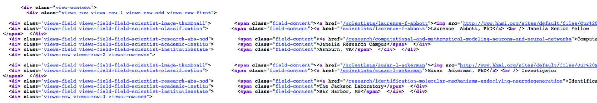
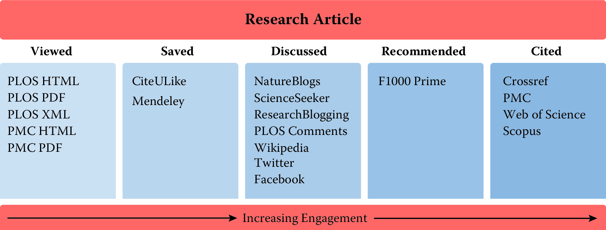

Working with Web Data and APIs {#chap:web}
==============================

***Cameron Neylon***
<br><br>

This chapter will show you how to extract information from social media
about the transmission of knowledge. The particular application will be
to develop links to authors' articles on Twitter using PLOS articles and
to pull information using an API. You will get link data from
bookmarking services, citations from Crossref, links from Facebook, and
information from news coverage. The examples that will be used are from
Twitter. In keeping with the social science grounding that is a core
feature of the book, it will discuss what can be captured, what is
potentially reliable, and how to manage data quality issues.

Introduction
------------

A tremendous lure of the Internet is the availability of vast amounts of
data on businesses, people, and their activity on social media. But how
can we capture the information and make use of it as we might make use
of more traditional data sources? In this chapter, we begin by
describing how web data can be collected, using the use case of UMETRICS
and research output as a readily available example, and then discuss how
to think about the scope, coverage, and integration issues associated
with its collection.

Often a big data exploration starts with information on people or on a
group of people. The web can be a rich source of additional information.
It can also act as pointers to new sources of information, allowing a
pivot from one perspective to another, from one kind of query to
another. Often this is exploratory. You have an existing core set of
data and are looking to augment it. But equally this exploration can
open up whole new avenues. Sometimes the data are completely
unstructured, existing as web pages spread across a site, and sometimes
they are provided in a machine-readable form. The challenge is in having
a sufficiently diverse toolkit to bring all of this information
together.

Using the example of data on researchers and research outputs, we will
explore obtaining information directly from web pages (*web scraping*)
as well as explore the uses of APIs--- web services that allow an
interaction with, and retrieval of, structured data. You will see how
the crucial pieces of integration often lie in making connections
between disparate data sets and how in turn making those connections
requires careful quality control. The emphasis throughout this chapter
is on the importance of focusing on the purpose for which the data will
be used as a guide for data collection. While much of this is specific
to data about research and researchers, the ideas are generalizable to
wider issues of data and public policy.

Scraping information from the web {#sec:4-1}
---------------------------------

With the range of information available on the web, our first question
is how to access it. The simplest approach is often to manually go
directly to the web and look for data files or other information. For
instance, on the NSF website [@nsfweb] it is possible to obtain data
dumps of all grant information. Sometimes data are available only on web
pages or we only want a subset of this information. In this case web
scraping is often a viable approach.

Web scraping involves using a program to download and process web pages
directly. This can be highly effective, particularly where tables of
information are made available online. It is also useful in cases where
it is desirable to make a series of very similar queries. In each case
we need to look at the website, identify how to get the information we
want, and then process it. Many websites deliberately make this
difficult to prevent easy access to their underlying data.

### Obtaining data from the HHMI website {#sec:4-1.1}

Let us suppose we are interested in obtaining information on those
investigators that are funded by the Howard Hughes Medical Institute
(HHMI). HHMI has a website that includes a search function for funded
researchers, including the ability to filter by field, state, and role.
But there does not appear to be a downloadable data set of this
information. However, we can automate the process with code to create a
data set that you might compare with other data.

This process involves first understanding how to construct a URL that
will do the search we want. This is most easily done by playing with
search functionality and investigating the URL structures that are
returned. Note that in many cases websites are not helpful here.
However, with HHMI if we do a general search and play with the structure
of the URL, we can see some of the elements of the URL that we can think
of as a query. As we want to see *all* investigators, we do not need to
limit the search, and so with some fiddling we come up with a URL like
the following. (We have broken the one-line URL into three lines for
ease of presentation.)

http://www.hhmi.org/scientists/browse?
kw=&sort_by=field_scientist_last_name&
sort_order=ASC&items_per_page=20&page=0

The `requests` module, available natively in Jupyter Python notebooks, is a useful
set of tools for handling interactions with websites. It lets us
construct the request that we just presented in terms of a base URL and
query terms, as follows:

```{r, eval=FALSE}
>> BASE_URL = "http://www.hhmi.org/scientists/browse"
>> query = {
            "kw" : "",
            "sort_by" : "field_scientist_last_name",
            "sort_order" : "ASC",
            "items_per_page" : 20,
            "page" : None
           }
```

With our request constructed we can then make the call to the web page
to get a response.

```{r, eval=FALSE}
>> import requests
>> response = requests.get(BASE_URL, params=query)
```

The first thing to do when building a script that hits a web page is to
make sure that your call was successful. This can be checked by looking
at the response code that the web server sent---and, obviously, by
checking the actual HTML that was returned. A `200` code means success and
that everything should be OK. Other codes may mean that the URL was
constructed wrongly or that there was a server error.

```{r, eval=FALSE}
>> response.status_code
200
```

With the page successfully returned, we now need to process the text it
contains into the data we want. This is not a trivial exercise. It is
possible to search through and find things, but there are a range of
tools that can help with processing HTML and XML data. Among these one
of the most popular is a module called BeautifulSoup [@bsoup], which
provides a number of useful functions for this kind of processing. The
module documentation provides more details.

We need to check the details of the page source to find where the
information we are looking for is kept (see, for example,
\@ref(fig:fig2-1)). Here, all the details on HHMI investigators can
be found in a `<div>` element with the class attribute `view-content`. This structure is not
something that can be determined in advance. It requires knowledge of
the structure of the page itself. Nested inside this `<div>` element are another
series of `div`s, each of which corresponds to one investigator. These have
the class attribute `view-rows`. Again, there is nothing obvious about finding
these, it requires a close examination of the page HTML itself for any
specific case you happen to be looking at.

```{r fig2-1, out.width = '70%', fig.align = 'center', echo = FALSE, fig.cap = 'Source HTML from the portion of an HHMI results page containing information on HHMI investigators; note that the webscraping results in badly formatted html which is difficult to read.'}

```

We first process the page using the BeautifulSoup module (into the
variable `soup`) and then find the `div` element that holds the information on
investigators (`investigator_list`). As this element is unique on the page (I checked using
my web browser), we can use the find method. We then process that `div` (using
`find_all`) to create an iterator object that contains each of the page segments
detailing a single investigator (`investigators`).

```{r, eval=FALSE}
>> from bs4 import BeautifulSoup
>> soup = BeautifulSoup(response.text, "html5lib")
>> investigator_list = soup.find('div', class_ = "view-content")
>> investigators = investigator_list.find_all("div", class_ = "views-row")
```

As we specified in our query parameters that we wanted 20 results per
page, we should check whether our list of page sections has the right
length.

```{r, eval=FALSE}
>> len(investigators)
20
```

``` {r web-py1, eval=FALSE, fig.cap = "Python code to parse for HHMI investigators"}
# Given a request response object, parse for HHMI investigators
def scrape(page_response):
   # Obtain response HTML and the correct <div> from the page
   soup = BeautifulSoup(response.text, "html5lib")
   inv_list = soup.find('div', class_ = "view-content")

   # Create a list of all the investigators on the page
   investigators = inv_list.find_all("div", class_ = "views-row")

   data = [] # Make the data object to store scraping results

   # Scrape needed elements from investigator list
   for investigator in investigators:
       inv = {} # Create a dictionary to store results

       # Name and role are in same HTML element; this code
       # separates them into two data elements
       name_role_tag = investigator.find("div",
           class_ = "views-field-field-scientist-classification")
       strings = name_role_tag.stripped_strings
       for string,a in zip(strings, ["name", "role"]):
           inv[a] = string

       # Extract other elements from text of specific divs or from
       # class attributes of tags in the page (e.g., URLs)
       research_tag = investigator.find("div",
          class_ = "views-field-field-scientist-research-abs-nod")
       inv["research"] = research_tag.text.lstrip()
       inv["research_url"] = "http://hhmi.org"
          + research_tag.find("a").get("href")
       institution_tag = investigator.find("div",
          class_ = "views-field-field-scientist-academic-institu")
       inv["institute"] = institution_tag.text.lstrip()
       town_state_tag = investigator.find("div",
           class_ = "views-field-field-scientist-institutionstate")
       inv["town"], inv["state"] = town_state_tag.text.split(",")
       inv["town"] = inv.get("town").lstrip()
       inv["state"] = inv.get("state").lstrip()

       thumbnail_tag = investigator.find("div",
          class_ = "views-field-field-scientist-image-thumbnail")
       inv["thumbnail_url"] = thumbnail_tag.find("img")["src"]
       inv["url"] = "http://hhmi.org"
          + thumbnail_tag.find("a").get("href")

       # Add the new data to the list
       data.append(inv)
   return data
```

Finally, we need to process each of these segments to obtain the data we
are looking for. This is the actual "scraping" of the page to get the
information we want. Again, this involves looking closely at the HTML
itself, identifying where the information is held, what tags can be used
to find it, and often doing some postprocessing to clean it up (removing
spaces, splitting different elements up).

Listing \@ref(fig:web-py1) provides a function to handle all of this. The
function accepts the response object from the requests module as its
input, processes the page text to soup, and then finds the `investigator_list` as above and
processes it into an actual list of the investigators. For each
investigator it then processes the HTML to find and clean up the
information required, converting it to a dictionary and adding it to our
growing list of data.

Let us check what the first two elements of our data set now look like.
You can see two dictionaries, one relating to Laurence Abbott, who is a
senior fellow at the HHMI Janelia Farm Campus, and one for Susan
Ackerman, an HHMI investigator based at the Jackson Laboratory in Bar
Harbor, Maine. Note that we have also obtained URLs that give more
details on the researcher and their research program (`research_url` and `url` keys in the
dictionary) that could provide a useful input to textual analysis or
topic modeling (see [Text Analysis](#chap:text)).

```{r, eval=FALSE}
>> data = scrape(response)
>> data[0:2]
[{'institute': u'Janelia Research Campus ',
  'name': u'Laurence Abbott, PhD',
  'research': u'Computational and Mathematical Modeling of Neurons and Neural... ',
  'research_url': u'http://hhmi.org/research/computational-and-mathematical-modeling-neurons-and-neural-networks',
  'role': u'Janelia Senior Fellow',
  'state': u'VA ',
  'thumbnail_url': u'http://www.hhmi.org/sites/default/files/Our%20Scientists/Janelia/Abbott-112x112.jpg',
  'town': u'Ashburn',
  'url': u'http://hhmi.org/scientists/laurence-f-abbott'},
 {'institute': u'The Jackson Laboratory ',
  'name': u'Susan Ackerman, PhD',
  'research': u'Identification of the Molecular Mechanisms Underlying... ',
  'research_url': u'http://hhmi.org/research/identification-molecular-mechanisms-underlying-neurodegeneration',
  'role': u'Investigator',
  'state': u'ME ',
  'thumbnail_url':
u'http://www.hhmi.org/sites/default/files/Our%20Scientists/Investigators/Ackerman-112x112.jpg',
  'town': u'Bar Harbor',
  'url': u'http://hhmi.org/scientists/susan-l-ackerman'}]
```

So now we know we can process a page from a website to generate usefully
structured data. However, this was only the first page of results. We
need to do this for each page of results if we want to capture all the
HHMI investigators. We could just look at the number of pages that our
search returned manually, but to make this more general we can actually
scrape the page to find that piece of information and use that to
calculate how many pages we need to work through.

The number of results is found in a `div` with the class "view-headers" as a
piece of free text ("Showing 1--20 of 493 results"). We need to grab the
text, split it up (I do so based on spaces), find the right number (the
one that is before the word "results") and convert that to an integer.
Then we can divide by the number of items we requested per page (20 in
our case) to find how many pages we need to work through. A quick mental
calculation confirms that if page 0 had results 1--20, page 24 would
give results 481--493.

```{r, eval=FALSE}
>> # Check total number of investigators returned
>> view_header = soup.find("div", class_ = "view-header")
>> words = view_header.text.split(" ")
>> count_index = words.index("results.") - 1
>> count = int(words[count_index])

>> # Calculate number of pages, given count & items_per_page
>> num_pages = count/query.get("items_per_page")
>> num_pages
24
```

Then it is a simple matter of putting the function we constructed
earlier into a loop to work through the correct number of pages. As we
start to hit the website repeatedly, we need to consider whether we are
being polite. Most websites have a file in the root directory called
robots.txt that contains guidance on using programs to interact with the
website. In the case of <http://hhmi.org> the file states first that we
are allowed (or, more properly, not forbidden) to query
<http://www.hhmi.org/scientists/> programmatically. Thus, you can pull
down all of the more detailed biographical or research information, if
you so desire. The file also states that there is a requested
"Crawl-delay" of 10. This means that if you are making repeated queries
(as we will be in getting the 24 pages), you should wait for 10 seconds
between each query. This request is easily accommodated by adding a
timed delay between each page request.

```{r, eval=FALSE}
>> for page_num in range(num_pages):
>> # We already have page zero and we need to go to 24:
>> # range(24) is [0,1,...,23]
>>    query["items_per_page"] = page_num + 1
>>    page = requests.get(BASE_URL, params=query)
>> # We use extend to add list for each page to existing list
>>    data.extend(scrape(page))
>> print "Retrieved and scraped page number:", query.get("items_per_page")
>> time.sleep(10) # robots.txt at hhmi.org specifies a crawl delay of 10 seconds
Retrieved and scraped page number: 1
Retrieved and scraped page number: 2
...
Retrieved and scraped page number: 24
```

Finally we can check that we have the right number of results after our
scraping. This should correspond to the 493 records that the website
reports.

```{r, eval=FALSE}
>> len(data)
493
```

### Limits of scraping {#sec:4-1.2}

While scraping websites is often necessary, is can be a fragile and
messy way of working. It is problematic for a number of reasons: for
example, many websites are designed in ways that make scraping difficult
or impossible, and other sites explicitly prohibit this kind of scripted
analysis. (Both reasons apply in the case of the NSF and Grants.gov
websites, which is why we use the HHMI website in our example.)

In many cases a better choice is to process a data dump from an
organization. For example, the NSF and Wellcome Trust both provide data
sets for each year that include structured data on all their awarded
grants. In practice, integrating data is a continual challenge of
figuring out what is the easiest way to proceed, what is allowed, and
what is practical and useful. The selection of data will often be driven
by pragmatic rather than theoretical concerns.

Increasingly, however, good practice is emerging in which organizations
provide APIs to enable scripted and programmatic access to the data they
hold. These tools are much easier and generally more effective to work
with. They are the focus of much of the rest of this chapter.

New data in the research enterprise {#sec:4-2}
-----------------------------------

The new forms of data we are discussing in this chapter are largely
available because so many human activities---in this case, discussion,
reading, and bookmarking---are happening online. All sorts of data are
generated as a side effect of these activities. Some of that data is
public (social media conversations), some private (IP addresses
requesting specific pages), and some intrinsic to the service (the
identity of a user who bookmarks an article). What exactly are these new
forms of data? There are broadly two new directions that data
availability is moving in. The first is information on new forms of
research output, data sets, software, and in some cases physical
resources. There is an interest across the research community in
expanding the set of research outputs that are made available and, to
drive this, significant efforts are being made to ensure that these
nontraditional outputs are seen as legitimate outputs. In particular
there has been a substantial policy emphasis on data sharing and,
coupled with this, efforts to standardize practice around data citation.
This is applying a well-established measure (citation) to a new form of
research output.

The second new direction, which is more developed, takes the alternate
route, providing *new forms of information on existing types of output*,
specifically research articles. The move online of research activities,
including discovery, reading, writing, and bookmarking, means that many
of these activities leave a digital trace. Often these traces are public
or semi-public and can be collected and tracked. This certainly raises
privacy issues that have not been comprehensively addressed but also
provides a rich source of data on who is doing what with research
articles.

```{r fig2-2, out.width = '70%', fig.align = 'center', echo = FALSE, fig.cap = 'Classes of online activity related to research journal articles. Reproduced from Lin and Fenner [237], under a Creative Commons Attribution v 3.0 license'}

```

There are a wide range of potential data sources, so it is useful to
categorize them. Figure \@ref(fig:fig2-2) shows one possible categorization, in which data
sources are grouped based on the level of engagement and the stage of
use. It starts from the left with "views," measures of online views and
article downloads, followed by "saves" where readers actively collect
articles into a library of their own, through online *discussion* forums
such as blogs, social media and new commentary, formal scholarly
*recommendations*, and, finally, formal *citations*.

These categories are a useful way to understand the classes of
information available and to start digging into the sources they can be
obtained from. For each category we will look at the *kind* of usage
that the indicator is a proxy for, which *users* are captured by the
indicator, the *limitations* that the indicator has as a measure, and
the *sources* of data. We start with the familiar case of formal
literature citations to provide context.

---

**Example: Citations**

Most quantitative analyses of research have focused on citations from
research articles to other research articles. Many familiar
measures---such as Impact Factors, Scimago Journal Rank, or
Eigenfactor---are actually measures of journal rather than article
performance. However, information on citations at the article level is
increasingly the basis for much bibliometric analysis.

-   Kind of usage

    -   Citing a scholarly work is a signal from a researcher that a
        specific work has relevance to, or has influenced, the work they
        are describing.

    -   It implies significant engagement and is a measure that carries
        some weight.

-   Users

    -   Researchers, which means usage by a specific group for a fairly
        small range of purposes.

    -   With high-quality data, there are some geographical, career, and
        disciplinary demographic details.

-   Limitations

    -   The citations are slow to accumulate, as they must pass through
        a peer-review process.

    -   It is seldom clear from raw data why a paper is being cited.

    -   It provides a limited view of usage, as it only reflects reuse
        in research, not application in the community.

-   Sources

    -   Public sources of citation data include PubMed Central and
        Europe PubMed Central, which mine publicly available full text
        to find citations.

    -   Proprietary sources of citation data include Thomson Reuters'
        Web of Knowledge and Elsevier's Scopus.

    -   Some publishers make citation data collected by Crossref
        available.
        
---

---

**Example: Page views and downloads**

A major new source of data online is the number of times articles are
viewed. Page views and downloads can be defined in different ways and
can be reached via a range of paths. Page views are an immediate measure
of usage. Viewing a paper may involve less engagement than citation or
bookmarking, but it can capture interactions with a much wider range of
users.

The possibility of drawing demographic information from downloads has
significant potential for the future in providing detailed information
on who is reading an article, which may be valuable for determining, for
example, whether research is reaching a target audience.

-   Kind of usage

    -   It counts the number of people who have clicked on an article
        page or downloaded an article.

-   Users

    -   Page views and downloads report on use by those who have access
        to articles. For publicly accessible articles this could be
        anyone; for subscription articles it is likely to be
        researchers.

-   Limitations

    -   Page views are calculated in different ways and are not directly
        comparable across publishers. Standards are being developed but
        are not yet widely applied.

    -   Counts of page views cannot easily distinguish between
        short-term visitors and those who engage more deeply with an
        article.

    -   There are complications if an article appears in multiple
        places, for example at the journal website and a repository.

    \pagebreak
-   Sources

    -   Some publishers and many data repositories make page view data
        available in some form. Publishers with public data include
        PLOS, Nature Publishing Group, Ubiquity Press, Co-Action Press,
        and Frontiers.

    -   Data repositories, including Figshare and Dryad, provide page
        view and download information.

    -   PubMed Central makes page views of articles hosted on that site
        available to depositing publishers. PLOS and a few other
        publishers make this available.
        
---

---

**Example: Analyzing bookmarks** 

Tools for collecting and curating personal collections of literature, or
web content, are now available online. They make it easy to make copies
and build up indexes of articles. Bookmarking services can choose to
provide information on the number of people who have bookmarked a paper.

Two important services targeted at researchers are Mendeley and
CiteULike. Mendeley has the larger user base and provides richer
statistics. Data include the number of users that who bookmarked a
paper, groups that have collected a paper, and in some cases
demographics of users, which can include discipline, career stage, and
geography.

Bookmarks accumulate rapidly after publication and provide evidence of
scholarly interest. They correlate quite well with the eventual number
of citations. There are also public bookmarking services that provide a
view onto wider interest in research articles.

-   Kind of usage

    -   Bookmarking is a purposeful act. It may reveal more interest
        than a page view, but less than a citation.

    -   Its uses are different from those captured by citations.

    -   The bookmarks may include a variety of documents, such as papers
        for background reading, introductory material, position or
        policy papers, or statements of community positions.

-   Users

    -   Academic-focused services provide information on use by
        researchers.

    -   Each service has a different user profile in, for instance,
        sciences or social sciences.

    -   All services have a geographical bias towards North America and
        Europe.

    -   There is some demographic information, for instance, on
        countries where users are bookmarking the most.

-   Limitations

    -   There is bias in coverage of services; for instance, Mendeley
        has good coverage of biomedical literature.

    -   It can only report on activities of signed-up users.

    -   It is not usually possible to determine why a bookmark has been
        created.

-   Sources

    -   Mendeley and CiteULike both have public APIs that provide data
        that are freely available for reuse.

    -   Most consumer bookmarking services provide some form of API, but
        this often has restrictions or limitations.

---

---

**Example: Discussions on social media**

Social media are one of the most valuable new services producing
information about research usage. A growing number of researchers,
policymakers, and technologists are on these services discussing
research.

There are three major features of social media as a tool. First, among a
large set of conversations, it is possible to discover a discussion
about a specific paper. Second, Twitter makes it possible to identify
groups discussing research and to learn whether they were potential
targets of the research. Third, it is possible to reconstruct
discussions to understand what paths research takes to users.

In the future it will be possible to identify target audiences and to
ask whether they are being reached and how modified distribution might
maximize that reach. This could be a powerful tool, particularly for
research with social relevance.

Twitter provides the most useful data because discussions and the
identity of those involved are public. Connections between users and the
things they say are often available, making it possible to identify
communities discussing work. However, the 140-character limit on Twitter
messages ("tweets") does not support extended critiques. Facebook has
much less publicly available information--- but being more private, it
can be a site for frank discussion of research.

-   Kind of usage

    -   Those discussing research are showing interest potentially
        greater than page views.

    -   Often users are simply passing on a link or recommending an
        article.

    -   It is possible to navigate to tweets and determine the level and
        nature of interest.

    -   Conversations range from highly technical to trivial, so numbers
        should be treated with caution.

    -   Highly tweeted or Facebooked papers also tend to have
        significant bookmarking and citation.

    -   Professional discussions can be swamped when a piece of research
        captures public interest.

-   Users

    -   The user bases and data sources for Twitter and Facebook are
        global and public.

    -   There are strong geographical biases.

    -   A rising proportion of researchers use Twitter and Facebook for
        professional activities.

    -   Many journalists, policymakers, public servants, civil society
        groups, and others use social media.

-   Limitations

    -   Frequent lack of explicit links to papers is a serious
        limitation.

    -   Use of links is biased towards researchers and against groups
        not directly engaged in research.

    -   There are demographic issues and reinforcement
        effects---retweeting leads to more retweeting in preference to
        other research---so analysis of numbers of tweets or likes is
        not always useful.

---

---

**Example: Recommendations**

A somewhat separate form of usage is direct expert recommendations. The
best-known case of this is the F1000 service on which experts offer
recommendations with reviews of specific research articles. Other
services such as collections or personal recommendation services may be
relevant here as well.

-   Kind of usage

    -   Recommendations from specific experts show that particular
        outputs are worth looking at in detail, are important, or have
        some other value.

    -   Presumably, recommendations are a result of in-depth reading and
        a high level of engagement.

-   Users

    -   Recommendations are from a selected population of experts
        depending on the service in question.

    -   In some cases this might be an algorithmic recommendation
        service.

-   Limitations

    -   Recommendations are limited to the interests of the selected
        population of experts.

    -   The recommendation system may be biased in terms of the
        interests of recommenders (e.g., towards---or away from---new
        theories vs. developing methodology) as well as their
        disciplines.

    -   Recommendations are slow to build up.

---

A functional view {#sec:4-3}
-----------------

The descriptive view of data types and sources is a good place to start,
but it is subject to change. Sources of data come and go, and even the
classes of data types may expand and contract in the medium to long
term. We also need a more functional perspective to help us understand
how these sources of data relate to activities in the broader research
enterprise.

Consider Figure \@ref(fig:fig2) in
Chapter [Introduction](#chap:intro). The research enterprise has been framed as
being made up of people who are generating outputs. The data that we
consider in this chapter relate to connections between outputs, such as
citations between research articles and tweets referring to articles.
These connections are themselves created by people, as shown in Figure
\@ref(fig:fig2-3). The people in
turn may be classed as belonging to certain categories or communities.
What is interesting, and expands on the simplified picture of
Figure \@ref(fig:fig2), is that many of these people are not
professional researchers. Indeed, in some cases they may not be people
at all but automated systems of some kind. This means we need to expand
the set of actors we are considering. As described above, we are also
expanding the range of outputs (or objects) that we are considering as
well.

```{r fig2-3, out.width = '70%', fig.align = 'center', echo = FALSE, fig.cap = 'A simplified model of online interactions between research outputs and the objects that refer to them'}
knitr::include_graphics("ChapterWeb/figures/fig2-3.png")
```

In the simple model of Figure \@ref(fig:fig2-3), there are three categories of things (nodes on the
graph): objects, people, and the communities they belong to. Then there
are the relationships between these elements (connections between
nodes). Any given data source may provide information on different parts
of this graph, and the information available is rarely complete or
comprehensive. Data from different sources can also be difficult to
integrate. As with any data integration, combining sources relies on
being able to confidently identify those nodes that are common between
data sources. Therefore identifying unique objects and people is
critical to making progress.

These data are not necessarily public but many services choose to make
some data available. An important characteristic of these data sources
is that they are completely in the gift of the service provider. Data
availability, its presentation, and upstream analysis can change without
notice. Data are sometimes provided as a dump but is also frequently
provided through an API.

An API is simply a tool that allows a program to interface with a
service. APIs can take many different forms and be of varying quality
and usefulness. In this section we will focus on one common type of API
and examples of important publicly available APIs relevant to research
communications. We will also cover combining APIs and the benefits and
challenges of bringing multiple data sources together.

### Relevant APIs and resources {#sec:4-3.1}

There is a wide range of other sources of information that can be used
in combination with the APIs featured above to develop an overview of
research outputs and of where and how they are being used. There are
also other tools that can allow deeper analysis of the outputs
themselves.
Table [\[tab:chapAPI:1\]](#tab:chapAPI:1){reference-type="ref"
reference="tab:chapAPI:1"} gives a partial list of key data sources and
APIs that are relevant to the analysis of research outputs.

  **Source**                  **Description**                                                                                                                                                                                                 **API**   **Free**
  --------------------------- -------------------------------------------------------------------------------------------------------------------------------------------------------------------------------------------------------------- --------- ----------
                                                                                                                                                                                                                                                       
  PubMed                      An online index that combines bibliographic data from Medline and PubMed Central. PubMed Central and Europe PubMed Central also provide information.                                                               Y         Y
  Web of Science              The bibliographic database provided by Thomson Reuters. The ISI Citation Index is also available.                                                                                                                  Y         N
  Scopus                      The bibliographic database provided by Elsevier. It also provides citation information.                                                                                                                            Y         N
  Crossref                    Provides a range of bibliographic metadata and information obtained from members registering DOIs.                                                                                                                 Y         Y
  Google Scholar              Provides a search index for scholarly objects and aggregates citation information.                                                                                                                                 N         Y
  Microsoft Academic Search   Provides a search index for scholarly objects and aggregates citation information. Not as complete as Google Scholar, but has an API.                                                                              Y         Y
                                                                                                                                                                                                                                                       
  Altmetric.com               A provider of aggregated data on social media and mainstream media attention of research outputs. Most comprehensive source of information across different social media and mainstream media conversations.       Y         N
  Twitter                     Provides an API that allows a user to search for recent tweets and obtain some information on specific accounts.                                                                                                   Y         Y
  Facebook                    The Facebook API gives information on the number of pages, likes, and posts associated with specific web pages.                                                                                                    Y         Y
                                                                                                                                                                                                                                                       
  ORCID                       Unique identifiers for research authors. Profiles include information on publication lists, grants, and affiliations.                                                                                              Y         Y
  LinkedIn                    CV-based profiles, projects, and publications.                                                                                                                                                                     Y         \*
                                                                                                                                                                                                                                                       
  Gateway to Research         A database of funding decisions and related outputs from Research Councils UK.                                                                                                                                     Y         Y
  NIH Reporter                Online search for information on National Institutes of Health grants. Does not provide an API but a downloadable data set is available.                                                                           N         Y
  NSF Award Search            Online search for information on NSF grants. Does not provide an API but downloadable data sets by year are available.                                                                                             N         Y

The data are restricted: sometimes fee based, other times not.

### RESTful APIs, returned data, and Python wrappers {#sec:4-3.2}

The APIs we will focus on here are all examples of RESTful services.
REST stands for Representational State Transfer
[@RESTwiki; @fielding2002principled], but for our purposes it is most
easily understood as a means of transferring data using web protocols.
Other forms of API require additional tools or systems to work with, but
RESTful APIs work directly over the web. This has the advantage that a
human user can also with relative ease play with the API to understand
how it works. Indeed, some websites work simply by formatting the
results ofAPI calls.

As an example let us look at the Crossref API. This provides a range of
information associated with Digital Object Identifiers (DOIs) registered
with Crossref. DOIs uniquely identify an object, and Crossref DOIs refer
to research objects, primarily (but not entirely) research articles. If
you use a web browser to navigate to
<http://api.crossref.org/works/10.1093/nar/gni170>, you should receive
back a webpage that looks something like the following. (We have laid it
out nicely to make it more readable.)

``` {r, eval = FALSE}
{ "status" : "ok",
  "message-type" : "work",
  "message-version" : "1.0.0",
  "message" :
   { "subtitle": [],
     "subject" : ["Genetics"],
     "issued" : { "date-parts" : [[2005,10,24]] },
     "score" : 1.0,
     "prefix" : "http://id.crossref.org/prefix/10.1093",
     "author" : [ "affiliation" : [],
                   "family" : "Whiteford",
                   "given" : "N."}],
     "container-title" : ["Nucleic Acids Research"],
     "reference-count" : 0,
     "page" : "e171-e171",
     "deposited" : {"date-parts" : [[2013,8,8]],
                    "timestamp" : 1375920000000},
     "issue" : "19",
     "title" :
       ["An analysis of the feasibility of short read sequencing"],
     "type" : "journal-article",
     "DOI" : "10.1093/nar/gni170",
     "ISSN" : ["0305-1048","1362-4962"],
     "URL" : "http://dx.doi.org/10.1093/nar/gni170",
     "source" : "Crossref",
     "publisher" : "Oxford University Press (OUP)",
     "indexed" : {"date-parts" : [[2015,6,8]],
                  "timestamp" : 1433777291246},
     "volume" : "33",
     "member" : "http://id.crossref.org/member/286"
   }
}
```

This is a package of JavaScript Object Notation (JSON) data returned in
response to a query. The query is contained entirely in the URL, which
can be broken up into pieces: the root URL (<http://api.crossref.org>)
and a data "query," in this case made up of a "field" (`works`) and an
identifier (the DOI `10.1093/nar/gni170`). The Crossref API provides information about the
article identified with this specific DOI.

Programming against an API {#sec:4-4}
--------------------------

Programming against an API involves constructing HTTP requests and
parsing the data that are returned. Here we use the Crossref API to
illustrate how this is done. Crossref is the provider of DOIs used by
many publishers to uniquely identify scholarly works. Crossref is not
the only organization to provide DOIs. The scholarly communication space
DataCite is another important provider. The documentation is available
at the Crossref website [@crossref].

Once again the `requests` Python library provides a series of convenience functions
that make it easier to make HTTP calls and to process returned JSON. Our
first step is to import the module and set a base URL variable.

```{r, eval=FALSE}
>> import requests
>> BASE_URL = "http://api.crossref.org/"
```

A simple example is to obtain metadata for an article associated with a
specific DOI. This is a straightforward call to the Crossref API,
similar to what we saw earlier.

```{r, eval=FALSE}
>> doi = "10.1093/nar/gni170"
>> query = "works/"
>> url = BASE_URL + query + doi
>> response = requests.get(url)
>> url
http://api.crossref.org/works/10.1093/nar/gni170
>> response.status_code
200
```

The `response` object that the `requests` library has created has a range of useful
information, including the URL called and the response code from the web
server (in this case 200, which means everything is OK). We need the
JSON body from the response object (which is currently text from the
perspective of our script) converted to a Python dictionary. The `requests` module
provides a convenient function for performing this conversion, as the
following code shows. (All strings in the output are in Unicode, hence
the "u" notation.)

``` {r, eval=FALSE}
>> response_dict = response.json()
>> response_dict
{ u'message' :
  { u'DOI' : u'10.1093/nar/gni170',
    u'ISSN' : [ u'0305-1048', u'1362-4962' ],
    u'URL' : u'http://dx.doi.org/10.1093/nar/gni170',
    u'author' : [ {u'affiliation' : [],
                   u'family' : u'Whiteford',
                   u'given' : u'N.'} ],
    u'container-title' : [ u'Nucleic Acids Research' ],
    u'deposited' : { u'date-parts' : [[2013, 8, 8]],
                     u'timestamp' : 1375920000000 },
    u'indexed' : { u'date-parts' : [[2015, 6, 8]],
                   u'timestamp' : 1433777291246 },
    u'issue' : u'19',
    u'issued' : { u'date-parts' : [[2005, 10, 24]] },
    u'member' : u'http://id.crossref.org/member/286',
    u'page' : u'e171-e171',
    u'prefix' : u'http://id.crossref.org/prefix/10.1093',
    u'publisher' : u'Oxford University Press (OUP)',
    u'reference-count' : 0,
    u'score' : 1.0,
    u'source' : u'Crossref',
    u'subject' : [u'Genetics'],
    u'subtitle' : [],
    u'title' : [u'An analysis of the feasibility of short read sequencing'],
    u'type' : u'journal-article',
    u'volume' : u'33'
  },
  u'message-type' : u'work',
  u'message-version' : u'1.0.0',
  u'status' : u'ok'
}
```

This data object can now be processed in whatever way the user wishes,
using standard manipulation techniques.

The Crossref API can, of course, do much more than simply look up
article metadata. It is also valuable as a search resource and for
cross-referencing information by journal, funder, publisher, and other
criteria. More details can be found at the Crossref website.

Using the ORCID API via a wrapper {#sec:4-4.1}
---------------------------------

ORCID, which stands for "Open Research and Contributor Identifier" (see
[orcid.org](orcid.org); see also [@haak2012orcid]), is a service that
provides unique identifiers for researchers. Researchers can claim an
ORCID profile and populate it with references to their research works,
funding and affiliations. ORCID provides an API for interacting with
this information. For many APIs there is a convenient Python wrapper
that can be used. The ORCID--Python wrapper works with the ORCID v1.2
API to make various API calls straightforward. This wrapper only works
with the public ORCID API and can therefore only access publicly
available data.

Using the API and wrapper together provides a convenient means of
getting this information. For instance, given an ORCID, it is
straightforward to get profile information. Here we get a list of
publications associated with my ORCID and look at the the first item on
the list.

```{r, eval=FALSE}
>> import orcid
>> cn = orcid.get("0000-0002-0068-716X")
>> cn
<Author Cameron Neylon, ORCID 0000-0002-0068-716X>
>> cn.publications[0]
<Publication "Principles for Open Scholarly Infrastructures-v1">
```

The wrapper has created Python objects that make it easier to work with
and manipulate the data. It is common to take the return from an API and
create objects that behave as would be expected in Python. For instance,
the `publications` object is a list populated with publications (which are also
Python-like objects). Each publication in the list has its own
attributes, which can then be examined individually. In this case the
external IDs attribute is a list of further objects that include a DOI
for the article and the ISSN of the journal the article was published
in.

```{r, eval=FALSE}
>> len(cn.publications)
70
>> cn.publications[12].external_ids
[<ExternalID DOI:10.1371/journal.pbio.1001677>, <ExternalID ISSN:1545-7885>]
```

As a simple example of data processing, we can iterate over the list of
publications to identify those for which a DOI has been provided. In
this case we can see that of the 70 publications listed in this ORCID
profile (at the time of testing), 66 have DOIs.

```{r, eval=FALSE}
>> exids = []
>> for pub in cn.publications:
        if pub.external_ids:
        exids = exids + pub.external_ids
>> DOIs = [exid.id for exid in exids if exid.type == "DOI"]
>> len(DOIs)
66
```

Wrappers generally make operating with an API simpler and cleaner by
abstracting away the details of making HTTP requests. Achieving the same
by directly interacting with the ORCID API would require constructing
the appropriate URLs and parsing the returned data into a usable form.
Where a wrapper is available it is generally much easier to use.
However, wrappers may not be actively developed and may lag the
development of the API. Where possible, use a wrapper that is directly
supported or recommended by the API provider.

Quality, scope, and management {#sec:4-5}
------------------------------

The examples in the previous section are just a small dip into the
surface of the data available, but we already can see a number of issues
that are starting to surface. A great deal of care needs to be taken
when using these data, and a researcher will need to apply subject
matter knowledge as well as broader data management expertise. Some of
the core issues are as follows:

**Integration**

In the examples given above with Crossref and ORCID, we used a known
identifier (a DOI or an ORCID). Integrating data from Crossref to
supplement the information from an ORCID profile is possible, but it
depends on the linking of identifiers. Note that for the profile data we
obtained, only 66 or the 70 items had DOIs. Data integration across
multiple data sources that reference DOIs is straightforward for those
objects that have DOIs, and messy or impossible for those that do not.
In general, integration is possible, but it depends on a means of
cross-referencing between data sets. Unique identifiers that are common
to both are extremely powerful but only exist in certain cases (see also
Chapter [Record Linkage]).

**Coverage**

\hspace*{4pt}
Without a population frame, it is difficult to know whether the
information that can be captured is comprehensive. For example, "the
research literature" is at best a vague concept. A variety of indexes,
some openly available (PubMed, Crossref), some proprietary (Scopus, Web
of Knowledge, many others), cover different partially overlapping
segments of this corpus of work. Each index has differing criteria for
inclusion and differing commitments to completeness. Sampling of "the
literature" is therefore impossible, and the choice of index used for
any study can make a substantial difference to the conclusions.

**Completeness**

Alongside the question of coverage (how broad is a data source?), with
web data and opt-in services we also need to probe the completeness of a
data set. In the example above, 66 of 70 objects have a DOI
*registered*. This does not mean that those four other objects do not
have a DOI, just that there are none included in the ORCID record.
Similarly, ORCID profiles only exist for a subset of researchers at this
stage. Completeness feeds into integration challenges. While many
researchers have a Twitter profile and many have an ORCID profile, only
a small subset of ORCID profiles provide a link to a Twitter profile.
See below for a worked example.

**Scope**

In survey data sets, the scope is defined by the question being asked.
This is not the case with much of these new data. For example, the
challenges listed above for research articles, traditionally considered
the bedrock of research outputs, at least in the natural sciences, are
much greater for other forms of research outputs. Increasingly, the data
generated from research projects, software, materials, and tools, as
well as reports and presentations, are being shared by researchers in a
variety of settings. Some of these are formal mechanisms for
publication, such as large disciplinary databases, books, and software
repositories, and some are highly informal. Any study of (a subset of)
these outputs has as its first challenge the question of how to limit
the corpus to be studied.

**Source and validity**

The challenges described above relate to the identification and counting
of outputs. As we start to address questions of how these outputs are
being used, the issues are compounded. To illustrate some of the
difficulties that can arise, we examine the number of citations that
have been reported for a single sample article on a biochemical
methodology [@chan2007covalent]. This article has been available for
eight years and has accumulated a reasonable number of citations for
such an article over that time.

However, the exact number of citations identified varies radically,
depending on the data source. Scopus finds 40, while Web of Science
finds only 38. A Google Scholar search performed on the same date
identified 59. These differences relate to the size of the corpus from
which inward citations are being counted. Web of Science has the
smallest database, with Scopus being larger and Google Scholar
substantially larger again. Thus the size of the index not only affects
output counting, it can also have a substantial effect on any analysis
that uses that corpus. Alongside the size of the corpus, the means of
analysis can also have an effect. For the same article, PubMed Central
reports 10 citations but Europe PubMed Central reports 18, despite using
a similar corpus. The distinction lies in differences in the methodology
used to mine the corpus for citations.

**Identifying the underlying latent variable**

These issues multiply as we move into newer forms of data. These sparse
and incomplete sources of data require different treatment than more
traditional structured and comprehensive forms of data. They are more
useful as a way of identifying activities than of quantifying or
comparing them. Nevertheless, they can provide new insight into the
processes of knowledge dissemination and community building that are
occurring online.

Integrating data from multiple sources {#sec:4-6}
--------------------------------------

We often must work across multiple data sources to gather the
information needed to answer a research question. A common pattern is to
search in one location to create a list of identifiers and then use
those identifiers to query another API. In the ORCID example above, we
created a list of DOIs from a single ORCID profile. We could use those
DOIs to obtain further information from the Crossref API and other
sources. This models a common path for analysis of research outputs:
identifying a corpus and then seeking information on its performance.

In this example, we will build on the ORCID and Crossref examples to
collect a set of work identifiers from an ORCID profile and use a range
of APIs to identify additional metadata as well as information on the
performance of those articles. In addition to the ORCID API, we will use
the PLOS Lagotto API. Lagotto is the software that was built to support
the Article Level Metrics program at PLOS, the open access publisher,
and its API provides information on various metrics of PLOS articles. A
range of other publishers and service providers, including Crossref,
also provide an instance of this API, meaning the same tools can be used
to collect information on articles from a range of sources.

### The Lagotto API {#sec:4-6.1}

The module `pyalm` is a wrapper for the Lagotto API, which is served from a
range of hosts. We will work with two instances in particular: one run
by PLOS, and the Crossref DOI Event Tracker (DET, recently renamed
Crossref Event Data) pilot service. We first need to provide the details
of the URLs for these instances to our wrapper. Then we can obtain some
information for a single DOI to see what the returned data look like.

```{r, eval=FALSE}
>> import pyalm
>> pyalm.config.APIS = {'plos' : {'url' :
>>         'http://alm.plos.org/api/v5/articles'},
>>         'det' : {'url' :
>>         'http://det.labs.crossref.org/api/v5/articles'}
>>         }
>> det_alm_test = pyalm.get_alm('10.1371/journal.pbio.1001677',
>>         info='detail', instance='det')
det_alm_test
{ 'articles' : [<ArticleALM Expert Failure: Re-evaluating Research Assessment, DOI 10.1371/journal.pbio.1001677>],
  'meta' : {u'error' : None, u'page' : 1,
            u'total' : 1, u'total_pages' : 1}
}
```

The library returns a Python dictionary containing two elements. The
articles key contains the actual data and the meta key includes general
information on the results of the interaction with the API. In this case
the library has returned one page of results containing one object
(because we only asked about one DOI). If we want to collect a lot of
data, this information helps in the process of paging through results.
It is common for APIs to impose some limit on the number of results
returned, so as to ensure performance. By default the Lagotto API has a
limit of 50 results.

The articles key holds a list of ArticleALM objects as its value. Each
ArticleALM object has a set of internal attributes that contain
information on each of the metrics that the Lagotto instance collects.
These are derived from various data providers and are called *sources*.
Each can be accessed by name from a dictionary called "sources." The `iterkeys()`
function provides an iterator that lets us loop over the set of keys in
a dictionary. Within the source object there is a range of information
that we will dig into.

```{r, eval=FALSE}
>> article = det_alm_test.get('articles')[0]
>> article.title
u'Expert Failure: Re-evaluating Research Assessment'
>> for source in article.sources.iterkeys():
>>    print source, article.sources[source].metrics.total
reddit 0
datacite 0
pmceuropedata 0
wikipedia 1
pmceurope 0
citeulike 0
pubmed 0
facebook 0
wordpress 0
pmc 0
mendeley 0
crossref 0
```

The DET service only has a record of citations to this article from
Wikipedia. As we will see below, the PLOS service returns more results.
This is because some of the sources are not yet being queried by DET.

Because this is a PLOS paper we can also query the PLOS Lagotto instance
for the same article.

```{r, eval=FALSE}
>> plos_alm_test = pyalm.get_alm('10.1371/journal.pbio.1001677', info='detail', instance='plos')
>> article_plos = plos_alm_test.get('articles')[0]
>> article_plos.title
u'Expert Failure: Re-evaluating Research Assessment'
>> for source in article_plos.sources.iterkeys():
>>    print source, article_plos.sources[source].metrics.total
datacite 0
twitter 130
pmc 610
articlecoveragecurated 0
pmceurope 1
pmceuropedata 0
researchblogging 0
scienceseeker 0
copernicus 0
f1000 0
wikipedia 1
citeulike 0
wordpress 2
openedition 0
reddit 0
nature 0
relativemetric 125479
figshare 0
facebook 1
mendeley 14
crossref 3
plos_comments 2
articlecoverage 0
counter 12551
scopus 2
pubmed 1
orcid 3
```

The PLOS instance provides a greater range of information but also seems
to be giving larger numbers than the DET instance in many cases. For
those sources that are provided by both API instances, we can compare
the results returned.

```{r, eval=FALSE}
>> for source in article.sources.iterkeys():
>>    print source, article.sources[source].metrics.total,
>>    article_plos.sources[source].metrics.total
reddit 0 0
datacite 0 0
pmceuropedata 0 0
wikipedia 1 1
pmceurope 0 1
citeulike 0 0
pubmed 0 1
facebook 0 1
wordpress 0 2
pmc 0 610
mendeley 0 14
crossref 0 3
```

The PLOS Lagotto instance is collecting more information and has a wider
range of information sources. Comparing the results from the PLOS and
DET instances illustrates the issues of coverage and completeness
discussed previously. The data may be sparse for a variety of reasons,
and it is important to have a clear idea of the strengths and weaknesses
of a particular data source or aggregator. In this case the DET instance
is returning information for some sources for which it is does not yet
have data.

We can dig deeper into the events themselves that the metrics.total
count aggregates. The API wrapper collects these into an event object
within the source object. These contain the JSON returned from the API
in most cases. For instance, the Crossref source is a list of JSON
objects containing information on an article that cites our article of
interest. The first citation event in the list is a citation from the
*Journal of the Association for Information Science and Technology* by
Du et al.

```{r, eval=FALSE}
>> article_plos.sources['crossref'].events[0]
{u'event' :
   {u'article_title' : u'The effects of research level and article type on the differences between citation metrics and F1000 recommendations',
    u'contributors' :
      {u'contributor' :
         [ { u'contributor_role' : u'author',
             u'first_author' : u'true',
             u'given_name' : u'Jian',
             u'sequence' : u'first',
             u'surname' : u'Du' },
           { u'contributor_role' : u'author',
             u'first_author' : u'false',
             u'given_name' : u'Xiaoli',
             u'sequence' : u'additional',
             u'surname' : u'Tang'},
           { u'contributor_role' : u'author',
             u'first_author' : u'false',
             u'given_name' : u'Yishan',
             u'sequence' : u'additional',
             u'surname' : u'Wu'} ]
         },
     u'doi' : u'10.1002/asi.23548',
     u'first_page' : u'n/a',
     u'fl_count' : u'0',
     u'issn' : u'23301635',
     u'journal_abbreviation' : u'J Assn Inf Sci Tec',
     u'journal_title' : u'Journal of the Association for Information Science and Technology',
     u'publication_type' : u'full_text',
     u'year' : u'2015'
   },
   u'event_csl' : {
     u'author' :
           [ { u'family' : u'Du', u'given' : u'Jian'},
             {u'family' : u'Tang', u'given' : u'Xiaoli'},
             {u'family' : u'Wu', u'given' : u'Yishan'} ],
     u'container-title' : u'Journal of the Association for Information Science and Technology',
     u'issued' : {u'date-parts' : [[2015]]},
     u'title' : u'The Effects Of Research Level And Article Type On The Differences Between Citation Metrics And F1000 Recommendations',
     u'type' : u'article-journal',
     u'url' : u'http://doi.org/10.1002/asi.23548'
    },
  u'event_url' : u'http://doi.org/10.1002/asi.23548'
}
```

Another source in the PLOS data is Twitter. In the case of the Twitter
events (individual tweets), this provides the text of the tweet, user
IDs, user names, URL of the tweet, and the date. We can see from the
length of the events list that there are at least 130 tweets that link
to this article.

```{r, eval=FALSE}
>> len(article_plos.sources['twitter'].events)
130
```

Again, noting the issues of coverage, scope, and completeness, it is
important to consider the limitations of these data. This is a lower
bound as it represents search results returned by searching the Twitter
API for the DOI or URL of the article. Other tweets that discuss the
article may not include a link, and the Twitter search API also has
limitations that can lead to incomplete results. The number must
therefore be seen as both incomplete and a lower bound.

We can look more closely at data on the first tweet on the list. Bear in
mind that the order of the list is not necessarily special. This is not
the first tweet about this article chronologically.

```{r, eval=FALSE}
>> article_plos.sources['twitter'].events[0]
{ u'event' : {u'created_at': u'2013-10-08T21:12:28Z',
  u'id' : u'387686960585641984',
  u'text' : u'We have identified the Higgs boson; it is surely not beyond our reach to make research assessment useful http://t.co/Odcm8dVRSU#PLOSBiology',
  u'user' : u'catmacOA',
  u'user_name' : u'Catriona MacCallum',
  u'user_profile_image' :
  u'http://a0.twimg.com/profile_images/1779875975/CM_photo_reduced_normal.jpg'},
  u'event_time' : u'2013-10-08T21:12:28Z',
  u'event_url' : u'http://twitter.com/catmacOA/status/387686960585641984'
}
```

We could use the Twitter API to understand more about this person. For
instance, we could look at their Twitter followers and whom they follow,
or analyze the text of their tweets for topic modeling. Much work on
social media interactions is done with this kind of data, using forms of
network and text analysis described elsewhere in this book.

A different approach is to integrate these data with information from
another source. We might be interested, for instance, in whether the
author of this tweet is a researcher, or whether they have authored
research papers. One thing we could do is search the ORCID API to see if
there are any ORCID profiles that link to this Twitter handle.

```{r, eval=FALSE}
>> twitter_search = orcid.search("catmacOA")
>> for result in twitter_search:
>>     print unicode(result)
>>     print result.researcher_urls}
<Author Catriona MacCallum, ORCID 0000-0001-9623-2225>
[<Website twitter [http://twitter.com/catmacOA]>]
```

So the person with this Twitter handle seems to have an ORCID profile.
That means we can also use ORCID to gather more information on their
outputs. Perhaps they have authored work which is relevant to our
article?

    >> cm = orcid.get("0000-0001-9623-2225")
    >> for pub in cm.publications[0:5]:
    >>     print pub.title
    The future is open: opportunities for publishers and institutions
    Open Science and Reporting Animal Studies: Who's Accountable?
    Expert Failure: Re-evaluating Research Assessment
    Why ONE Is More Than 5
    Reporting Animal Studies: Good Science and a Duty of Care

From this analysis we can show that this tweet is actually from one of
my co-authors of the article.

To make this process easier we write the convenience function shown in
Listing \@ref(fig:web-py2), to go from a Twitter user handle to try and
find an ORCID for that person.

```{r web-py2, eval=FALSE, fig.cap = "Python code to find ORCID for Twitter handle"}
# Take a twitter handle or user name and return an ORCID
def twitter2orcid(twitter_handle,
                  resp = 'orcid', search_depth = 10):
    search = orcid.search(twitter_handle)
    s = [r for r in search]
    orc = None
    i = 0
    while i < search_depth and orc == None and i < len(s):
        arr = [('twitter.com' in website.url)
               for website in s[i].researcher_urls]
        if True in arr:
            index = arr.index(True)
            url = s[i].researcher_urls[index].url
            if url.lower().endswith(twitter_handle.lower()):
                orc = s[i].orcid
                return orc
        i+=1
     return None
```

Let us do a quick test of the function.

```{r, eval=FALSE}
>> twitter2orcid('catmacOA')
u'0000-0001-9623-2225'
```

### Working with a corpus {#sec:4-6.2}

In this case we will continue as previously to collect a set of works
from a single ORCID profile. This collection could just as easily be a
date range, or subject search at a range of other APIs. The target is to
obtain a set of identifiers (in this case DOIs) that can be used to
precisely query other data sources. This is a general pattern that
reflects the issues of scope and source discussed above. The choice of
how to construct a corpus to analyze will strongly affect the results
and the conclusions that can be drawn.

```{r, eval=FALSE}
>> # As previously, collect DOIs available from an ORCID profile
>> cn = orcid.get("0000-0002-0068-716X")
>> exids = []
>> for pub in cn.publications:
>>     if pub.external_ids:
>>         exids = exids + pub.external_ids
>> DOIs = [exid.id for exid in exids if exid.type == "DOI"]
>> len(DOIs)
66
```

We have recovered 66 DOIs from the ORCID profile. Note that we have not
obtained an identifier for every work, as not all have DOIs. This result
illustrates an important point about data integration. In practice it is
generally not worth the effort of attempting to integrate data on
objects unless they have a unique identifier or key that can be used in
multiple data sources, hence the focus on DOIs and ORCIDs in these
examples. Even in our search of the ORCID API for profiles that are
associated with a Twitter account, we used the Twitter handle as a
unique ID to search on.

While it is possible to work with author names or the titles of works
directly, disambiguating such names and titles is substantially more
difficult than working with unique identifiers. Other chapters (in
particular, Chapter [Record Linkage]) deal with issues of data cleaning and
disambiguation. Much work has been done on this basis, but increasingly
you will see that the first step in any analysis is simply to discard
objects without a unique ID that can be used across data sources.

We can obtain data for these from the DET API. As is common with many
APIs, there is a limit to how many queries can be simultaneously run, in
this case 50, so we divide our query into batches.

```{r, eval=FALSE}
>> batches = [DOIs[0:50], DOIs[51:-1]]
>> det_alms = []
>> for batch in batches:
>>     alms_response = pyalm.get_alm(batch, info="detail", instance="det")
>>     det_alms.extend(alms_response.get('articles'))
>> len(det_alms)
24
```

The DET API only provides information on a subset of Crossref DOIs. The
process that Crossref has followed to populate its database has focused
on more recently published articles, so only 24 responses are received
in this case for the 66 DOIs we queried on. A good exercise would be to
look at which of the DOIs are found and which are not. Let us see how
much interesting data is available in the subset of DOIs for which we
have data.

    >> for r in [d for d in det_alms if d.sources['wikipedia'].metrics.total != 0]:
    >>     print r.title
    >>     print '     ', r.sources['pmceurope'].metrics.total, 'pmceurope citations'
    >>     print '     ', r.sources['wikipedia'].metrics.total, 'wikipedia citations'
    Architecting the Future of Research Communication: Building the Models and Analytics for an Open Access Future
          1 pmceurope citations
          1 wikipedia citations
    Expert Failure: Re-evaluating Research Assessment
          0 pmceurope citations
          1 wikipedia citations
    LabTrove: A Lightweight, Web Based, Laboratory "Blog" as a Route towards a Marked Up Record of Work in a Bioscience Research Laboratory
          0 pmceurope citations
          1 wikipedia citations
    The lipidome and proteome of oil bodies from Helianthus annuus (common sunflower)
          2 pmceurope citations
          1 wikipedia citations

As discussed above, this shows that the DET instance, while it provides
information on a greater number of DOIs, has less complete data on each
DOI at this stage. Only four of the 24 responses have Wikipedia
references. You can change the code to look at the full set of 24, which
shows only sparse data. The PLOS Lagotto instance provides more data but
only on PLOS articles. However, it does provide data on all PLOS
articles, going back earlier than the set returned by the DET instance.
We can collect the set of articles from the profile published by PLOS.

    >> plos_dois = []
    >> for doi in DOIs:
    >>     # Quick and dirty, should check Crossref API for publisher
    >>     if doi.startswith('10.1371'):
    >>         plos_dois.append(doi)
    >> len(plos_dois)
    7

    >> plos_alms = pyalm.get_alm(plos_dois, info='detail', instance='plos').get('articles')
    >> for article in plos_alms:
    >>     print article.title
    >>     print '     ', article.sources['crossref'].metrics.total, 'Crossref citations'
    >>     print '     ', article.sources['twitter'].metrics.total, 'tweets'
    Architecting the Future of Research Communication: Building the Models and Analytics for an Open Access Future
          2 Crossref citations
          48 tweets
    Expert Failure: Re-evaluating Research Assessment
          3 Crossref citations
          130 tweets
    LabTrove: A Lightweight, Web Based, Laboratory "Blog" as a Route towards a Marked Up Record of Work in a Bioscience Research Laboratory
          6 Crossref citations
          1 tweets
    More Than Just Access: Delivering on a Network-Enabled Literature
          4 Crossref citations
          95 tweets
    Article-Level Metrics and the Evolution of Scientific Impact
          24 Crossref citations
          5 tweets
    Optimal Probe Length Varies for Targets with High Sequence Variation: Implications for Probe
    Library Design for Resequencing Highly Variable Genes
          2 Crossref citations
          1 tweets
    Covalent Attachment of Proteins to Solid Supports and Surfaces via Sortase-Mediated Ligation
          40 Crossref citations
          0 tweets

From the previous examples we know that we can obtain information on
citing articles and tweets associated with these 66 articles. From that
initial corpus we now have a collection of up to 86 related articles
(cited and citing), a few hundred tweets that refer to (some of) those
articles, and perhaps 500 people if we include authors of both articles
and tweets. Note how for each of these links our query is limited, so we
have a subset of all the related objects and agents. At this stage we
probably have duplicate articles (one article might cite multiple in our
set of seven) and duplicate people (authors in common between articles
and authors who are also tweeting).

These data could be used for network analysis, to build up a new corpus
of articles (by following the citation links), or to analyze the links
between authors and those tweeting about the articles. We do not pursue
an in-depth analysis here, but will gather the relevant objects,
deduplicate them as far as possible, and count how many we have in
preparation for future analysis.

```{r, eval=FALSE}
>> # Collect all citing DOIs & author names from citing articles
>> citing_dois = []
>> citing_authors = []
>> for article in plos_alms:
>>     for cite in article.sources['crossref'].events:
>>         citing_dois.append(cite['event']['doi'])
>>         # Use 'extend' because the element is a list
>>         citing_authors.extend(cite['event_csl']['author'])
>> print '\nBefore de-deduplication:'
>> print '  ', len(citing_dois), 'DOIs'
>> print '  ', len(citing_authors), 'citing authors'
>>
>> # Easiest way to deduplicate is to convert to a Python set
>> citing_dois = set(citing_dois)
>> citing_authors = set([author['given'] + author['family'] for author in citing_authors])
>> print '\nAfter de-deduplication:'
>> print '  ', len(citing_dois), 'DOIs'
>> print '  ', len(citing_authors), 'citing authors'

Before de-deduplication:
  81 DOIs
  346 citing authors

After de-deduplication:
  78 DOIs
  278 citing authors
```

```{r, eval=FALSE}
>> # Collect all tweets, usernames; check for ORCIDs
>> tweet_urls = set()
>> twitter_handles = set()
>> for article in plos_alms:
>>     for tweet in article.sources['twitter'].events:
>>         tweet_urls.add(tweet['event_url'])
>>         twitter_handles.add(tweet['event']['user'])
>> # No need to explicitly deduplicate as we created sets directly
>> print len(tweet_urls), 'tweets'
>> print len(twitter_handles), 'Twitter users'

280 tweets
210 Twitter users
```

It could be interesting to look at which Twitter users interact most
with the articles associated with this ORCID profile. To do that we
would need to create not a set but a list, and then count the number of
duplicates in the list. The code could be easily modified to do this.
Another useful exercise would be to search ORCID for profiles
corresponding to citing authors. The best way to do this would be to
obtain ORCIDs associated with each of the citing articles. However,
because ORCID data are sparse and incomplete, there are two limitations
here. First, the author may not have an ORCID. Second, the article may
not be explicitly linked to another article. Try searching ORCID for the
DOIs associated with each of the citing articles.

In this case we will look to see how many of the Twitter handles
discussing these articles are associated with an ORCID profile we can
discover. This in turn could lead to more profiles and more cycles of
analysis to build up a network of researchers interacting through
citation and on Twitter. Note that we have inserted a delay between
calls. This is because we are making a larger number of API calls (one
for each Twitter handle). It is considered polite to keep the pace at
which calls are made to an API to a reasonable level. The ORCID API does
not post suggested limits at the moment, but delaying for a second
between calls is reasonable.

```{r, eval=FALSE}
>> tweet_orcids = []
>> for handle in twitter_handles:
>>     orc = twitter2orcid(handle)
>>     if orc:
>>         tweet_orcids.append(orc)
>>     time.sleep(1) # wait one second between each call to the ORCID API
>> print len(tweet_orcids)
12
```

In this case we have identified 12 ORCID profiles that we can link
positively to tweets about this set of articles. This is a substantial
underestimate of the likely number of ORCIDs associated with these
tweets. However, relatively few ORCIDs have Twitter accounts registered
as part of the profile. To gain a broader picture a search and matching
strategy would need to be applied. Nevertheless, for these 12 we can
look more closely into the profiles.

The first step is to obtain the actual profile information for each of
the 12 ORCIDs that we have found. Note that at the moment what we have
is the ORCIDs themselves, not the retrieved profiles.

```{r, eval=FALSE}
>> orcs = []
>> for id in tweet_orcids:
>>     orcs.append(orcid.get(id))
```

With the profiles retrieved we can then take a look at who they are, and
check that we do in fact have sensible Twitter handles associated with
them. We could use this to build up the network of related authors and
Twitter users for further analysis.

```{r, eval=FALSE}
>> for orc in orcs:
>>     i = [('twitter.com' in website.url) for website in orc.researcher_urls].index(True)
>>     twitter_url = orc.researcher_urls[i].url
>>     print orc.given_name, orc.family_name, orc.orcid, twitter_url
Catriona MacCallum 0000-0001-9623-2225 http://twitter.com/catmacOA
John Dupuis 0000-0002-6066-690X https://twitter.com/dupuisj
Johannes Velterop 0000-0002-4836-6568 https://twitter.com/Villavelius
Stuart Lawson 0000-0002-1972-8953 https://twitter.com/Lawsonstu
Nelson Piedra 0000-0003-1067-8707 http://www.twitter.com/nopiedra
Iryna Kuchma 0000-0002-2064-3439 https://twitter.com/irynakuchma
Frank Huysmans 0000-0002-3468-9032 https://twitter.com/fhuysmans
Salvatore Salvi VICIDOMINI 0000-0001-5086-7401 https://twitter.com/SalViVicidomini
William Gunn 0000-0002-3555-2054 http://twitter.com/mrgunn
Stephen Curry 0000-0002-0552-8870 https://twitter.com/Stephen_Curry
Cameron Neylon 0000-0002-0068-716X http://twitter.com/cameronneylon
Graham Steel 0000-0003-4681-8011 https://twitter.com/McDawg
```

Working with the graph of relationships {#sec:4-7}
---------------------------------------

In the above examples we started with the profile of an individual, used
this to create a corpus of works, which in turn led us to other citing
works (and their authors) and commentary about those works on Twitter
(and the people who wrote those comments). Along the way we built up a
graph of relationships between objects and people. In this section we
will look at this model of the data and how it reveals limitations and
strengths of these forms of data and what can be done with them.

### Citation links between articles {#sec:4-7.1}

A citation in a research article (or a policy document or working paper)
defines a relationship between that citing article and the cited
article. The exact form of the relationship is generally poorly defined,
at least at the level of large-scale data sets. A citation might be
referring to previous work, indicating the source of data, or supporting
(or refuting) an idea. While efforts have been made to codify citation
types, they have thus far gained little traction.

In our example we used a particular data source (Crossref) for
information about citations. As previously discussed, this will give
different results than other sources (such as Thomson Reuters, Scopus,
or Google Scholar) because other sources look at citations from a
different set of articles and collect them in a different way. The
completeness of the data will always be limited. We could use the data
to clearly connect the citing articles and their authors because author
information is generally available in bibliographic metadata. However,
we would have run into problems if we had only had names. ORCIDs can
provide a way to uniquely identify authors and ensure that our graph of
relationships is clean.

A *citation* is a reference from an object of one type to an object of
the same type. We also sought to link social media activity with
specific articles. Rather than a link between objects that are the same
(articles) we started to connect different kinds of objects together. We
are also expanding the scope of the communities (i.e., people) that
might be involved. While we focused on the question of which Twitter
handles were connected with researchers, we could just as easily have
focused on trying to discover which comments came from people who are
*not* researchers.

We used the Lagotto API at PLOS to obtain this information. The PLOS API
in turn depends on the Twitter Search API. A tweet that refers
explicitly to a research article, perhaps via a Crossref DOI, can be
discovered, and a range of services do these kinds of checks. These
services generally rely either on Twitter Search or, more generally, on
a search of "the firehose," a dump of all Twitter data that are
available for purchase. The distinction is important because Twitter
Search does not provide either a complete or a consistent set of
results. In addition, there will be many references to research articles
that do not contain a unique identifier, or even a link. These are more
challenging to discover. As with citations, the completeness of any data
set will always be limited.

However, the set of all tweets is a more defined set of objects than the
set of all "articles." Twitter is a specific social media service with a
defined scope. "Articles" is a broad class of objects served by a very
wide range of services. Twitter is clearly a subset of all discussions
and is highly unlikely to be representative of "all discussions."
Equally the set of all objects with a Crossref DOI, while defined, is
unlikely to be representative of all articles.

```{r fig2-4, out.width = '70%', fig.align = 'center', echo = FALSE, fig.cap = 'A functional view of proxies and relationships'}
knitr::include_graphics("ChapterWeb/figures/fig2-4.png")
```

Expanding on Figure \@ref(fig:fig2-3), we show in Figure
\@ref(fig:fig2-4) agents and
actors (people) and outputs. We place both agents and outputs into
categories that may be more or less well defined. In practice our
analysis is limited to those objects that we discover by using some
"selector" (circles in this diagram), which may or may not have a close
correspondence with the "real" categories (shown with graded shapes).
Our aim is to identify, aggregate, and in some cases count the
relationships between and within categories of objects; for instance,
citations are relationships between formal research outputs. A tweet may
have a relationship ("links to") with a specific formally published
research output. Both tweets and formal research outputs relate to
specific agents ("authors") of the content.

### Categories, sources, and connections {#sec:4-7.1.2}

We can see in this example a distinction between categories of objects
of interest (articles, discussions, people) and sources of information
on subsets of those categories (Crossref, Twitter, ORCID). Any analysis
will depend on one or more data sources, and in turn be limited by the
coverage of those data sources. The selectors used to generate data sets
from these sources will have their own limitations.

Similar to a query on a structured data set, the selector itself may
introduce bias. The crucial difference between filtering on a
comprehensive (or at least representative) data set and the data sources
we are discussing here is that these data sources are by their very
nature incomplete. Survey data may include biases introduced in the way
that the survey itself is structured or the sampling is designed, but
the intent is to be comprehensive. Many of these new forms of data make
no attempt to be comprehensive or avowedly avoid such an attempt.

Understanding this incompleteness is crucial to understanding the forms
of inference that can be made from these data. Sampling is only possible
within a given source or corpus, and this limits the conclusions that
can be drawn to the scope of that corpus. It is frequently possible to
advance a plausible argument to claim that such findings are more
broadly applicable, but it is crucial to avoid assuming that this is the
case. In particular, it is important to be clear about what data sources
a finding applies to and where the boundary between the strongly
evidenced finding and a claim about its generalization lies. Much of the
literature on scholarly communications and research impact is poor on
this point.

If this is an issue in identifying the objects of interest, it is even
more serious when seeking to identify the relationships between them,
which are, after all generally the thing of interest. In some cases
there are reasonably good sources of data between objects of the same
class (at least those available from the same data sources) such as
citations between journal articles or links between tweets. However, as
illustrated in this chapter, detecting relationships between tweets and
articles is much more challenging.

These issues can arise both due to the completeness of the data source
itself (e.g., ORCID currently covers only a subset of researchers;
therefore, the set of author--article relationships is limited) or due
to the challenges of identification (e.g., in the Twitter case above) or
due to technical limitations at source (the difference between the
Twitter search API and the firehose). In addition, because the source
data and the data services are both highly dynamic and new, there is
often a mismatch. Many services tracking Twitter data only started
collecting data relatively recently. There is a range of primary and
secondary data sources working to create more complete data sets.
However, once again it is important to treat all of these data as sparse
and limited as well as highly dynamic and changeable.

### Data availability and completeness {#sec:4-7.1.3}

With these caveats in hand and the categorization discussed above, we
can develop a mapping of what data sources exist, what objects those
data sources inform us about, the completeness of those data sources,
and how well the relationships between the different data sources are
tracked. Broadly speaking, data sources concern themselves with either
agents (mostly people) or objects (articles, books, tweets, posts),
while additionally providing additional data about the relationships of
the agents or objects that they describe with other objects or agents.

The five broad types of data described above are often treated as ways
of categorizing the data source. They are more properly thought of as
relationships between objects, or between objects and agents. Thus, for
example, citations are relationships between articles; the tweets that
we are considering are actually relationships between specific Twitter
posts and articles; and "views" are an event associating a reader
(agent) with an article. The last case illustrates that often we do not
have detailed information on the relationship but merely a count of
them. Relationships between agents (such as co-authorship or group
membership) can also be important.

With this framing in hand, we can examine which types of relationships
we can obtain data on. We need to consider both the *quality* of data
available and the *completeness* of the data availability. These metrics
are necessarily subjective and any analysis will be a personal view of a
particular snapshot in time. Nevertheless, some major trends are
available.

We have growing and improving data on the relationships between a wide
range of objects and agents and traditional scholarly outputs. Although
it is sparse and incomplete in many places, *nontraditional* information
on *traditional* outputs is becoming more available and increasingly
rich. By contrast, references from traditional outputs to nontraditional
outputs are weaker and data that allow us to understand the
relationships between nontraditional outputs is very sparse.

In the context of the current volume, a major weakness is our inability
to triangulate around people and communities. While it may be possible
to collect a set of co-authors from a bibliographic data source and to
identify a community of potential research users on Twitter or Facebook,
it is extremely challenging to connect these different sets. If a
community is discussing an article or book on social media, it is almost
impossible to ascertain whether the authors (or, more generically,
interested parties such as authors of cited works or funders) are
engaged in that conversation.

### The value of sparse dynamic data {#sec:4-7.1.4}

Two clear messages arise from our analysis. These new forms of data are
incomplete or sparse, both in quality and in coverage, and they change.
A data source that is poor today may be much improved tomorrow. A query
performed one minute may give different results the next. This can be
both a strength and a weakness: data are up to the minute, giving a view
of relationships as they form (and break), but it makes ensuring
consistency within analyses and across analyses challenging. Compared to
traditional surveys, these data sources cannot be relied on as either
representative samples or to be stable.

A useful question to ask, therefore, is what kind of statements these
data *can* support. Questions like this will be necessarily different
from the questions that can be posed with high-quality survey data. More
often they provide an existence proof that something has happened---but
they cannot, conversely, show that it has not. They enable some forms of
comparison and determination of the characteristics of activity in some
cases.

**Provide evidence that ...**

Because much of the data that we have is sparse, the absence of an
indicator cannot reliably be taken to mean an absence of activity. For
example, a lack of Mendeley bookmarks may not mean that a paper is not
being saved by researchers, just that those who do save the article are
not using Mendeley to do it. Similarly, a lack of tweets about an
article does not mean the article is not being discussed. But we can use
the data that do exist to show that some activity is occurring. Here are
some examples:

-   Provide evidence that relevant communities are aware of a specific
    paper. I identified the fact that a paper by Jewkes et
    al. [@jewkes2011relationship] was mentioned by crisis centers,
    sexual health organizations, and discrimination support groups in
    South Africa when I was looking for University of Cape Town papers
    that had South African Twitter activity using Altmetric.com.

-   Provide evidence that a relatively under-cited paper is having a
    research impact. There is a certain kind of research article, often
    a method description or a position paper, that is influential
    without being (apparently) heavily cited. For instance, the *PLoS
    One* article by Shen et al. [@shen2009simplified] has a respectable
    14,000 views and 116 Mendeley bookmarks, but a relatively (for the
    number of views) small number of WoS citations (19) compared to,
    say, another article, by Leahy et al. [@leahy2010genome] and also in
    *PLoS One*, that is similar in age and number of views but has many
    more citations.

-   Provide evidence of public interest in some topic. Many articles at
    the top of lists ordered by views or social media mentions are of
    ephemeral (or prurient) interest---the usual trilogy of sex, drugs,
    and rock and roll. However, if we dig a little deeper, a wide range
    of articles surface, often not highly cited but clearly of wider
    interest. For example, an article on Y-chromosome distribution in
    Afghanistan [@haber2012afghanistan] has high page views and Facebook
    activity among papers with a Harvard affiliation but is not about
    sex, drugs, nor rock and roll. Unfortunately, because this is
    Facebook data we cannot see *who* is talking about it, which limits
    our ability to say *which* groups are talking about it, which could
    be quite interesting.

**Compare ...**

Comparisons using social media or download statistics need real care. As
noted above, the data are sparse so it is important that comparisons are
fair. Also, comparisons need to be on the basis of something that the
data can actually tell you: for example, "which article is discussed
more by this online community," *not* "which article is discussed more."

-   Compare the extent to which these articles are discussed by this
    online patient group, or possibly specific online communities in
    general. Here the online communities might be a proxy for a broader
    community, or there might be a specific interest in knowing whether
    the dissemination strategy reaches this community. It is clear that
    in the longer term social media will be a substantial pathway for
    research to reach a wide range of audiences, and understanding which
    communities are discussing what research will help us to optimize
    the communication.

-   Compare the readership of these articles in these countries. One
    thing that most data sources are weak on at the moment is
    demographics, but in principle the data are there. Are these
    articles that deal with diseases of specific areas actually being
    viewed by readers in those areas? If not, why not? Do they have
    Internet access, could lay summaries improve dissemination, are they
    going to secondary online sources instead?

-   Compare the communities discussing these articles online. Is most
    conversation driven by science communicators or by researchers? Are
    policymakers, or those who influence them, involved? What about
    practitioner communities? These comparisons require care, and simple
    counting rarely provides useful information. But understanding which
    people within which networks are driving conversations can give
    insight into who is aware of the work and whether it is reaching
    target audiences.

**What flavor is it?**

Priem et al. [@priem2012altmetrics] provide a thoughtful analysis of the
PLOS Article Level Metrics data set. They used principal component
analysis to define different "flavors of impact" based on the way
different combinations of signals seemed to point to different kinds of
interest. Many of the above use cases are variants on this theme---what
kind of article is this? Is it a policy piece, of public interest? Is it
of interest to a niche research community or does it have wider public
implications? Is it being used in education or in health practice? And
to what extent are these different kinds of use independent from each
other?

It is important to realize that these kinds of data are proxies of
things that we do not truly understand. They are signals of the flow of
information down paths that we have not mapped. To me this is the most
exciting possibility and one we are only just starting to What can these
signals tell us about the underlying pathways down which information
flows? How do different combinations of signals tell us about who is
using that information now, and how they might be applying it in the
future? Correlation analysis cannot answer these questions, but more
sophisticated approaches might. And with that information in hand we
could truly *design* scholarly communication systems to maximize their
reach, value, and efficiency.

Bringing it together: Tracking pathways to impact {#sec:4-8}
-------------------------------------------------

Collecting data on research outputs and their performance clearly has
significant promise. However, there are a series of substantial
challenges in how best to use these data. First, as we have seen, it is
sparse and patchy. Absence of evidence cannot be taken as evidence of
absence. But, perhaps more importantly, it is unclear in many cases what
these various proxies actually *mean*. Of course this is also true of
more familiar indicators like citations.

Finally, there is a challenge in how to effectively analyze these data.
The sparse nature of the data is a substantial problem in itself, but in
addition there are a number of significantly confounding effects. The
biggest of these is time. The process of moving research outputs and
their use online is still proceeding, and the uptake and penetration of
online services and social media by researchers and other relevant
communities has increased rapidly over the past few years and will
continue to do so for some time.

These changes are occurring on a timescale of months, or even weeks, so
any analysis must take into account how those changes may contribute to
any observed signal. Much attention has focused on how different
quantitative proxies correlate with each other. In essence this has
continued the mistake that has already been made with citations.
Focusing on proxies themselves implicitly makes the assumption that it
is the proxy that matters, rather than the underlying process that is
actually of interest. Citations are irrelevant; what matters is the
influence that a piece of research has had. Citations are merely a proxy
for a particular slice of influence, a (limited) indicator of the
underlying process in which a research output is used by other
researchers.

Of course, these are common challenges for many "big data" situations.
The challenge lies in using large, but disparate and messy, data sets to
provide insight while avoiding the false positives that will arise from
any attempt to mine data blindly for correlations. Using the appropriate
models and tools and careful validation of findings against other
sources of data are the way forward.

### Network analysis approaches {#sec:4-8.1}

One approach is to use these data to dissect and analyze the (visible)
network of relationships between agents and objects. This approach can
be useful in defining how networks of collaborators change over time,
who is in contact with whom, and how outputs are related to each other.
This kind of analysis has been productive with citation graphs (see
Eigenfactor for an example) as well as with small-scale analysis of
grant programs (see, for instance, the Lattes analysis of the network
grant program).

Network analysis techniques and visualization are covered in
Chapter [Networks: The Basics] (on networks) and clustering and
categorization in Chapter [Machine Learning](#chap:ml) (on machine learning). Networks may be built up
from any combination of outputs, actors/agents, and their relationships
to each other. Analyses that may be particularly useful are those
searching for highly connected (proxy for influential) actors or
outputs, clustering to define categories that emerge from the data
itself (as opposed to external categorization) and comparisons between
networks, both between those built from specific nodes (people, outputs)
and between networks that are built from data relating to different time
frames.

Care is needed with such analyses to make sure that comparisons are
valid. In particular, when doing analyses of different time frames, it
is important to compare any change in the network characteristics that
are due to general changes over time as opposed to specific changes. As
noted above, this is particularly important with networks based on
social media data, as any networks are likely to have increased in size
and diversity over the past few years as more users interested in
research have joined. It is important to distinguish in these cases
between changes relating to a specific intervention or treatment and
those that are environmental. As with any retrospective analysis, a good
counterfactual sample is required.

### Future prospects and new data sources {#sec:4-8.3}

As the broader process of research moves online we are likely to have
more and more information on what is being created, by whom, and when.
As access to these objects increases, both through provision of open
access to published work and through increased data sharing, it will
become more and more feasible to mine the objects themselves to enrich
the metadata. And finally, as the use of unique identifiers increases
for both outputs and people, we will be able to cross-reference across
data sources much more strongly.

Much of the data currently being collected is of poor quality or is
inconsistently processed. Major efforts are underway to develop
standards and protocols for initial processing, particularly for page
view and usage data. Alongside efforts such as the Crossref DOI Event
Tracker Service to provide central clearing houses for data, both
consistency and completeness will continue to rise, making new and more
comprehensive forms of analysis feasible.

Perhaps the most interesting prospect is new data that arise as more of
the outputs and processes of research move online. As the availability
of data outputs, software products, and even potentially the raw record
of lab notebooks increases, we will have opportunities to query how (and
how much) different reagents, techniques, tools, and instruments are
being used. As the process of policy development and government becomes
more transparent and better connected, it will be possible to watch in
real time as research has its impact on the public sphere. And as health
data moves online there will be opportunities to see how both chemical
and behavioral interventions affect health outcomes in real time.

In the end all of this data will also be grist to the mill for further
research. For the first time we will have the opportunity to treat the
research enterprise as a system that is subject to optimization and
engineering. Once again the challenges of what it is we are seeking to
optimize for are questions that the data itself cannot answer, but in
turn the data can better help us to have the debate about what matters.

Summary {#sec:4-9}
-------

The term *research impact* is difficult and politicized, and it is used
differently in different areas. At its root it can be described as the
change that a particular part of the research enterprise (e.g., research
project, researcher, funding decision, or institute) makes in the world.
In this sense, it maps well to standard approaches in the social
sciences that seek to identify how an intervention has led to change.

The link between "impact" and the distribution of limited research
resources makes its definition highly political. In fact, there are many
forms of impact, and the different pathways to different kinds of
change, further research, economic growth, improvement in health
outcomes, greater engagement of citizenry, or environmental change may
have little in common beyond our interest in how they can be traced to
research outputs. Most public policy on research investment has avoided
the difficult question of which impacts are most important.

In part this is due to the historical challenges of providing evidence
for these impacts. We have only had good data on formal research
outputs, primarily journal articles, and measures have focused on naïve
metrics such as productivity or citations, oron qualitative peer review.
Broader impacts have largely been evidenced through case studies, an
expensive and nonscalableapproach.

The move of research processes online is providing much richer and more
diverse information on how research outputs are used and disseminated.
We have the prospect of collecting much more information around the
performance and usage of traditional research outputs as well as greater
data on the growing diversity of nontraditional research outputs that
are now being shared.

It is possible to gain quantitative information on the numbers of people
looking at research, different groups talking about research (in
different places), those citing research in different places, and
recommendations and opinions on the value of work. These data are sparse
and incomplete and its use needs to acknowledge these limitations, but
it is nonetheless possible to gain new and valuable insights from
analysis.

Much of this data is available from web services in the form of
application programming interfaces. Well-designed APIs make it easy to
search for, gather, and integrate data from multiple sources. A key
aspect of successfully integrating data is the effective use and
application of unique identifiers across data sets that allow
straightforward cross-referencing. Key among the identifiers currently
being used are ORCIDs to uniquely identify researchers and DOIs, from
both Crossref and increasingly DataCite, to identify research outputs.
With good cross-referencing it is possible to obtain rich data sets that
can be used as inputs to many of the techniques described elsewhere in
the book.

The analysis of this new data is a nascent field and the quality of work
done so far has been limited. In my view there is a substantial
opportunity to use these rich and diverse data sets to treat the
underlying question of how research outputs flow from the academy to
their sites of use. What are the underlying processes that lead to
various impacts? This means treating these data sets as time domain
signals that can be used to map and identify the underlying processes.
This approach is appealing because it offers the promise of probing the
actual process of knowledge diffusion while making fewer assumptions
about what we think is happening.

Resources
---------

We talked a great deal here about how to access publications and other
resources via their DOIs. Paskin [@paskin2008digital] provides a nice
summary of the problems that DOIs solve and how they work.

ORCIDs are another key piece of this puzzle, as we have seen throughout
this chapter. You might find some of the early articles describing the
need for unique author IDs useful, such as Bourne et
al. [@bourne2008authorids], as well as more recent descriptions
[@haak2012orcid]. More recent initiatives on expanding the scope of
identifiers to materials and software have also been developed
[@bandrowski2015resource].

More general discussions of the challenges and opportunities of using
metrics in research assessment may be found in recent reports such as
the HEFCE Expert Group Report [@wilsdon2015], and I have covered some of
the broader issues elsewhere [@neylon2015].

There are many good introductions to web scraping using BeautifulSoup
and other libraries as well as API usage in general. Given the pace at
which APIs and Python libraries change, the best and most up to date
source of information is likely to be a web search.

In other settings, you may be concerned with assigning DOIs to data that
you generate yourself, so that you and others can easily and reliably
refer to and access that data in their own work. Here we face an
embarrassment of riches, with many systems available that each meet
different needs. Big data research communities such as climate science
[@williams2009earth], high-energy physics [@pordes2007open], and
astronomy [@szalay2002sdss] operate their own specialized
infrastructures that you are unlikely to require. For small data sets,
Figshare [@figshare] and DataCite [@datacite] are often used. The Globus
publication service [@chard15publication] permits an institution or
community to build their own publicationsystem.

Acknowledgements and copyright
------------------------------

Section [2.3](#sec:4-2){reference-type="ref" reference="sec:4-2"} is
adapted in part from Neylon et al. [@neylon2014scap], copyright
International Development Research Center, Canada, used here under a
Creative Commons Attribution v 4.0 License.

Section [2.9.4](#sec:4-7.1.4){reference-type="ref"
reference="sec:4-7.1.4"} is adapted in part from Neylon
[@neylon2014plosaltmetrics], copyright PLOS, used here under a Creative
Commons Attribution v 4.0License.
