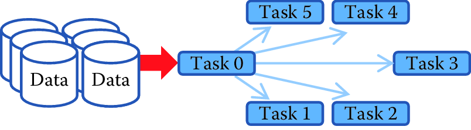
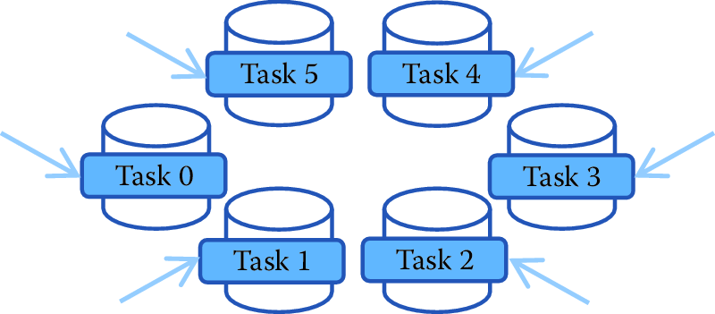
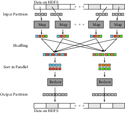

Scaling up through Parallel and Distributed Computing {#chap:parallel}
=========================

**Huy Vo and Claudio Silva**


This chapter provides an overview of techniques that facilitate the use of large amounts of data (often using parallel computing). While the focus is on widely used big data programming paradigm (MapReduce) and popular implementations such as Apache Hadoop and Spark, the goal the chapter is to provide a conceptual framework to the key challenges that the approach is designed to address.

This chapter will describe:

-   Why we need mapreduce
-   What is mapreduce
-   How to use it
-   Hadoop
-   spark
-   Benefits and challenges
-   Examples

-   Where the computer is
-   Where the data is: one disk, or distributed


-   Single processor
-   multiprocessor
-   distributed/parallel
-   laptop/Desktop

-   mapreduce/hadoop
-   Server in IT center

-   mapreduce/hadoop
-   Cloud - AWS, Azure, Google

-   mapreduce/hadoop


Introduction
------------

Why we need parallel computing for social sciences?
What happens when you use traditional programming approaches with data that’s too large to fit into memory on one computer? Or when doing analysis on one computer will just take too long?
Today, when dealing with these scenarios, social scientists might perform sampling and analyze a subset of the data or reduce the type and size of analysis that are done. The techniques described in this chapter allows us to scale the analysis by using all the data and run a larger number of …
Network analysis
Record linkage
ML methods can be parallelized


**This chapter will describe:**
* Why we need mapreduce
* What is mapreduce
* How to use it
* Hadoop
* spark
* Benefits and challenges
* Examples


Parallel computing to deal with large amounts of data are hardly new ideas for dealing with
computational challenges. Scientists have routinely been working on data
sets much larger than a single machine can handle for several decades,
especially at the DOE National Laboratories
[@bigdata_old1; @crossno1993heterogeneous] where high-performance
computing has been a major technology trend. This is also demonstrated
by the history of research in distributed computing and data management
going back to the 1980s [@CSConf].

There are many ways to do distributed and parallel computing, ranging from completely flexible (but more complex to use) approaches such as Message Passing Interface (MPI) [@mpi] to more restrictive (but much easier to use) approaches such as MapReduce. MPI allows you to do anything with as much efficiency as your MPI skills allow you to code while MapReduce allows a more restrictive set of analysis to be done (possibly less efficiently) but is much easier to learn and implement. 

MapReduce{#sec:intro}
-------------------------------
The MapReduce framework only supports two operations: map and reduce. We provide an overview of the MapReduce paradigm and its most popular implementation, Apache Hadoop.
MapReduce framework was proposed by Jeffrey Dean and Sanjay Ghemawat
at Google in 2004 [@MapReduce]. Its origins date back to conceptually
similar approaches first described in the early 1980s. MapReduce was
indeed inspired by the *map* and *reduce* functions of functional
programming, though its `reduce` function is more of a *group-by-key* function,
producing a list of values, instead of the traditional reduce, which
outputs only a single value. MapReduce is a record-oriented model, where
each record is treated as a *key--value* pair; thus, both and functions
operate on key--value pair data.

A typical MapReduce job is composed of three phases---map, shuffle, and
reduce---taking a list of key--value pairs `[(k$_1$,v$_2$), (k$_2$,v$_2$), ..., (k$_n$,v$_n$)]` as input. In the map phase,
each input key--value pair is run through the `map` function, and zero or more
new key--value pairs are output. In the shuffle phase, the framework
sorts the outputs of the map phase, grouping pairs by keys before
sending each of them to the `reduce` function. In the reduce phase, each grouping
of values are processed by the `reduce` function, and the result is a list of new
values that are collected for the job output.

In brief, a MapReduce job just takes a list of key--value pairs as input
and produces a list of values as output. Users only need to implement
interfaces of the `map` and `reduce` functions (the shuffle phase is not very
customizable) and can leave it up to the system that implements
MapReduce to handle all data communications and parallel computing. We
can summarize the MapReduce logic as follows:

**map**: $(k_i, v_i)$ → $[f(k^{'}_{i1}, v^{'}_{i1}),f(k^{'}_{i2}, v^{'}_{i2}),..]$
for a user-defined function $f$.

**reduce**: $(k^{''}_{i}, [v^{''}_{i1},v^{''}_{i2},..])$ → $[v^{'''}_{1},v^{'''}_{2},..]$
where $\{k^{'}_{i}\} \equiv \{k^{''}_{j}\}$ and $v^{'''} = g(v^{''})$
for a user-defined function $g$.

\enlargethispage{12pt}

---

**Example: Counting NSF awards**

To gain a better understanding of these MapReduce operators, imagine
that we have a list of NSF principal investigators, along with their
email information and award IDs as below. Our task is to count the
number of awards for each institution. For example, given the four
records below, we will discover that the Berkeley Geochronology Center
has two awards, while New York University and the University of Utah
each have one.

    AwardId,FirstName,LastName,EmailAddress
    0958723,Roland,Mundil,rmundil@bgc.org
    0958915,Randall,Irmis,irmis@umnh.utah.edu
    1301647,Zaher,Hani,zh8@nyu.edu
    1316375,David,Shuster,dshuster@bgc.org

We observe that institutions can be distinguished by their email address
domain name. Thus, we adopt of a strategy of first grouping all award
IDs by domain names, and then counting the number of distinct award
within each group. In order to do this, we first set the function to
scan input lines and extract institution information and award IDs.
Then, in the function, we simply count unique IDs on the data, since
everything is already grouped by institution. Python pseudo-code is
provided in
Listing 5.1.

```{r, eval = FALSE}
# Input  : a list of text lines
# Output : a list of domain name and award ids
def MAP(lines):
    for line in lines:
        fields     = line.strip('\n').split(',')
        awardId    = fields[0]
        domainName = fields[3].split('@')[-1].split('.')[-2:]
        yield (domainName, awardId)

# Input  : a list of domain name and award ids
# Output : a list of domain name and award count
def REDUCE(pairs):
    for (domainName, awardIds) in pairs:
        count = len(set(awardIds))
        yield (domainName, count)
```
<div style="text-align: center">Listing 5.1. Python pseudo-code for the `map` and `reduce` functions to count the number of awards per institution</div>
<br>

In the map phase, the input will be transformed into tuples of
institutions and award ids:

`"0958723,Roland,Mundil,rmundil@bgc.org"` → `("bgc.org", 0958723)`
`"0958915,Randall,Irmis,irmis@umnh.utah.edu"` → `("utah.edu", 0958915)`
`"1301647,Zaher,Hani,zh8@nyu.edu"` → `("nyu.edu", 1301647)`
`"1316375,David,Shuster,dshuster@bgc.org"` → `("bgc.org", 1316375)`

Then the tuples will be grouped by institutions and be counted by the
function.

`("bgc.org", [0958723,1316375])` → `("bgc.org", 2)`
`("utah.edu", \[0958915\])` → `("utah.edu", 1)`
`("nyu.edu", \[1301647\])` → `("nyu.edu", 1)`

\pagebreak
As we have seen so far, the MapReduce programming model is quite simple
and straightforward, yet it supports a simple parallelization model. In
fact, it has been said to be *too* simple and criticized as "a major
step backwards" [@MapReduceBad] for large-scale, data-intensive
applications. It is hard to argue that MapReduce is offering something
truly innovative when MPI has been offering similar scatter and reduce
operations since 1995, and Python has had high-order functions (`map`, `reduce`, `filter`, and `lambda`) since its 2.2 release in 1994. However, the biggest strength of
MapReduce is its simplicity. Its simple programming model has brought
many non-expert users to big data analysis. Its simple architecture has
also inspired many developers to develop advanced capabilities, such as
support for distributed computing, data partitioning, and streaming
processing. (A downside of this diversity of interest is that available
features and capabilities can vary considerably, depending on the
specific implementation of MapReduce that is being used.)

As mentioned above, MapReduce is a programming model. In order to implement an analysis in MapReduce, we need to select an implementation of MapReduce. Two most commonly used n implementations of the MapReduce model are Hadoop and Spark, that we describe in more detail below.

Apache Hadoop MapReduce
-----------------------


Apache Hadoop (or Hadoop)^[The term *Hadoop* refers to the creator’s son’s toy elephant.] was originally designed to run in environments with thousands of
machines. Supporting such a large computing environment puts several
constraints on the system; for instance, with so many machines, the
system had to assume computing nodes would fail. Hadoop is an enhanced
MapReduce implementation with the support for fault tolerance,
distributed storage, and data parallelism through two added key design
features: (1) a distributed file system called the Hadoop Distributed
File System (HDFS); and (2) a data distribution strategy that allows
computation to be moved to the data during execution.

### The Hadoop Distributed File System

The Hadoop Distributed File System [@Hadoop][@HDFS] is a distributed file system that stores data across all the nodes (machines) of a Hadoop cluster. HDFS splits large data files into
smaller blocks (chunks of data) which are managed by different nodes in a cluster. Each
block is also replicated across several nodes as an attempt to ensure
that a full copy of the data is still available even in the case of
computing node failures. The block size as well as the number of
replications per block are fully customized by users when they create
files on HDFS. By default, the block size is set to 64 MB with a
replication factor of 3, meaning that the system may encounter at least
two concurrent node failures without losing any data. HDFS also actively
monitors failures and re-replicates blocks on failed nodes to make sure
that the number of replications for each block always stays at the
user-defined settings. Thus, if a node fails, and only two copies of
some data exist, the system will quickly copy those data to a working
node, thus raising the number of copies to three again. This dynamic
replication the primary mechanism for fault tolerance in Hadoop.

Note that data blocks are replicated and distributed across several
machines. This could create a problem for users, because if they had to
manage the data manually, they might, for example, have to access more
than one machine to fetch a large data file. Fortunately, Hadoop
provides infrastructure for managing this complexity seamlessly, including command
line programs as well as an API that users can employ to interact with
HDFS as if it were a local file system. For example, one can run simple linux commands such as ls and mkdir to list and create a directory on HDFS, or even use to inspect file
contents the same way as one would do in a Linux file system. The following code
shows some examples of interacting with HDFS.

``` {#lst:hdfs style="PythonStyleInLine" label="lst:hdfs"}
# Creating a folder
hadoop dfs -mkdir /hadoopiseasy

# Upload a CSV file from our local machine to HDFS
hadoop dfs -put importantdata.csv /hadoopiseasy

# Listing all files under hadoopiseasy folder
hadoop dfs -ls /hadoopiseasy

# Download a file to our local machine
hadoop dfs -get /hadoopiseasy/importantdata.csv
```

### Hadoop Setup: Bringing compute to the data

There are two parts of the computing environment when using Hadoop: 
a *compute cluster* with substantial computing
power (e.g., thousands of computing cores)
2. a *storage cluster* with lots of disk space, capable of storing and serving data quickly to the compute cluster. 

These two clusters have quite different hardware specifications: the first is optimized for CPU performance and the second for storage. The two systems are typically configured
as separate physical hardware.

```{r fig5_1b, out.width = '70%', fig.align = 'center', echo = FALSE}

```
```{r fig5-1a, out.width = '70%', fig.align = 'center', echo = FALSE, fig.cap = 'Top: The traditional parallel computing model where data are brought to the computing nodes. Bottom: Hadoop’s parallel computing model: bringing compute to the data [@HadoopParallelModel]'}

```

Running compute jobs on such hardware often goes like this. When a user
requests to run an intensive task on a particular data set, the system
will first reserve a set of computing nodes. Then the data are
partitioned and copied from the storage server into these computing
nodes before the task is executed. This process is illustrated in
Figure \@ref(fig:fig5-1a) (top). This computing model will be referred
to as *bringing data to computation*. In this model, if a data set is
being analyzed in multiple iterations, it is very likely that the data
will be copied multiple times from the storage cluster to the compute
nodes without reusability. This is because the compute node scheduler
normally does not have or keep knowledge of where data have previously
been held. The need to copy data multiple times tends to make such a
computation model inefficient, and I/O becomes the bottleneck when all
tasks constantly pull data from the storage cluster (the green arrow).
This in turn leads to poor scalability; adding more nodes to the
computing cluster would not increase its performance.

To solve this problem, Hadoop implements a *bring compute to the data*
strategy that combines both computing and storage at each node of the
cluster. In this setup, each node offers both computing power and
storage capacity. As shown in
Figure \@ref(fig:fig5-1a) (bottom), when users submit a task to be run on
a data set, the scheduler will first look for nodes that contain the
data, and if the nodes are available, it will schedule the task to run
directly on those nodes. If a node is busy with another task, data will
still be copied to available nodes, but the scheduler will maintain
records of the copy for subsequent use of the data. In addition, data
copying can be minimized by increasing the data duplication in the
cluster, which also increases the potential for parallelism, since the
scheduler has more choices to allocate computing without copying. Since
both the compute and data storage are closely coupled for this model, it
is best suited for data-intensive applications.

Given that Hadoop was designed for batch data processing at scale, this
model fits the system nicely, especially with the support of HDFS.
However, in an environment where tasks are more compute intensive, a
traditional high-performance computing environment is probably best
since it tends to spend more resources on CPU cores. It should be clear
now that the Hadoop model has hardware implications, and computer
architects have optimized systems for data-intensive computing.

### Hardware provisioning

Hadoop requires a distributed cluster of machines to operate
efficiently. (It can be set up to run entirely on a single computer, but
this should only be done for technology demonstration purposes.) This is
mostly because the MapReduce performance heavily depends on the total
I/O throughput (i.e., disk read and write) of the entire system. Having
a distributed cluster, where each machine has its own set of hard
drives, is one of the most efficient ways to maximize this throughput.

A typical Hadoop cluster consists of two types of machine: masters and
workers. Master machines are those exclusively reserved for running
services that are critical to the framework operations. Some examples
are the NameNode and the JobTracker services, which are tasked to manage
how data and tasks are distributed among the machines, respectively. The
worker machines are reserved for data storage and for running actual
computation tasks (i.e., map and reduce). It is normal to have worker
machines that can be included or removed from an operational cluster on
demand. This ability to vary the number of worker nodes makes the
overall system more tolerant of failure. However, master machines are
usually required to be running uninterrupted.

Provisioning and configuring the hardware for Hadoop, like any other
parallel computing, are some of the most important and complex tasks in
setting up a cluster, and they often require a lot of experience and
careful consideration. Major big data vendors provide guidelines and
tools to facilitate the process
[@ApacheAmbari; @ClouderaManager; @Provisioning]. most decisions will be
based on the types of analysis to be run on the cluster, for which only
you, as the user, can provide the best input.

### Programming in Hadoop

Now that we are equipped with the knowledge that Hadoop is a MapReduce
implementation that runs on HDFS and a bring-compute-to-the-data model,
we can go over the design of a Hadoop MapReduce job. A MapReduce job is
still composed of three phases: map, shuffle, and reduce. However,
Hadoop divides the map and reduce phases into smaller tasks.

Each map phase in Hadoop is divided into five tasks: **input format**, **record reader**, **mapper**, **combiner**, and **partitioner**. An [input format]{.roman} task is in charge of talking to the input data
presumably sitting on HDFS, and splitting it into partitions (e.g., by
breaking lines at line breaks). Then a [record reader]{.roman} task is
responsible for translating the split data into the key--value pair
records so that they can be processed by the mapper. By default, Hadoop
parses files into key--value pairs of line numbers and line contents.
However, both input formats and record readers are fully customizable
and can be programmed to read custom data including binary files. It is
important to note that input formats and record readers only provide
data partitioning; they do not move data around computing nodes.

After the records are generated, mappers are spawned---typically on
nodes containing the blocks---to run through these records and output
zero or more new key--value pairs. A mapper in Hadoop is equivalent to
the `map` function of the MapReduce model that we discussed earlier. The
selection of the key to be output from the mapper will heavily depend on
the data processing pipeline and could greatly affect the performance of
the framework. Mappers are executed concurrently in Hadoop as long as
resources permit.

A combiner task in Hadoop is similar to a function in the MapReduce
framework, but it only works locally at each node: it takes output from
mappers executed on the same node and produces aggregated values.
Combiners are optional but can be used to greatly reduce the amount of
data exchange in the shuffle phase; thus, users are encouraged to
implement this whenever possible. A common practice is when a `reduce` function
is both commutative and associative, and has the same input and output
format, one can just use the `reduce` function as the combiner. Nevertheless,
combiners are not guaranteed to be executed by Hadoop, so this should
only be treated as a hint. Its execution must not affect the correctness
of the program.

A partitioner task is the last process taking place in the map phase on
each mapper node, where it hashes the key of each key--value pair output
from the mappers or the combiners into bins. By default, the partitioner
uses object hash codes and modulus operations to direct a designated
reducer to pull data from a map node. Though it is possible to customize
the partitioner, it is only advisable to do so when one fully
understands the intermediate data distribution as well as the
specifications of the cluster. In general, it is better to leave this
job to Hadoop.

Each reduce phase in Hadoop is divided into three tasks: **reducer**, **output format**, and **record writer**. The `reducer`
task is equivalent to the `reduce` function of the MapReduce model. It basically
groups the data produced by the mappers by keys and runs a `reduce` function on
each list of grouping values. It outputs zero or more key--value pairs
for the output format task, which then translates them into a writable
format for the record writer task to serialize on HDFS. By default,
Hadoop will separate the key and value with a tab and write separate
records on separate lines. However, this behavior is fully customizable.
Similarly, the map phase reducers are also executed concurrently in
Hadoop.


```{r hadoop, out.width = '70%', fig.align = 'center', echo = FALSE, fig.cap = 'Data transfer and communication of a MapReduce job in Hadoop. Data blocks are assigned to several maps, which emit key--value pairs that are shuffled and sorted in parallel. The reduce step emits one or more pairs, with results stored on the HDFS'}

```

### Programming language support

\enlargethispage{6pt}
Hadoop is written entirely in Java, thus it is best supporting
applications written in Java. However, Hadoop also provides a *streaming
API* that allows arbitrary code to be run inside the Hadoop MapReduce
framework through the use of UNIX pipes. This means that we can supply a
mapper program written in Python or C++ to Hadoop as long as that
program reads from the standard input and writes to the standard output.
The same mechanism also applies for the combiner and reducer. For
example, we can develop from the Python pseudo-code in
Listing 5.1 to a complete Hadoop streaming mapper
(Listing 5.2) and reducer
(Listing 5.3).

``` {#lst:mapper style="PythonStyle" belowskip="-6pt" caption="A Hadoop streaming mapper in Python" label="lst:mapper" numbers="none"}
#!/usr/bin/env python
import sys

def parseInput():
    for line in sys.stdin:
        yield line

if __name__=='__main__':
    for line in parseInput():
        fields     = line.strip('\n').split(',')
        awardId    = fields[0]
        domainName = fields[3].split('@')[-1].split('.')[-2:]
        print('%s\t%s' % (domainName,awardId))
```
<div style="text-align: center">Listing 5.2. A Hadoop streaming mapper in Python</div>
<br>

``` {#lst:reducer style="PythonStyle" float="b" caption="A Hadoop streaming reducer in Python" label="lst:reducer" numbers="none"}
#!/usr/bin/env python
import sys

def parseInput():
    for line in sys.stdin:
        yield line

if __name__=='__main__':
    for line in parseInput():
        (domainName, awardIds) = line.split('\t')
        count = len(set(awardIds))
        print('%s\t%s' % (domainName, count))
```
<div style="text-align: center">Listing 5.3. A Hadoop streaming reducer in Python</div>
<br>

It should be noted that in Hadoop streaming, intermediate key--value
pairs (the data flowing between mappers and reducers) must be in
tab-delimited format, thus we replace the original `yield` command with a `print`
formatted with tabs. Though the input format and record reader are still
customizable in Hadoop streaming, they must be supplied as Java classes.
This is one of the biggest limitations of Hadoop for Python developers.
They not only have to split their code into separate mapper and reducer
programs, but also need to learn Java if they want to work with
nontextual data.


### Benefits and Limitations of Hadoop


-   **Fault Tolerance**: By default, HDFS uses checksums to enforce data integrity on its file
system use data replication for recovery of potential data losses.
Taking advantage of this, Hadoop also maintains fault tolerance of
MapReduce jobs by storing data at every step of a MapReduce job to HDFS,
including intermediate data from the combiner. Then the system checks
whether a task fails by either looking at its heartbeats (data
activities) or whether it has been taking too long. If a task is deemed
to have failed, Hadoop will kill it and run it again on a different
node. The time limit for the heartbeats and task running duration may
also be customized for each job. Though the mechanism is simple, it
works well on thousands of machines. It is indeed highly robust because
of the simplicity of the model.


-   **Performance**: Hadoop has proven to be a scalable implementation that can run on
    thousands of cores. However, it is also known for having a
    relatively high job setup overheads and suboptimal running time. An
    empty task in Hadoop (i.e., with no mapper or reducer) can take
    roughly 30 seconds to complete even on a modern cluster. This
    overhead makes it unsuitable for real-time data or interactive jobs.
    The problem comes mostly from the fact that Hadoop monitoring
    processes only lives within a job, thus it needs to start and stop
    these processes each time a job is submitted, which in turns results
    in this major overhead. Moreover, the brute force approach of
    maintaining fault tolerance by storing everything on HDFS is
    expensive, especially when for large data sets.

-   **Hadoop streaming support for non-Java applications**: As mentioned previously, non-Java applications may only be
    integrated with Hadoop through the Hadoop streaming API. However,
    this API is far from optimal. First, input formats and record
    readers can only be written in Java, making it impossible to write
    advanced MapReduce jobs entirely in a different language. Second,
    Hadoop streaming only communicates with Hadoop through Unix pipes,
    and there is no support for data passing within the application
    using native data structure (e.g., it is necessary to convert Python
    tuples into strings in the mappers and convert them back into tuples
    again in reducers).

-   **Real-time applications**: With the current setup, Hadoop only supports batch data processing
    jobs. This is by design, so it is not exactly a limitation of
    Hadoop. However, given that more and more applications are dealing
    with real-time massive data sets, the community using MapReduce for
    real-time processing is constantly growing. Not having support for
    streaming or real-time data is clearly a disadvantage of Hadoop over
    other implementations.

-   **Limited data transformation operations**: This is more of a limitation of MapReduce than Hadoop per se.
    MapReduce only supports two operations, map and reduce, and while
    these operations are sufficient to describe a variety of data
    processing pipelines, there are classes of applications that
    MapReduce is not suitable for. Beyond that, developers often find
    themselves rewriting simple data operations such as data set joins,
    finding a min or max, and so on. Sometime, these tasks require more
    than one map-and-reduce operation, resulting in multiple MapReduce
    jobs. This is both cumbersome and inefficient. There are tools to
    automate this process for Hadoop; however, they are only a layer
    above, and it is not easy to integrate with existing customized
    Hadoop applications.

Other MapReduce Implementations
------------

In addition to Apache Hadoop, other notable MapReduce implementations
include MongoDB, GreenplumDB, Disco, Riak, and Spark. MongoDB, Riak, and
Greenplum DB are all database systems^[See Chapter 4.] and thus their MapReduce
implementations focus more on the interoperability of MapReduce and the
core components such as MongoDB's aggregation framework, and leave it up
to users to customize the MapReduce functionalities for broader tasks.
Some of these systems, such as Riak, only parallelize the map phase, and
run the reduce phase on the local machine that request the tasks. The
main advantage of the three implementations is the ease with which they
connect to specific data stores. However, their support for general data
processing pipelines is not as extensive as that of Hadoop.

Disco, similar to Hadoop, is designed to support MapReduce in a
distributed computing environment, but it written in Erlang with a
Python interface. Thus, for Python developers, Disco might be a better
fit. However, it has significantly fewer supporting applications, such
as access control and workflow integration, as well as a smaller
developing community. This is why the top three big data platforms,
Cloudera, Hortonworks, and MapR, still build primarily on Hadoop.

## Apache Spark

Apache Spark is another implementation that aims to support beyond
MapReduce. The framework is centered around the concept of resilient
distributed data sets and data transformations that can operate on these
objects. An innovation in Spark is that the fault tolerance of resilient
distributed data sets can be maintained without flushing data onto
disks, thus significantly improving the system performance (with a claim
of being 100 times faster than Hadoop). Instead, the fault-recovery
process is done by replaying a log of data transformations on
check-point data. Though this process could take longer than reading
data straight from HDFS, it does not occur often and is a fair tradeoff
between processing performance and recovery performance.

Beyond map and reduce, Spark also supports various other transformations
[@SparkTransformation], including filter, data join, and aggregation.
Streaming computation can also be done in Spark by asking Spark to
reserve resources on a cluster to constantly stream data to/from the
cluster. However, this streaming method might be resource intensive
(still consuming resources when there is no data coming). Additionally,
Spark plays well with the Hadoop ecosystem, particularly with the
distributed file system (HDFS) and resource manager (YARN), making it
possible to be built on top of current Hadoop applications.

Another advantage of Spark is that it supports Python natively; thus,
developers can run Spark in a fraction of the time required for Hadoop.
Listing 5.4 provides the full code for the previous example
written entirely in Spark. It should be noted that Spark's concept of
the `reduceByKey` operator is not the same as Hadoop's, as it is designed to aggregate
all elements of a data set into a single element. The closest simulation
of Hadoop's MapReduce pattern is a combination of `mapPartitions`, `groupByKey` and `mapPartitions`, as shown in
the next example.

``` {#lst:spark style="PythonStyle" caption="Python code for a Spark program that counts the number of awards per institution using MapReduce" label="lst:spark" numbers="none"}
import sys
from pyspark import SparkContext
def mapper(lines):
    for line in lines:
        fields     = line.strip('\n').split(',')
        awardId    = fields[0]
        domainName = fields[3].split('@')[-1].split('.')[-2:]
        yield (domainName, awardId)

def reducer(pairs):
    for (domainName, awardIds) in pairs:
        count = len(set(awardIds))
        yield (domainName, count)

if __name__=='__main__':
    hdfsInputPath  = sys.argv[1]
    hdfsOutputFile =  sys.argv[2]
    sc = SparkContext(appName="Counting Awards")
    output = sc.textFile(hdfsInputPath) \
        .mapPartitions(mapper) \
        .groupByKey() \
        .mapPartitions(reducer)

    output.saveAsTextFile(hdfsInputPath)
```
<div style="text-align: center">Listing 5.4. Python code for a Spark program that counts the number of awards
per institution using MapReduce</div>

---

**Example: Analyzing home mortgage disclosure application data**

We use a financial services analysis problem to illustrate the use of
Apache Spark.

Mortgage origination data provided by the Consumer Protection Financial
Bureau provide insightful details of the financial health of the real
estate market. The data [@HDMA], which are a product of the Home
Mortgage Disclosure Act (HMDA), highlight key attributes that function
as strong indicators of health and lending patterns.

Lending institutions, as defined by section 1813 in Title 12 of the
HMDA, decide on whether to originate or deny mortgage applications based
on credit risk. In order to determine this credit risk, lenders must
evaluate certain features relative to the applicant, the underlying
property, and the location. We want to determine whether census tract
clusters could be created based on mortgage application data and whether
lending institutions' perception of risk is held constant across the
entire USA.

For the first step of this process, we study the debt--income ratio for
loans originating in different census tracts. This could be achieved
simply by computing the debt--income ratio for each loan application and
aggregating them for each year by census tract number. A challenge,
however, is that the data set provided by HMDA is quite extensive. In
total, HMDA data contain approximately 130 million loan applications
between 2007 and 2013. As each record contains 47 attributes, varying in
types from continuous variables such as loan amounts and applicant
income to categorical variables such as applicant gender, race, loan
type, and owner occupancy, the entire data set results in about 86 GB of
information. Parsing the data alone could take up to hours on a single
machine if using a naïve approach that scans through the data
sequentially. Tables \@ref(tab:table5-1) and \@ref(tab:table5-2) highlight the breakdown in size per year and
data fields of interest.

Table: (\#tab:table5-1) Home Mortgage Disclosure Act data size

 |  **Year**  |    **Records**   |  **File Size (Gigabytes)**|
 |:------------:|:------------------:|:---------------------------:|
 |    2007    |   26,605,696     |            18|
 |    2008    |   17,391,571     |            12 |
 |    2009    |    19,493,492    |             13|
 |    2010    |    16,348,558    |              11|
 |    2011    |    14,873,416    |             9.4|
 |    2012    |    18,691,552    |             12|
 |    2013    |    17,016,160    |             11|
 |  **Total** |  **130,420,445** |          **86.4**|
<br>

Table: (\#tab:table5-2) Home Mortgage Disclosure Act data size

|  **Index** |  **Attribute**  |     **Type**|
|-----------|------------------|:----------:|
 | 0          | Year             |   Integer|
 | 1         |  State            |    String|
 | 2         |  County           |    String|
 | 3         |  Census Tract      |   String|
 | 4         |  Loan Amount       |   Float|
 | 5         |  Applicant Income  |   Float|
 | 6         |  Loan Originated   |  Boolean|
 |...|...|...|
<br>

Observing the transactional nature of the data, where the aggregation
process could be distributed and merged across multiple partitions of
the data, we could complete this task in much less time by using Spark.
Using a cluster consisting of 1,200 cores, the Spark program in
Listing 5.5 took under a minute to complete. The substantial
performance gain comes not so much from the large number of processors
available, but mostly from the large I/O bandwidth available on the
cluster thanks to the 200 distributed hard disks and fast network
interconnects.

``` {#lst:hdma style="PythonStyle" caption="Python code for a Spark program to aggregate the debt--income ratio for loans originated in different census tracts" label="lst:hdma" numbers="none"}
import ast
import sys
from pyspark import SparkContext

def mapper(lines):
    for line in lines:
        fields = ast.literal_eval('(%s)' % line)
        (year, state, county, tract) = fields[:4]
        (amount, income, originated) = fields[4:]

        key = (year, state, county, tract)
        value = (amount, income)

        # Only count originated loans
        if originated:
            yeild (key, value)

def sumDebtIncome(debtIncome1, debtIncome2):
    return (debtIncome1[0] + debtIncome2[0], debtIncome1[1] + debtIncome2[1])

if __name__=='__main__':
    hdfsInputPath  = sys.argv[1]
    hdfsOutputFile =  sys.argv[2]
    sc = SparkContext(appName="Counting Awards")
    sumValues = sc.textFile(hdfsInputPath) \
        .mapPartitions(mapper) \
        .reduceByKey(sumDebtIncome)

    # Actually compute the aggregated debt income
    output = sumValues.mapValues(lambda debtIncome: debtIncome[0]/debtIncome[1])

    output.saveAsTextFile(hdfsInputPath)
```
<div style="text-align: center">Listing 5.5. Python code for a Spark program to aggregate the debt–income ratio
for loans originated in different census tracts</div>

---


Summary
-------


Analyzing large amounts of data means that it is necessary to both store very large collections
of data and perform aggregate computations on those data. This chapter
Describes an important data storage approach (the Hadoop Distributed
File System) and a way of processing large-scale data sets (the
MapReduce model, as implemented in both Hadoop and Spark). This
model enables not only large-scale data analysis but also provides easy to use implementations for more flexibility for social scientists to work with
large amounts of data. This increases the analytic throughput as
well as the time to insight, speeding up the decision-making process and
thus increasing impact.

Resources
---------

There are a wealth of online resources describing both Hadoop and Spark.
See, for example, the tutorials on the Apache Hadoop [@AHweb] and Spark
[@ASweb] websites. Albanese describes how to use Hadoop for social
science [@socialhadoop], and Lin and Dyer discuss the use of MapReduce
for text analysis [@lin2010data].

