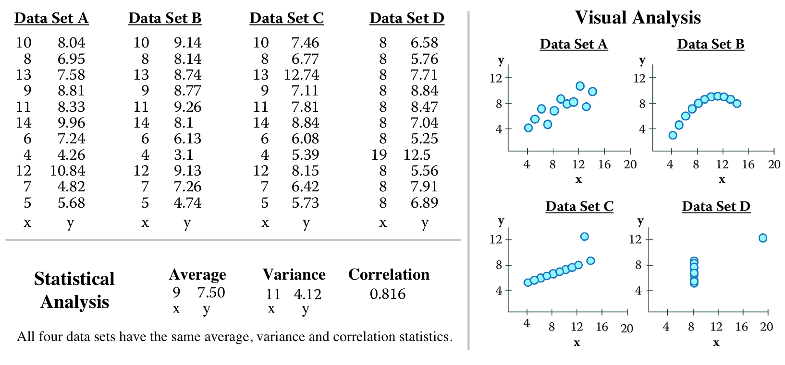
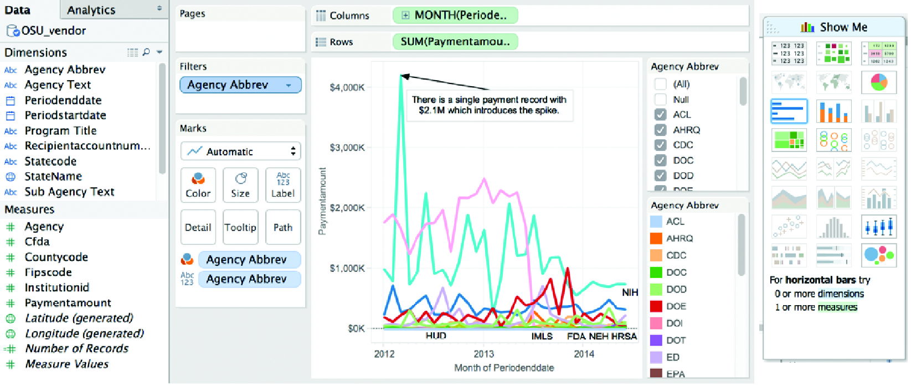
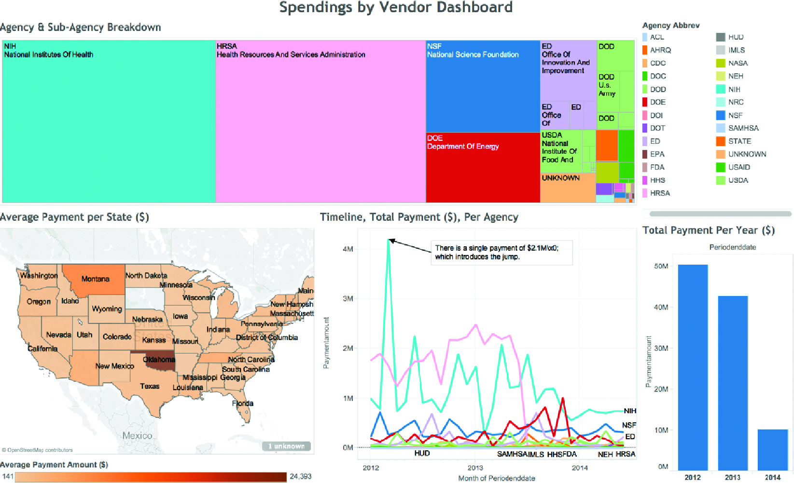
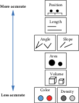
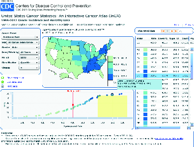
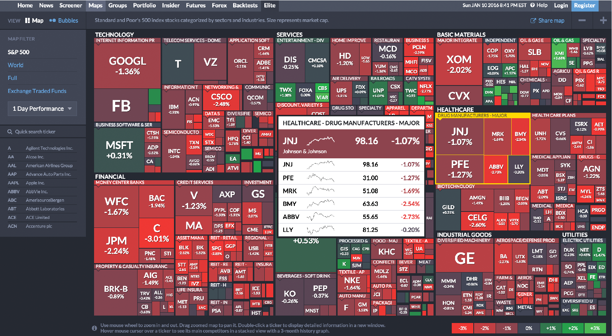
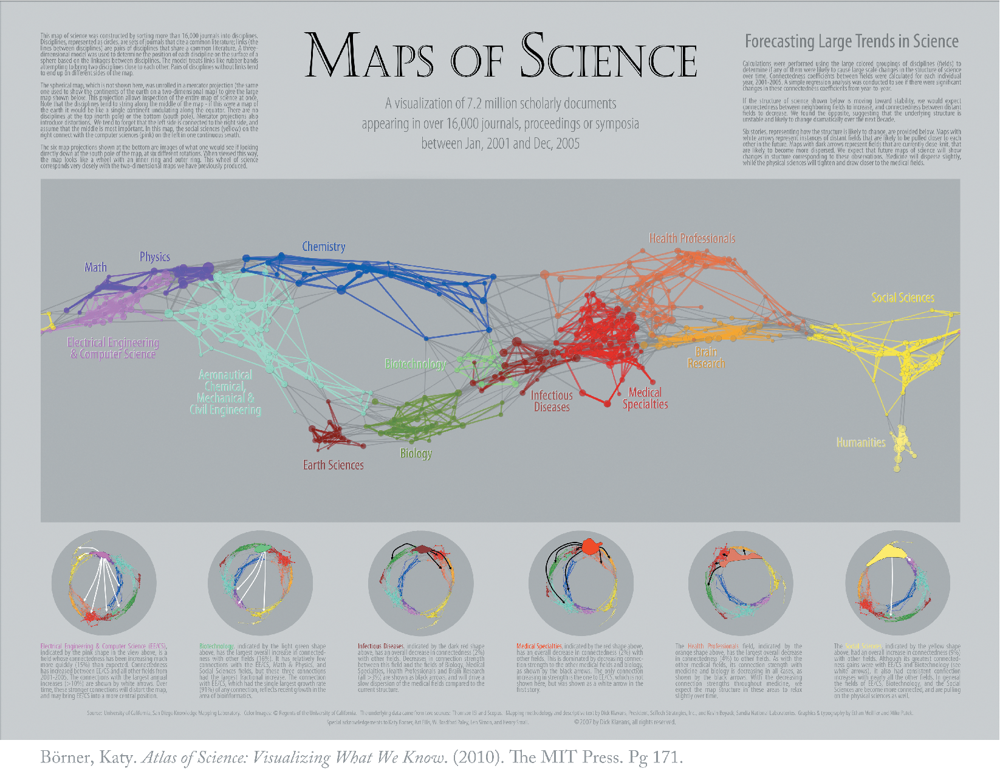

<!-- % done --> 

Information Visualization {#chap:viz}
=========================

**M. Adil Yalcin and Catherine Plaisant**


This chapter will show you how to use visualization to explore data as well as to communicate results so that data can be turned into interpretable, actionable information.
There are many ways of presenting statistical information that convey
content in a rigorous manner. The goal of this chapter is to present an
introductory overview of effective visualization techniques for a range
of data types and tasks, and to explore the foundations and challenges
of information visualization at different stages of a project.


Introduction {#sec:viz-1}
------------

One of the most famous discoveries in science---that disease was
transmitted through germs, rather than through pollution--- resulted
from insights derived from a visualization of the location of London
cholera deaths near a water pump [@snow1855mode]. Information
visualization in the twenty-first century can be used to generate
similar insights: detecting financial fraud, understanding the spread of
a contagious illness, spotting terrorist activity, or evaluating the
economic health of a country. But the challenge is greater: many
($10^{2}$--$10^{7}$) items may be manipulated and visualized, often
extracted or aggregated from yet larger data sets, or generated by
algorithms for analytics.

Visualization tools can organize data in a meaningful way that lowers
the cognitive and analytical effort required to make sense of the data
and make data-driven decisions. Users can scan, recognize, understand,
and recall visually structured representations more rapidly than they
can process nonstructured representations. The science of visualization
draws on multiple fields such as perceptual psychology, statistics, and
graphic design to present information, and on advances in rapid
processing and dynamic to design user interfaces that permit powerful
interactive visual analysis.

Figure \@ref(fig:fig9-1), "Anscombe's quartet" [@anscombe1973graphs],
provides a classic example of the value of visualization compared to
basic descriptive statistical analysis. The left-hand panel includes raw
data of four small number-pair data sets (A, B, C, D), which have the
same average, median, and standard deviation and have correlation across
number pairs. The right-hand panel shows these data sets visualized with
each point plotted on perpendicular axes (scatterplots), revealing
dramatic differences between the data sets, trends, and outliers
visually.

```{r fig9-1, out.width = '90%', fig.align = 'center', echo = FALSE, fig.cap = 'Adapted from Anscombe`s quartet [@anscombe1973graphs]'}

```
 
In broad terms, visualizations are used either to present results or for
analysis and open-ended exploration. This chapter provides an overview
of how modern information visualization, or visual data mining, can be
used to in the context of big data.

Developing effective visualizations {#sec:viz-2}
-----------------------------------

The effectiveness of a visualization depends on both analysis needs and
design goals. Sometimes, questions about the data are known in advance;
in other cases, the goal may be to explore new data sets, generate
insights, and answer questions that are unknown before starting the
analysis. The design, development, and evaluation of a visualization is
guided by understanding the background and goals of the target audience
(see Box 9.1^[See Chapters [Working with Web Data and APIs](#chap:web), 
[Record Linkage](#chap:link), [Databases](#chap:db), and [Scaling up through Parallel and Distributed Computing](#chap:parallel) for an overview of collecting, merging, storing, and processing data sets.]).

```{block, type='F00'}
**Box 9.1:**
The development of an
effective visualization is a continous process that generally includes
the following activities:

-   Specify user needs, tasks, accessibility requirements and criteria
    for success.

-   Prepare data (clean, transform).

-   Design visual representations.

-   Design interaction.

-   Plan sharing of insights, provenance.

-   Prototype/evaluate, including usability testing.

-   Deploy (monitor usage, provide user support, manage revision
    process).
```

If the goal is to present results, there is a wide spectrum of users and
a wide range of options. If the audience is broad, then *infographics*
can be developed by graphic designers, as described in classic texts
(see [@few2009now; @edward2001visual; @edward2006beauty] or the examples
compiled by Harrison et al. [@harrison2015infographic; @harrisonweb]).
If, on the other hand, the audience comprises domain experts interested in
monitoring the overview status of dynamic processes on a continuous basis,
monitoring *dashboards* with no or little interactivity can be used. 
Examples include the monitoring of sales, or the number of tweets about 
people, or symptoms of the flu and how they compare to a baseline
[@few2013information]. Such dashboards, composed of multiple charts of 
different operational data, can increase situational awareness so that 
problems can be noticed and solved early and better decisions can be 
made with up-to-date information.

Another goal of visualization is to enable *interactive exploratory analysis*. This approach goes beyond a visual snapshot of data for presentation, and provides many windows into different parts and relationships within data on demand. Tailor-made solutions can focus on specific querying and navigation tasks given a specific data. For example, the BabyNameVoyager (http://www.babynamewizard.com/voyager/) lets users type in a name and see a graph of its popularity over the past century. With each letter typed, the page filters baby names starting with the input (such as Joan, Joyce and John for input “Jo”).”

```{r fig9-2a, out.width = '90%', fig.align = 'center', echo = FALSE, fig.cap = 'Aid Worker Security Incidents Analysis Dashboard (https://gallery.keshif.me/AidWorkerSecurity)'}
knitr::include_graphics("ChapterViz/figures/fig9-2a-new.png")
```

In addition, detailed aspects of a dataset can be made explorable by advanced data querying, navigation and view options. Figure \@ref(fig:fig9-2a) shows an interactive dashboard that visualizes the data from the Humanitarian Outcomes' Aid Worker Security Database (https://aidworkersecurity.org/). In this example, the event point locations are clustered on a map, and surrounding charts show trends in attack means, context, location types, region, country, as well as event date and the number of affected people. This view also presents a breakdown of data by location type, shown using color, includes contextual tooltips that provide details on a geographic cluster of points. Additional shortcuts on top allow navigation to key alternative insights as a storytelling tool.

```{r fig9-3a, out.width = '90%', fig.align = 'center', echo = FALSE, fig.cap = 'Charting interface of Tableau'}

```

```{r fig9-3b, out.width = '90%', fig.align = 'center', echo = FALSE, fig.cap = 'A treemap visualization of agency and sub-agency spending breakdown'}

```

To create interactive charts and dashboards from new datasets for analysis, products and tools, such as Tableau, PowerBI, Keshif, and others (see Section [Resources](#sec:viz-6)), offer a range of chart types with various parameters, as well as visual design environments that allow combining and sharing these charts in potent dashboards. For example, Figure
\@ref(fig:fig9-3a) shows the charting interface of Tableau on a
transaction data set. The left-hand panel shows the list of attributes
associated with vendor transactions for a given university. The
visualization (center) is constructed by placing the month of spending
in chart columns, and the sum of payment amount on the chart row, with
data encoded using line mark type. Agencies are broken down by color
mapping. The agency list, to the right, allows filtering the agencies,
which can be used to simplify the chart view. A peak in the line chart
is annotated with an explanation of the spike. On the rightmost side,
the Show Me panel suggests the applicable chart types potentially
appropriate for the selected attributes. This chart can be combined with
other charts focusing on other aspects in interactive dashboards.
Figure \@ref(fig:fig9-3b) shows a treemap [@johnson1991tree] for agency
and sub-agency spending breakdown, combined with a map showing average
spending per state. Oklahoma state stands out with few but large
expenditures. Mousing-over Oklahoma reveals details of these
expenditures. An additional histogram provides an overview of spending
change across three years.

Creating effective visualizations requires careful consideration of many
components. Data values may be encoded using one or more visual
elements, like position, length, color, angle, area, and texture
(Figure \@ref(fig:fig9-4); see also
[@cleveland1984graphical; @edward2001visual]). Each of these can be
organized in a multitude of ways, discussed in more detail by Munzner
[@munzner2014visualization]. In addition to visual data encoding, units
for axes, labels, and legends need to be provided as well as
explanations of the mappings when the design is unconventional. A visually
compelling example is “how to read this data” section of “A world of Terror”
project by Periscopic (https://terror.periscopic.com/).

Annotations or comments can be used to guide viewer
attention and to describe related insights. Providing attribution and
data source, where applicable, is an ethical practice that also enables
validating data, and promotes reuse to explore new perspectives.

```{r fig9-4, out.width = '50%', fig.align = 'center', echo = FALSE, fig.cap = 'Visual elements described by MacKinlay [@mackinlay1986automating]'}

```

The following is a short list of guidelines: provide immediate feedback
upon interaction with the visualization; generate tightly coupled views
(i.e., so that selection in one view updates the others); and use a high
"data to ink ratio" [@edward2001visual]. Use color carefully and ensure
that the visualization is truthful (e.g., watch for perceptual biases or
distortion). Avoid use of three-dimensional representations or
embellishments, since comparing 3D volumes is perceptually challenging
and occlusion is a problem. Labels and legends should be meaningful,
novel layouts should be carefully explained, and online visualizations
should adapt to different screen sizes. For extended and in-depth
discussions, see various textbooks
[@few2009now; @kirk2012data; @ward2010interactive; @munzner2014visualization; @edward2001visual; @edward2006beauty].

We provide a summary of the basic tasks that users typically perform
during visual analysis of data in the next section.

A data-by-tasks taxonomy {#sec:viz-3}
------------------------

We give an overview of visualization approaches for six common data
types: multivariate, spatial, temporal, hierarchical, network, and text
[@shneiderman2015sharpening]. For each data type listed in this section,
we discuss its distinctive properties, the common analytical questions,
and examples. Real-life data sets often include multiple data types
coming from multiple sources. Even a single data source can include a
variety of data types. For example, a single data table of countries (as
rows) can have a list of attributes with varying types: the growth rate
in the last 10 years (one observation per year, time series data), their
current population (single numerical data), the amount of trade with
other countries (networked/linked data), and the top 10 exported
products (if grouped by industry, hierarchical data). 

In addition to common data types, Box 9.2 provides an overview of common tasks for visual data analysis, which can be applied across different data types
based on goals and types of visualizations.

```{block, type='F00'}
**Box 9.2: A task categorization for visual data analysis**

Select/Query

-   Filter to focus on a subset of the data

-   Retrieve details of item

-   Brush linked selections across multiple charts

-   Compare across multiple selections

Navigate

-   Scroll along a dimension (1D)

-   Pan along two dimensions (2D)

-   Zoom along the third dimension (3D)

Derive

-   Aggregate item groups and generate characteristics

-   Cluster item groups by algorithmic techniques

-   Rank items to define ordering

Organize

-   Select chart type and data encodings to organize data

-   Layout multiple components or panels in the interface

Understand

-   Observe distributions

-   Compare items and distributions

-   Relate items and patterns

Communicate

-   Annotate findings

-   Share results

-   Trace action histories
```

Interactive visualization design should also consider the devices where data will be viewed and interacted. Conventionally, visualizations have been designed for
mouse and keyboard interaction on desktop computers. However, a wider
range of device forms, such as mobile devices with small displays and
touch interaction, is becoming common. Creating visualizations for new
forms requires special care, though basic design principles such as
"less is more" still apply.

### Multivariate data {#sec:viz-2.1}

In common tabular data, each record (row) has a list of attributes
(columns), whose value is mostly categorical or numerical. The analysis
of multivariate data with basic categorical and interval types aims to
understand patterns within and across data attributes. Given a larger number of
attributes, one of the challenges in data exploration and analytics is
to select the attributes and relations to focus on. Expertise in the
data domain can be helpful for targeting relevant attributes.

Multivariate data can be presented in multiple forms of charts depending
on the data and relations being explored. One-dimensional (1D) charts
present data on a single axis only. An example is a *box-plot*, which
shows quartile ranges for numerical data. So-called 1.5D charts list the
range of possible values on one axis, and describe a measurement of data
on the other. *Bar charts* are a ubiquitous chart type that can effectively visualize numeric data, 
for example, a numeric grade per student, or grade average for
aggregated student groups by gender. Records can also be grouped over
numerical ranges such as sales price, and bars can show the number of items in each
grouping, which generates a *histogram* chart. Two-dimensional charts, such as scatterplots, 
plot data along two attributes, such as *scatterplots*. Matrix (grid)
charts can also be used to show relations between two attributes.
*Heatmaps* visualize each matrix cell using color to represent its
value. *Correlation matrices* show the relation between attribute pairs.

To show relations of more than two attributes (3D+), one option is to
use additional visual encodings in a single chart, for example, by
adding point size/shape as a data variable in scatterplots. Another
option is to use alternative visual designs that can encode multiple
relations within a single chart. For example, a *parallel coordinate
plot* [@inselberg2009] has multiple parallel axes, each one representing
an attribute; each record is shown as connected lines passing through
the record's values on each attribute. Charts can also show
part-of-whole relations using appropriate mappings based on subdividing
the chart space, such as stacked charts or pie charts.

Finally, another approach to analyzing multidimensional data is to use
clustering algorithms to identify similar items. Clusters are typically
represented as a tree structure (see Section [Hierarchical data](#sec:viz-2.5)). 
For example, $k$-means clustering starts by
users specifying how many clusters to create; the algorithm then places
every item into the most appropriate cluster. Surprising relationships
and interesting outliers may be identified by these techniques on
mechanical analysis algorithms. However, such results may require more
effort to interpret.

### Spatial data {#sec:viz-2.2}

Spatial data convey a physical context, commonly in a 2D space, such as
geographical maps or floor plans. Several of the most examples of
information visualization include maps, from the 1861 representation of
Napoleon's ill-fated Russian campaign by Minard (popularized by Tufte
[@edward2001visual] and Kraak [@Kraak2014]) to the interactive
HomeFinder application that introduced the concept of dynamic queries
[@ahlberg1992dynamic]. The tasks include finding adjacent items, regions
containing certain items or with specific characteristics, and paths
between items---and performing the basic tasks listed in
Box 9.1.

The primary form of visualizing spatial data is *maps*. In *choropleth
maps*, color encoding is used to add represent one data attribute.
*Cartograms* aim to encode the attribute value with the size of regions
by distorting the underlying physical space. *Tile grid maps* reduce
each spatial area to a uniform size and shape (e.g., a square) so that
the color-coded data are easier to observe and compare, tile grid maps convert each spatial region to a fixed shape, such as a square tile and arrange these tiles to approximate and maintain relative physical positions of the regions  [@DeBelius2015; @ProtoVis2015]. Grid maps also make selection
of smaller areas (such as small cities or states) easier. *Contour
(isopleth) maps* connect areas with similar measurements and color each
one separately. *Network maps* aim to show network connectivity between
locations, such as flights to/from many regions of the world. Spatial
data can be also presented with a nonspatial emphasis (e.g., as a
hierarchy of continents, countries, and cities, such as by using a treemap chart.).

```{r fig9-5, out.width = '90%', fig.align = 'center', echo = FALSE, fig.cap = 'The US Cancer Atlas [@usca]. Interface based on [@maceachren2008design]'}

```

Maps are commonly combined with other visualizations. For example, in
Figure \@ref(fig:fig9-5), the US Cancer Atlas combines a map showing
patterns across states on one attribute, with a sortable table providing
additional statistical information and a scatterplot that allows users
to explore correlations between attributes. Figures \@ref(fig:fig9-2a) and \@ref(fig:fig9-3b) also demonstrate the use of different map designs in the context of larger analytical solutions.

### Temporal data {#sec:viz-2.4}

Time is the unique dimension in our physical world that steadily flows
forward. While we cannot control time, we frequently record it as a
point or  an interval. Figures \@ref(fig:fig9-2a) and \@ref(fig:fig9-3a) 
exemplify line charts that show trends over multiple years, with each 
single line representing a subset of the data for cross-comparison of temporal
trends. Temporal data also has multiple levels of representation (year,
month, day, hour, minute, and so on) with irregularities (leap year,
different days per month, etc.). As we measure time based on cyclic
events in nature (day/night), our representations are also commonly
cyclic. For example, January follows December (first month follows
last). This cyclic nature can be captured by circular visual encodings,
such as the the conventional clock with hour, minute, and second hands.

Time series data (Figures \@ref(fig:fig9-6) and \@ref(fig:fig9-7))
describe values measured at regular intervals, such as stock market or
weather data. The focus of analysis is to understand temporal trends and
anomalies, querying for specific patterns, or prediction. To show
multiple time-series trends across different data categories in a very
compact chart area, each trend can be shown with small height using a
multi-layered color approach, creating horizon graphs. While
perceptually effective after learning to read its encoding, this chart
design may not be appropriate for audiences who may lack such training
or familiarity.

```{r fig9-6, out.width = '90%', fig.align = 'center', echo = FALSE, fig.cap = 'Horizon graphs used to display time series'}
knitr::include_graphics("ChapterViz/figures/fig9-6.png")
```

```{r fig9-7, out.width = '90%', fig.align = 'center', echo = FALSE, fig.cap = 'EventFlow (https://hcil.umd.edu/eventflow/) is used to visualize sequences of innovation activities by Illinois companies. Created with EventFlow; data sources include NIH, NSF, USPTO, SBIR. Image created by C. Scott Dempwolf, used with permission'}
knitr::include_graphics("ChapterViz/figures/fig9-7.png")
```

Another form of temporal analysis is understanding sequences of events.
The study of human activity often includes analyzing event sequences.
For example, students' records include events such as attending
orientation, getting a grade in a class, going on internship, and
graduation. In the analysis of event sequences, finding the most common
patterns, spotting rare ones, searching for specific sequences, or
understanding what leads to particular types of events is important
(e.g., what events lead to a student dropping out, precede a medical
error, or a company filing bankruptcy).
Figure \@ref(fig:fig9-7) shows EventFlow used to visualize sequences of
innovation activities by Illinois companies. Activity types include
research, invention, prototyping, and commercialization. The timeline
(right panel) shows the sequence of activities for each company. The
overview panel (center) summarizes all the records aligned by the first
prototyping activity of the company. In most of the sequences shown
here, the company's first prototype is preceded by two or more patents
with a lag of about a year.

### Hierarchical data {#sec:viz-2.5}

Data are often organized in a hierarchical fashion. Each item appears in
one grouping (e.g., like a file in a folder), and groups can be grouped
to form larger groups (e.g., a folder within a folder), up to the root
(e.g., a hard disk). Items, and the relations between items and their
grouping, can have their own attributes. For example, the National
Science Foundation is organized into directorates and divisions, each
with a budget and a number of grant recipients.

Analysis may focus on the structure of the relations, by questions such
as "how deep is the tree?", "how many items does this branch have?", or
"what are the characteristics of one branch compared to another?" In
such cases, the most appropriate representation is usually a node-link
diagram [@plaisant2002spacetree; @card2002degree]. In
Figure \@ref(fig:fig9-8), Spacetree is used to browse a company organizational
chart. Since not all the nodes of the tree fit on the screen, we see an
iconic representation of the branches that cannot be displayed,
indicating the size of each branch. As the tree branches are opened or
closed, the layout is updated with smooth multiple-step animations to
help users remain oriented.

When the structure is less important but the attribute values of the
leaf nodes are of primary interest, treemaps, a space-filling approach,
are preferable as they can show arbitrary-sized trees in a fixed
rectangular space and map one attribute to the size of each rectangle
and another to color. For example,
Figure \@ref(fig:fig9-9) shows the Finviz treemap that helps users monitor
the stock market. Each stock is shown as a rectangle. The size of the
rectangle represents market capitalization, and color indicates whether
the stock is going up or down. Treemaps are effective for situation
awareness: we can see that today is a fairly bad day as most stocks are
red (i.e., down). Stocks are organized in a hierarchy of industries,
allowing users to see that "healthcare technology" is not doing as
poorly as most other industries. Users can also zoom on healthcare to
focus on that industry.

```{r fig9-8, out.width = '90%', fig.align = 'center', echo = FALSE, fig.cap = 'SpaceTree (http://www.cs.umd.edu/hcil/spacetree/)'}
knitr::include_graphics("ChapterViz/figures/fig9-8.png")
```

```{r fig9-9, out.width = '90%', fig.align = 'center', echo = FALSE, fig.cap = 'The Finviz treemap helps users monitor the stock market (https://www.finviz.com/)'}

```

### Network data {#sec:viz-2.6}

```{r fig9-10, out.width = '90%', fig.align = 'center', echo = FALSE, fig.cap = 'NodeXL showing innovation networks of the Great Lakes manufacturing region. Created with NodeXL. Data source: USPTO. Image created by C. Scott Dempwolf, used with permission'}
knitr::include_graphics("ChapterViz/figures/fig9-10.png")
```

Network data encode relationships between items^[See Chapter 
[Networks: The Basics](#chap:networks).]: for example, social
connection patterns (friendships, follows and reposts, etc.), travel
patterns (such as trips between metro stations), and communication
patterns (such as emails). The network overviews attempt to reveal the
structure of the network, show clusters of related items (e.g., groups
of tightly connected people), and allow the path between items to be
traced. Analysis can also focus on attributes of the items and the links
in between, such as age of people in communication or the average
duration of communications.

```{r fig9-10b, out.width = '90%', fig.align = 'center', echo = FALSE, fig.cap = 'An example from "Maps of Science: Forecasting Large Trends in Science," 2007, The Regents of the University of California, all rights reserved [@borner2010atlas]'}

```

Node-link diagrams are the most common representation of network 
structures and overviews (Figures \@ref(fig:fig9-10) and
\@ref(fig:fig9-10b), and may use linear (arc), circular, or force-
directed layouts for positioning the nodes (items). Matrices or grid
layouts are also a valuable way to represent networks
[@henry2006matrixexplorer]. Hybrid solutions have been proposed, with
powerful ordering algorithms to reveal clusters [@hansen2010analyzing].
A major challenge in network data exploration is in dealing with larger
networks where nodes and edges inevitably overlap by virtue of the
underlying network structure, and where aggregation and filtering may be
needed before effective overviews can be presented to users.

Figure \@ref(fig:fig9-10) shows the networks of inventors (white) and
companies (orange) and their patenting connections (purple lines) in the
network visualization NodeXL. Each company and inventor is also
connected to a location node (blue = USA; yellow = Canada). Green lines
are weak ties based on patenting in the same class and subclass, and
they represent potential economic development leads. The largest of the
technology clusters are shown using the *group-in-a-box* layout option,
which makes the clusters more visible. Note the increasing level of
structure moving from the cluster in the lower right to the main cluster
in the upper left. NodeXL is designed for interactive network
exploration; many controls (not shown in the figure) allow users to zoom
on areas of interest or change options.
Figure \@ref(fig:fig9-10b) shows an example of network visualization on
science as a topic used for data presentation in a book and a traveling
exhibit. Designed for print media, it includes a clear title and
annotations and shows a series of topic clusters at the bottom with a
summary of the insights gathered by analysts.

### Text data {#sec:viz-2.7}

Text is usually preprocessed (for word/paragraph counts, sentiment
analysis, categorization, etc.) to generate metadata about text
segments, which are then visualized^[See Chapter [Text Analysis](#chap:text) 
for text analysis approaches.]. Simple visualizations like tag
clouds display statistics about word usage in a text collection, or can
be used to compare two collections or text segments. While visually
appealing, they can easily be misinterpreted and are often replaced by
word indexes sorted by some count of interest. Specialized visual text
analysis tools combine multiple visualizations of data extracted from
the text collections, such as matrices to see relations, network
diagrams, or parallel coordinates to see entity relationships (e.g.,
between what, who, where, and when). Timelines can be mapped to the
linear dimension of text.
Figure \@ref(fig:fig9-11) shows an example using Jigsaw
[@stasko2008jigsaw] for the exploration of car reviews. Entities have
been extracted automatically (in this case make, model, features, etc.),
and a cluster analysis has been performed, visualized in the bottom
right. A separate view (rightmost) allows analysts to review links
between entities. Another view allows traversing word sequences as a
tree. Reading original documents is critical, so all the visualization
elements are linked to the corresponding text.

```{r fig9-11, out.width = '90%', fig.align = 'center', echo = FALSE, fig.cap = 'Jigsaw used to explore a collection of car reviews'}
knitr::include_graphics("ChapterViz/figures/fig9-11.png")
```

Challenges {#sec:viz-4}
----------

While information visualization is a powerful tool, there are many
obstacles to its effective use. We note here four areas of particular
concern: scalability, evaluation, visual impairment, and visual
literacy.

### Scalability {#sec:viz-4.1}

Most visualizations handle relatively small data sets (between a
thousand and a hundred thousand, sometimes up to millions, depending on
the technique) but scaling visualizations from millions to billions of
records does require careful coordination of analytic algorithms to
filter data or perform rapid aggregation, effective visual summary
designs, and rapid refreshing of displays [@shneiderman2008extreme]. The
visual information seeking mantra, "Overview first, zoom and filter,
then details on demand," remains useful with data at scale. To
accommodate a billion records, aggregate markers (which may represent
thousands of records) and density plots are useful [@dunne2013motif]. In
some cases the large volume of data can be aggregated meaningfully into
a small number of pixels. One example is Google Maps and its
visualization of road conditions. A quick glance at the map allows
drivers to use a highly aggregated summary of the speed of a large
number of vehicles and only a few red pixels are enough to decide when
to get on the road.

While millions of graphic elements may be represented on large screens
[@fekete2002interactive], perception issues need to be taken into
consideration [@yost2007beyond]. Extraction and filtering may be
necessary before even attempting to visualize individual records
[@wongsuphasawat2014using]. Preserving interactive rates in querying big
data sources is a challenge, with a variety of methods proposed, such as
approximations [@fisher2012trust] and compact caching of aggregated
query results [@lins2013nanocubes]. Progressive loading and processing
will help users review the results as they appear and steer the lengthy
data processing [@glueck2014dive; @fekete2015progressivis]. Systems are
starting to emerge, and strategies to cope with volume and variety of
patterns are being described [@shneiderman2015sharpening].

### Evaluation {#sec:viz-4.2}

Human-centric evaluation of visualization techniques can generate
qualitative and quantitative assessments of their potential quality,
with early studies focusing on the effectiveness of basic visual
variables [@mackinlay1986automating]. To this day, user studies remain
the workhorse of evaluation. In laboratory settings, experiments can
demonstrate faster task completion, reduced error rates, or increased
user satisfaction. These studies are helpful for comparing visual and
interaction designs. For example, studies are reporting on the effects
of latency on interaction and understanding [@liu2014effects], and often
reveal that different visualizations perform better for different tasks
[@saket2014node; @plaisant2002spacetree]. Evaluations may also aim to
measure and study the amount and value of the insights revealed by the
use of exploratory visualization tools [@saraiya2005insight]. Diagnostic
usability evaluation remains a cornerstone of user-centered design.
Usability studies can be conducted at various stages of the development
process to verify that users are able to complete benchmark tasks with
adequate speed and accuracy. Comparisons with the technology previously
used by target users may also be possible to verify improvements.
Metrics need to address the learnability and utility of the system, in
addition to performance and user satisfaction [@lam2012empirical]. Usage
data logging, user interviews, and surveys can also help identification
of potential improvements in visualization and interaction design.

### Visual impairment {#sec:viz-4.3}

Color impairment is a common condition that needs to be taken into
consideration [@olson1997evaluation]. For example, red and green are
appealing for their intuitive mapping to positive or negative outcomes
(also depending on cultural associations); however, users with
red--green color blindness, one of the most common forms, would not be
able to differentiate such scales clearly. To assess and assist visual
design under different color deficiencies, color simulation tools can be
used (see additional resources). The impact of color impairment can be
mitigated by careful selection of limited color schemes, using double
encoding when appropriate (i.e., using symbols that vary by both shape
and color), and allowing users to change or customize color palettes. To
accommodate users with low vision, adjustable size and zoom settings can
be useful. Users with severe visual impairments may require alternative
accessibility-first interface and interaction designs.

### Visual literacy {#sec:viz-4.4}

While the number of people using visualization continues to grow, not
everyone is able to accurately interpret graphs and charts. When
designing a visualization for a population of users who are expected to
make sense of the data without training, it is important to adequately
estimate the level of visual literacy of those users. Even simple
scatterplots can be overwhelming for some users. Recent work has
proposed new methods for assessing visual literacy [@boy2014principled],
but user testing with representative users in the early stages of design
and development will remain necessary to verify that adequate designs
are being used. Training is likely to be needed to help analysts get
started when using visual analytics tools. Recorded video
demonstrations and online support for question answering are helpful to
bring users from novice to expert levels.

Summary {#sec:viz-5}
-------

The use of information visualization is spreading widely, with a growing
number of commercial products and additions to statistical packages now
available. Careful user testing should be conducted to verify that
visual data presentations go beyond the desire for eye-candy in
visualization, and to implement designs that have demonstrated benefits
for realistic tasks. Visualization is becoming increasingly used by the
general public and attention should be given to the goal of universal
usability so the widest range of users can access and benefit from new
approaches to data presentation and interactive analysis.

Resources {#sec:viz-6}
---------

We have referred to various textbooks throughout this chapter. Tufte's
books remain the classics, as inspiring to read as they are instructive
[@edward2001visual; @edward2006beauty]. We also recommend Few's books on
information visualization [@few2009now] and information dashboard design
[@few2013information]. See also the book's website for further readings.

Given the wide variety of goals, tasks, and use cases of visualization,
many different data visualization tools have been developed that address
different needs and appeal to different skill levels. In this chapter we
can only point to a few examples to get started. To generate a wide
range of visualizations and dashboards, and to quickly share them
online, Tableau and Tableau Public provide a flexible visualization
design platform. If a custom design is required and programmers are
available, d3 is the de facto low-level library of choice for many
web-based visualizations, with its native integration to web standards
and flexible ways to convert and manipulate data into visual objects as
a JavaScript library. There exist other JavaScript web libraries that
offer chart templates (such as Highcharts), or web services that can be
used to create a range of charts from given (small) data sets, such as
Raw or DataWrapper. To clean, transform, merge, and restructure data
sources so that they can be visualized appropriately, tools like
Trifacta and Alteryx can be used to create pipelines for data wrangling.
For statistical analysis and batch-processing data, programming
environments such as R or libraries for languages such as Python (for
example, the Python Plotly library) can be used.

An extended list of visualization tools and books are available at https://gallery.keshif.me/VisTools and https://gallery.keshif.me/VisBooks.
