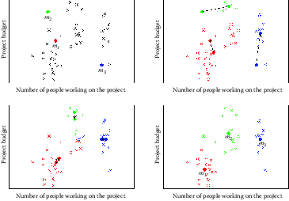
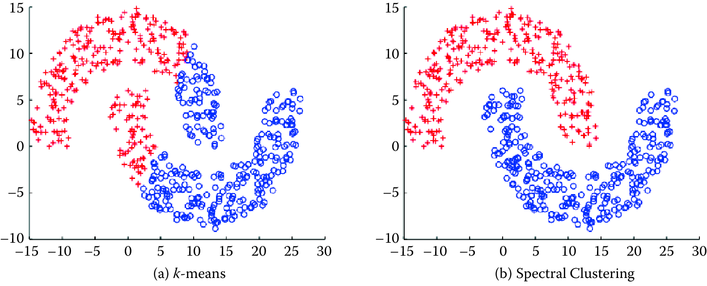
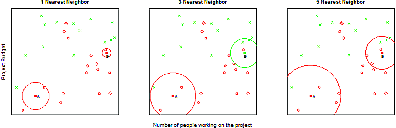
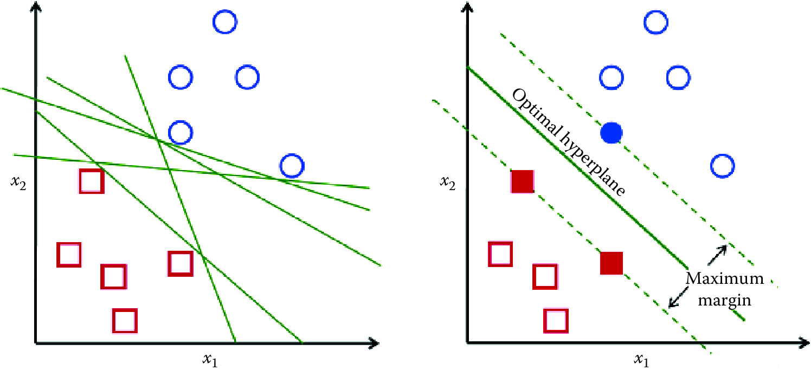
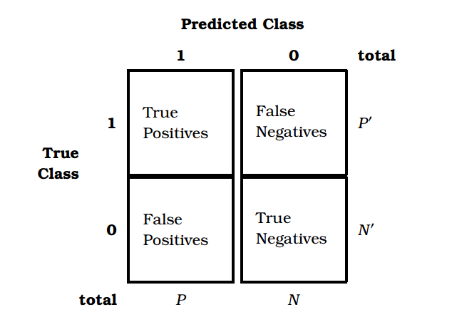
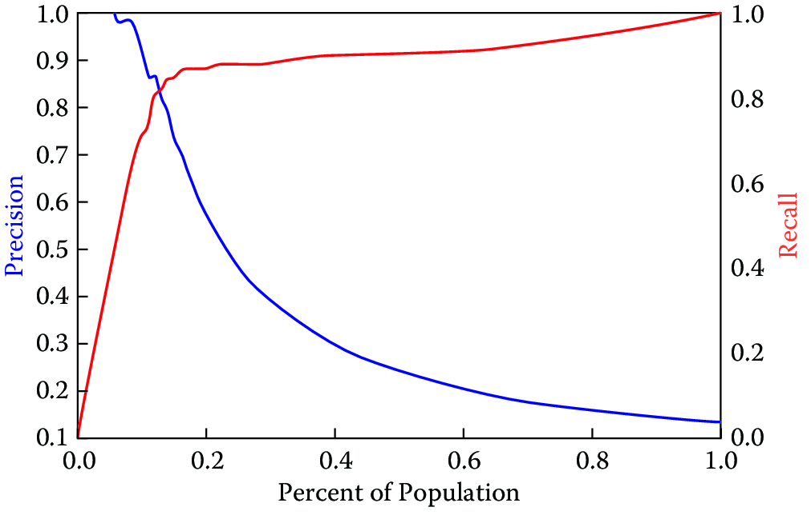

% TODO: add links or lit references to ICML, nips, and kdd are not defined .. add links to conference websites
% TODO: add coleridge ML cheat sheat as box or reference / resources at the end
% TODO: add ML process image  [Coleridge slides] 

Machine Learning {#chap:ml}
================

**Rayid Ghani and Malte Schierholz**


This chapter introduces you to the use of machine learning in tackling 
social science and public policy problems. We cover the end-to-end machine learning
process and focus on clustering and classification methods. After reading this chapter, you should have an overview of the components of a machine learning pipeline and methods, and know how to use those in solving social science problems. We have written this chapter to give an intuitive explanation for the methods and to provide a framework and practical
tips on how to use them in practice.

Introduction
------------

You have probably heard of "machine learning" but are not sure exactly
what it is, how it differs from traditional statistics, and what you, as social scientists, can
do with it. In this chapter, we will demystify machine learning, draw
connections to what you already know from statistics and data analysis,
and go deeper into some of the novel concepts and methods that have
been developed in this field. Although the field originates from
computer science, it has been
influenced quite heavily by math and statistics in the past 15-20 years. As you will
see, many of the concepts you will learn are not entirely new, but are
simply called something else. For example, you already are familiar with
logistic regression (a classification method that falls under the
supervised learning framework in machine learning) and cluster analysis
(a form of unsupervised learning). You will also learn about new methods

that are more exclusively used in machine learning, such as random
Forests, support vector machines, and neural networks. We will keep formalisms to a
minimum and focus on getting the intuition across, as well as providing
practical tips. Our hope is this chapter will make you comfortable and
familiar with machine learning vocabulary, concepts, and processes, and
allow you to further explore and use these methods and tools in your own
research and practice.

What is machine learning?
-------------------------

When humans improve their skills with experience, they are said to
learn. Is it also possible to program computers to do the same? Arthur
Samuel, who coined the term *machine learning* in 1959
[@samuel1959some], was a pioneer in this area, programming a computer to
play checkers. The computer played against itself and human opponents,
improving its performance with every game. Eventually, after sufficient
*training* (and experience), the computer became a better player than
the human programmer. Today, machine learning has grown significantly
beyond learning to play checkers. Machine learning systems have learned
to drive (and park) autonomous cars, are embedded inside robots, can
recommend books, products, and movies we are (sometimes) interested in,
identify drugs, proteins, and genes that should be investigated further
to cure diseases, detect cancer and other pathologies in x-rays and other types of medical imaging, help us understand how the human brain learns language, help identify
which voters are persuadable in elections, detect which students are
likely to need extra support to graduate high school on time, and help
solve many more problems. Over the past 20 years, machine learning has
become an interdisciplinary field spanning computer science, artificial
intelligence, databases, and statistics. At its core, machine learning
seeks to design computer systems that improve over time with more
experience. In one of the earlier books on machine learning, Tom
Mitchell gives a more operational definition, stating that: "A computer
program is said to learn from experience $E$ with respect to some class
of tasks $T$ and performance measure $P$, if its performance at tasks in
$T$, as measured by $P$, improves with experience $E$"
[@mitchell1997machine]. We like this definition because it is task-focused and allows us to think of machine learning as a tool used inside a larger system to improve outcomes that we care about.

\enlargethispage{6pt}

```{block, type='F00'}
**Box 7.1: Commercial machine learning examples**

-   **Speech recognition**: Speech recognition software uses machine learning algorithms that
    are built on large amounts of initial training data. Machine
    learning allows these systems to be tuned and adapt to individual
    variations in speaking as well as across different domains.

-   **Autonomous cars**: The ongoing development of self-driving cars applies techniques from
    machine learning. An onboard computer continuously analyzes the
    incoming video and sensor streams in order to monitor the
    surroundings. Incoming data are matched with annotated images to
    recognize objects like pedestrians, traffic lights, and potholes. In
    order to assess the different objects, huge training data sets are
    required where similar objects already have been identified. This
    allows the autonomous car to decide on which actions to take next.

-   **Fraud detection**: Many public and private organizations face the problem of fraud and
    abuse. Machine learning systems are widely used to take historical
    cases of fraud and flag fraudulent transactions as they take place.
    These systems have the benefit of being adaptive, and improving with
    more data over time.

-   **Personalized ads**: Many online stores have personalized recommendations promoting
    possible products of interest. Based on individual shopping history
    and what other similar users bought in the past, the website
    predicts products a user may like and tailors recommendations.
    Netflix and Amazon are two examples of companies whose
    recommendation software predicts how a customer would rate a certain
    movie or product and then suggests items with the highest predicted
    ratings. Of course there are some caveats here, since they then
    adjust the recommendations to maximize profits.
	
-   **Face recognition**: Surveillance systems, social networking platforms, and imaging
    software all use face detection and face recognition to first detect
    faces in images (or video) and then tag them with individuals for
    various tasks. These systems are trained by giving examples of faces
    to a machine learning system which then learns to detect new faces,
    and tag known individuals. The bias and fairness chapter will highlight some concerns with these types of systems.
```


\enlargethispage{6pt}

```{block, type='F00'}
**Box 7.2: Social Science machine learning examples**
Potash et al (reference) worked with the Chicago Department of Public Health and used random forests (a machine learning classification method) to predict which children are at risk of lead poisoning. This early warning system was then used to prioritize lead hazard inspections to detect and remediate lead hazards before they had an adverse effect on the child.

Carton et al (reference) used a collection of machine learning methods to identify police officers at risk of adverse behavior, such as unjustified use of force or unjustified shootings or sustained complaints, to prioritize preventive interventions such as training and counseling.

Athey and  Wager (https://obsstudies.org/277-2/) use a modification of random forests to estimate heterogeneous treatment effects using a data set from The National Study of Learning Mindsets to evaluate the impact of interventions to improve student achievement.


Voigt et al (http://web.stanford.edu/~eberhard/downloads/2017-LanguageFromPoliceBodyCameraFootage.pdf) uses machine learning methods to analyze footage from body-worn cameras and understand the respectfulness of police officer language toward white and black community members during routine traffic stops.

-  ```


Machine learning grew from the need for systems that were adaptive,
scalable, and cost-effective to build and maintain. A lot of tasks now
being done using machine learning used to be done by rule-based systems,
where experts would spend considerable time and effort developing and
maintaining the rules. The problem with those systems was that they were
rigid, not adaptive, hard to scale, and expensive to maintain. Machine
learning systems started becoming popular because they could improve the
system along all of these dimensions^[See Chapter 3.]. Box 7.1
mentions several examples where machine learning is being used in
commercial applications today. Social scientists are uniquely placed
today to take advantage of the same advances in machine learning by
having better methods to solve several key problems they are tackling.
Box 7.2 describes a few social science and policy problems that are being tackled using machine learning today.

This chapter is not an exhaustive introduction to machine learning.
There are many books that have done an excellent job of that
[@Flach; @HastieTibshirani; @mitchell1997machine]. Instead, we present a
short and accessible introduction to machine learning for social
scientists, give an overview of the overall machine learning process,
provide an intuitive introduction to machine learning methods, give some
practical tips that will be helpful in using these methods, and leave a
lot of the statistical theory to machine learning textbooks. As you read
more about machine learning in the research literature or the media, you
will encounter names of other fields that are related (and practically
the same for most social science audiences), such as statistical
learning, data mining, and pattern recognition.

Types of analysis

A lot of the data analysis tasks that social scientists do can be broken down into four types
Description: The goal is to describe patterns or groupings in historical data. You’re already familiar with descriptive statistics and exploratory data analysis methods, and we will cover more advanced versions of those later in this chapter under Unsupervised Learning.
Detection: The goal here is not to necessarily understand historical behavior but to detect new or emerging anomalies, events, or patterns as they happen. A typical example is early outbreak detection for infectious diseases in order to inform public health officials.
Prediction: The goal here is to use the same historical data as the description and detection methods, but use it to predict events and behaviors in the future.
Behavior Change (or Causal Inference): The goal here is to understand the causal relationships in the data in order to influence the outcomes we care about.

In this chapter, we will mostly focus on Description and Prediction methods but there is a lot of work going in developing and using machine learning methods for detection as well as for behavior change and causal inference.

The Machine Learning process 
----------------------------

When solving problems using machine learning methods, it is important to
think of the larger data-driven problem-solving process of which these
methods are a small part^[See Chapter 3.]. A typical machine learning problem requires
researchers and practitioners to take the following steps:

1.  **Understand the problem and goal**: This sounds obvious but is often nontrivial. Problems typically
    start as vague descriptions of a goal---improving health outcomes,
    increasing graduation rates, understanding the effect of a variable
    $X$ on an outcome $Y$, etc. It is really important to work with
    people who understand the domain being studied to discuss and
    define the problem more concretely. What is the analytical
    formulation of the metric that you are trying to improve? The Data Science Project Scoping Guide (http://www.datasciencepublicpolicy.org/home/resources/data-science-project-scoping-guide/) is a good place to start when doing problem scoping for social science or policy problems

2.  **Formulate it as a machine learning problem**: Is it a classification problem or a regression problem? Is the goal to build a model that generates a ranked list prioritized by risk of an outcome,   or is it to detect anomalies as new data come in? 

Knowing what kinds of tasks machine learning can solve will allow you to map the  problem you are working on to one or more machine learning settings  and give you access to a suite of methods appropriate for that task.

3.  **Data exploration and preparation**: Next, you need to carefully explore the data you have. What additional data do you need or have access to? What variable will
    you use to match records for integrating different data sources?
    What variables exist in the data set? Are they continuous or
    categorical? What about missing values? Can you use the variables in
    their original form or do you need to alter them in some way?

4.  **Feature engineering**: In machine learning language, what you might know as independent
    variables or predictors or factors or covariates are called
    "features." Creating good features is probably the most important
    step in the machine learning process. This involves doing
    transformations, creating interaction terms, or aggregating over
    data points or over time and space.

5.  **Modeling**: Having formulated the problem and created your features, you now
    have a suite of methods to choose from. It would be great if there
    were a single method that always worked best for a specific type of
    problem, but that would make things too easy. Each method makes a difference assumption about the structure and distribution of the data and with large amounts of high-dimensional data^[dimensionality of the data often refers to how many variables we have in the data], it is difficult to know apriori which assumption will best match the data we have. Typically, in machine
    learning, you take a collection of methods and try them out to
    empirically validate which one works the best for your problem. This process not only helps you select the best method for your problem but also helps you understand the structure of your data.  We will give an overview of leading methods that are being used today
    in this chapter.

6. **Model Interpretation**: Once we have built the machine learning models, we also want to understand what they are,, which predictors they found important, and how much, what types of entities they flagged as high risk (and why), where they made errors, etc. All of these fall under the model interpretation, interpretability, explainability umbrella which is an active area of research right now in machine learning.

7.  **Model Selection**: As you build a large number of possible models, you need a way to
    select the model that is the “best”. This part of the chapter will
    cover methodology to first test the models on
    historical data as well as discuss a variety of evaluation metrics. While this chapter will focus mostly on traditionally used metrics, Chapter \ref{chap:bias} will expand on this using bias and fairness related metrics. It is important to not that sometimes the machine learning literature will call this step using historical data, the “validation” step, but we want to distinguish it here from validation, which is the next step.

8. **Model Validation**: The next step, after model selection (using historical data) is validation  validate on new data, as well as designing and running field trials or experiments.

9.  **Deployment and Monitoring**: Once you have selected the best model and validated it using
    historical data as well as a field trial, you are ready to put the
    model into practice. You still have to keep in mind that new data
    will be coming in, the world will be changing, and the model might also (need to) change over time. We will not cover too much of those aspects in this chapter, but they are
    important to keep in mind when putting the machine learning work in to practice.

Although each step in this process is critical, this chapter will not focus on step 3 (data exploration) because we assume you already have some experience doing that, and on step 7 (deployment) because, although critical, it is outside the scope of the book. 

Problem formulation: Mapping a problem to machine learning methods
------------------------------------------------------------------

When working on a new problem, one of the first things we need to do is
to map it to a class of machine learning methods. In general, the
problems we will tackle, including the examples above, can be grouped
into two major categories:

1.  **Supervised learning**: These are problems where there exists a target variable (continuous
    or discrete) that we want to predict or classify data into.
    Classification, prediction, and regression all fall into this
    category. More formally, supervised learning methods predict a value
    $Y$ given input(s) $X$ by learning (or estimating or fitting or
    training) a function $F$, where $F(X) = Y$. Here, $X$ is the set of
    variables (known as *features* in machine learning, or in other
    fields as *predictors*) provided as input and $Y$ is the
    target/dependent variable or a *label* (as it is known in machine
    learning).

    The goal of supervised learning methods is to search for that
    function $F$ that best estimates or predicts $Y$. When the output $Y$ is
    categorical, this is known as *classification*. When $Y$ is a
    continuous value, this is called *regression*. Sound familiar?

    One key distinction in machine learning is that the goal is not just
    to find the best function $F$ that can estimate or predict $Y$ for observed
    outcomes (known $Y$s) but to find one that best generalizes to new,
    unseen data, often in the future. This distinction makes methods more focused on
    generalization and less on just fitting the data we have as best as
    we can. It is important to note that you do that implicitly when
    performing regression by not adding more and more higher-order terms
    to get better fit statistics. By getting better fit statistics, we
    *overfit* to the data and the performance on new (unseen) data often
    goes down. Methods like the lasso [@tibshirani1996regression]
    penalize the model for having too many terms by performing what is
    known as *regularization*^[In statistical terms, regularization is an attempt to avoid overfitting the model]. 


2.  **Unsupervised learning**: These are problems where there does not exist a target variable that
    we want to predict but we want to understand "natural" groupings or
    patterns in the data. Clustering is the most common example of this
    type of analysis where you are given $X$ and want to group similar
    $X$s together. You may have heard of “segmentation” that’s used in the marketing world to group similar customers together using clustering techniques. Principal components analysis (PCA) and related
    methods also fall into the unsupervised learning category.

In between the two extremes of supervised and unsupervised learning,
there is a spectrum of methods that have different levels of supervision
involved (Figure
\@ref(fig:spectrum)). Supervision in this case is the presence
of target variables (known in machine learning as *labels*). In
unsupervised learning, none of the data points have labels. In
supervised learning, all data points have labels. In between, either the
percentage of examples with labels can vary or the types of labels can
vary. We do not cover the weakly supervised and semi-supervised methods
much in this chapter, but this is an active area of research in machine
learning. Zhu [@zhu2005semi] provides more details.

```{r spectrum, out.width = '70%', fig.align = 'center', echo = FALSE, fig.cap = 'Spectrum of machine learning methods from unsupervised to supervised learning'}
knitr::include_graphics("ChapterML/figures/spectrum.png")
```

### Features

Before we get to models and methods, we need to turn our raw data into “features”. In social science, they are not called features but instead are known as variables or
Predictors (or covariates if you’re doing regression). [Good features are what makes machine learning systems
effective]{.roman}. Feature generation (or engineering, as it is often
called) is where a large chunk of the time is spent in the machine learning
process. This is also the phase where previous research and learnings from the domain being tackled can be incorporated into the machine learning process. As social science researchers or practitioners, you have spent
a lot of time constructing features, using transformations, dummy
variables, and interaction terms. All of that is still required and
critical in the machine learning framework. One difference you will need
to get comfortable with is that instead of carefully selecting a few
predictors, machine learning systems tend to encourage the creation of
*lots* of features and then empirically use holdout data to perform
regularization and model selection. It is common to have models that are
trained on thousands of features. Of course, it is important to keep in mind that increasing the number of features requires you to have enough data so that you’re not overfitting. Commonly used approaches to create
features include:

-   **Transformations**, such as log, square, and square root.

-   **Dummy (binary) variables**: This is often done by taking categorical variables (such as city)
    and creating a binary variable for each value (one variable for each
    city in the data). These are also called indicator variables.

-   **Discretization**: Several methods require features to be discrete instead of
    continuous. Several approaches exist to convert continuous variables
    into discrete ones, the most common of which is equal-width binning.

-   **Aggregation**: Aggregate features often constitute the majority of features for a
    given problem. These aggregations use different aggregation
    functions (count, min, max, average, standard deviation, etc.),
    often over varying windows of time and space. For example, given
    urban data, we would want to calculate the number (and min, max,
    mean, variance) of crimes within an $m$-mile radius of an address in
    the past $t$ months for varying values of $m$ and $t$, and then to
    use all of them as features in a classification problem. Spatiotemporal aggregation features are going to be extremely important as you build machine learning models.

In general, it is a good idea to have the complexity in features and use
a simple model, rather than using more complex models with simple
features. Keeping the model simple makes it faster to train and easier
to understand and explain.

[ideally give a reference with list of features]


Methods
-------

We will start by describing unsupervised learning methods and then go on
to supervised learning methods. We focus here on the intuition behind
the methods and the algorithm, as well as some practical tips, rather than on
the statistical theory that underlies the methods. We encourage readers
to refer to machine learning books listed in
Section [Resources](#ml:res). Box 7.2 gives brief definitions of several terms we will use in this section.

```{block, type='F00'}
**Box 7.2: Machine learning vocabulary**

-  **Learning**: In machine learning, you will notice the term *learning* that will
    be used in the context of "learning" a model. This is what you
    probably know as *fitting* or *estimating* a function, or *training*
    or *building* a model. These terms are all synonyms and are used
    interchangeably in the machine learning literature.

-   **Examples**: These are data points, rows, or instances.

-   **Features**: These are independent variables, attributes, predictor variables,
    and explanatory variables.

-   **Labels**: These include the response variable, dependent variable, target
    Variable, or outcomes.

-   **Underfitting**: This happens when a model is too simple and does not capture the
    structure of the data well enough.

-   **Overfitting**: This happens when a model is possibly too complex and models the
    noise in the data, which can result in poor generalization
    performance. Using in-sample measures to do model selection can
    result in that.

-   **Regularization**: This is a general method to avoid overfitting by applying additional
    constraints to the model that is learned. For example, in building logistic regression models, a common approach is to
    make sure the model weights are, on average, small in magnitude. Two
    common regularizations are $L_1$ regularization (used by the lasso),
    which has a penalty term that encourages the sum of the absolute
    values of the parameters to be small; and $L_2$ regularization,
    which encourages the sum of the squares of the parameters to be
    Small.
```

### Unsupervised learning methods

As mentioned earlier, unsupervised learning methods are used when we do
not have a target variable to estimate or predict but want to understand
clusters, groups, or patterns in the data. These methods are often used for
data exploration, as in the following examples:

1.  When faced with a large corpus of text data---for example, email
    records, congressional bills, speeches, or open-ended free-text
    survey responses---unsupervised learning methods are often used to
    understand and get a handle on the patterns in our data.

2.  Given a data set about students and their behavior over time
    (academic performance, grades, test scores, attendance, etc.), one
    might want to understand typical behaviors as well as trajectories
    of these behaviors over time. Unsupervised learning methods
    (clustering) can be applied to these data to get student "segments"
    with similar behavior.

3.  Given a data set about publications or patents in different fields,
    we can use unsupervised learning methods (association rules) to
    figure out which disciplines have the most collaboration and which
    fields have researchers who tend to publish across different fields.


4. Given a set of people who are at high risk of recidivism, clustering can be used to understand different groups of people within the high risk set, to determine intervention programs that may need to be created.

**Clustering**

Clustering is the most common unsupervised learning technique and is
used to group data points together that are similar to each other. The
goal of clustering methods is to produce with high intra-cluster
(within) similarity and low inter-cluster (between) similarity.

Clustering algorithms typically require a distance (or similarity)
metric^[Distance metrics are mathematical formulas to
calculate the distance between two objects.
For example, *Manhattan distance* is the distance a
car would drive from one
place to another place in
a grid-based street system,
whereas *Euclidean distance*
(in two-dimensional space)
is the “straight-line” distance between two points.] to generate clusters. They take a data set and a distance metric
(and sometimes additional parameters), and they generate clusters based
on that distance metric. The most common distance metric used is
Euclidean distance, but other commonly used metrics are Manhattan,
Minkowski, Chebyshev, cosine, Hamming, Pearson, and Mahalanobis. Often,
domain-specific similarity metrics can be designed for use in specific
problems. For example, when performing the record linkage tasks
discussed in Chapter [Record Linkage], you can design a similarity metric that compares
two first names and assigns them a high similarity (low distance) if
they both map to the same canonical name, so that, for example, Sammy
and Sam map to Samuel.

Most clustering algorithms also require the user to specify the number
of clusters (or some other parameter that indirectly determines the
number of clusters) in advance as a parameter. This is often difficult
to do a priori and typically makes clustering an iterative and
interactive task. Another aspect of clustering that makes it interactive
is often the difficulty in automatically evaluating the quality of the
clusters. While various analytical clustering metrics have been
developed, the best clustering is task-dependent and thus must be
evaluated by the user. There may be different clusterings that can be
generated with the same data. You can imagine clustering similar news
stories based on the topic content, based on the writing style or based
on sentiment. The right set of clusters depends on the user and the task
they have. Clustering is therefore typically used for exploring the
data, generating clusters, exploring the clusters, and then rerunning
the clustering method with different parameters or modifying the
clusters (by splitting or merging the previous set of clusters).
Interpreting a cluster can be nontrivial: you can look at the centroid
of a cluster, look at frequency distributions of different features (and
compare them to the prior distribution of each feature), or you can
build a decision tree (a supervised learning method we will cover later
in this chapter) where the target variable is the cluster ID that can
describe the cluster using the features in your data. A good example of
a tool that allows interactive clustering from text data is Ontogen
[@Ontogen].

\enlargethispage{6pt}
**$k$-means clustering**

The most commonly used clustering algorithm is called $k$-means, where
$k$ defines the number of clusters. The algorithm works as follows:

1.  Select $k$ (the number of clusters you want to generate).

2.  Initialize by selecting $k$ points as centroids of the $k$ clusters.
    This is typically done by selecting $k$ points uniformly at random.

3.  Assign each point a cluster according to the nearest centroid.

4.  Recalculate cluster centroids based on the assignment in (3) as the
    mean of all data points belonging to that cluster.

5.  Repeat (3) and (4) until convergence.

The algorithm stops when the assignments do not change from one
iteration to the next (Figure
\@ref(fig:kmeans)). The final set of clusters, however, depend
on the starting points. If they are initialized differently, it is
possible that different clusters are obtained. One common practical
trick is to run $k$-means several times, each with different (random)
starting points. The $k$-means algorithm is fast, simple, and easy to
use, and is often a good first clustering algorithm to try and see if it
fits your needs. When the data are of the form where the mean of the
data points cannot be computed, a related method called $K$-medoids can
be used [@park2009simple].

```{r kmeans, out.width = '70%', fig.align = 'center', echo = FALSE, fig.cap = 'Example of $k$-means clustering with $k = 3$. The upper left panel shows the distribution of the data and the three starting points $m_1$, $m_2$, $m_3$ placed at random. On the upper right we see what happens in the first iteration. The cluster means move to more central positions in their respective clusters. The lower left panel shows the second iteration. After six iterations the cluster means have converged to their final destinations and the result is shown in the lower right panel'}

```

**Expectation-maximization (EM) clustering**

\hspace*{3pt}
You may be familiar with the EM algorithm in the context of imputing
missing data. EM is a general approach to maximum likelihood in the
presence of incomplete data. However, it is also used as a clustering
method where the missing data are the clusters a data point belongs to.
Unlike $k$-means, where each data point gets assigned to only one
cluster, EM does a soft assignment where each data point gets a
probabilistic assignment to various clusters. The EM algorithm iterates
until the estimates converge to some (locally) optimal solution.

The EM algorithm is fairly good at dealing with outliers as well as
high-dimensional data, compared to $k$-means. It also has a few
limitations. First, it does not work well with a large number of
clusters or when a cluster contains few examples. Also, when the value
of $k$ is larger than the number of actual clusters in the data, EM may
not give reasonable results.

**Mean shift clustering**

Mean shift clustering works by finding dense regions in the data by
defining a window around each data point and computing the mean of the
data points in the window. Then it shifts the center of the window to
the mean and repeats the algorithm till it converges. After each
iteration, we can consider that the window shifts to a denser region of
the data set. The algorithm proceeds as follows:

1.  Fix a window around each data point (based on the bandwidth
    parameter that defines the size of the window).

2.  Compute the mean of data within the window.

3.  Shift the window to the mean and repeat till convergence.

Mean shift needs a bandwidth parameter $h$ to be tuned, which influences
the convergence rate and the number of clusters. A large $h$ might
result in merging distinct clusters. A small $h$ might result in too
many clusters. Mean shift might not work well in higher dimensions since
the number of local maxima is pretty high and it might converge to a
local optimum quickly.

One of the most important differences between mean shift and $k$-means
is that $k$-means makes two broad assumptions: the number of clusters is
already known and the clusters are shaped spherically (or elliptically).
Mean shift does not assume anything about the number of clusters (but
the value of $h$ indirectly determines that). Also, it can handle
arbitrarily shaped clusters.

The $k$-means algorithm is also sensitive to initializations, whereas
mean shift is fairly robust to initializations. Typically, mean shift is
run for each point, or sometimes points are selected uniformly randomly.
Similarly, $k$-means is sensitive to outliers, while mean shift is less
sensitive. On the other hand, the benefits of mean shift come at a
cost---speed. The $k$-means procedure is fast, whereas classic mean
shift is computationally slow but can be easily parallelized.

**Hierarchical clustering**

\hspace*{-1pt}
The clustering methods that we have seen so far, often termed
*partitioning* methods, produce a flat set of clusters with no
hierarchy. Sometimes, we want to generate a hierarchy of clusters, and
methods that can do that are of two types:

1.  **Agglomerative (bottom-up)**: Start with each point as its own cluster and iteratively merge the
    closest clusters. The iterations stop either when the clusters are
    too far apart to be merged (based on a predefined distance
    criterion) or when there is a sufficient number of clusters (based
    on a predefined threshold).

2.  **Divisive (top-down)**: Start with one cluster and create splits recursively.

Typically, agglomerative clustering is used more often than divisive
clustering. One reason is that it is significantly faster, although both
of them are typically slower than direct partition methods such as
$k$-means and EM. Another disadvantage of these methods is that they are
*greedy*, that is, a data point that is incorrectly assigned to the
"wrong" cluster in an earlier split or merge cannot be reassigned again
later on.

**Spectral clustering**

Figure \@ref(fig:spectral) shows the clusters that $k$-means would
generate on the data set in the figure. It is obvious that the clusters
produced are not the clusters you would want, and that is one drawback
of methods such as $k$-means. Two points that are far away from each
other will be put in different clusters even if there are other data
points that create a "path" between them. Spectral clustering fixes that
problem by clustering data that are connected but not necessarily (what
is called) compact or clustered within convex boundaries. Spectral
clustering methods work by representing data as a graph (or network),
where data points are nodes in the graph and the edges (connections
between nodes) represent the similarity between the two data points.

```{r spectral, out.width = '70%', fig.align = 'center', echo = FALSE, fig.cap = 'The same data set can produce drastically different clusters: (a) k-means; (b) spectral clustering'}

```

\vspace*{8pt}
The algorithm works as follows:

1.  Compute a similarity matrix from the data. This involves determining
    a pairwise distance function (using one of the distance functions we
    described earlier).

2.  With this matrix, we can now perform graph partitioning, where
    connected graph components are interpreted as clusters. The graph
    must be partitioned such that edges connecting different clusters
    have low weights and edges within the same cluster have high values.

3.  We can now partition these data represented by the similarity matrix
    in a variety of ways. One common way is to use the normalized cuts
    method. Another way is to compute a graph Laplacian from the
    similarity matrix.

4.  Compute the eigenvectors and eigenvalues of the Laplacian.

5.  The $k$ eigenvectors are used as proxy data for the original data
    set, and they are fed into $k$-means clustering to produce cluster
    assignments for each original data point.

Spectral clustering is in general much better than $k$-means in
clustering performance but much slower to run in practice. For
large-scale problems, $k$-means is a preferred clustering algorithm to
run because of efficiency and speed.

**Principal components analysis**

Principal components analysis is another unsupervised method used for
finding patterns and structure in data. In contrast to clustering
methods, the output is not a set of clusters but a set of *principal
components* that are linear combinations of the original variables. PCA
is typically used when you have a large number of variables and you want
a reduced number that you can analyze. This approach is often called
*dimensionality reduction*. It generates linearly uncorrelated
dimensions that can be used to understand the underlying structure of
the data. In mathematical terms, given a set of data on $n$ dimensions,
PCA aims to find a linear subspace of dimension $d$ lower than $n$ such
that the data points lie mainly on this linear subspace.

PCA is related to several other methods you may already know about.
Multidimensional scaling, factor analysis, and independent component
analysis differ from PCA in the assumptions they make, but they are
often used for similar purposes of dimensionality reduction and
discovering the underlying structure in a data set.

**Association rules**

Association rules are a different type of analysis method and originate
from the data mining and database community, primarily focused on
finding frequent co-occurring associations among a collection of items.
This method is sometimes referred to as "market basket analysis," since
that was the original application area of association rules. The goal is
to find associations of items that occur together more often than you
would randomly expect. The classic example (probably a myth) is "men who
go to the store to buy diapers will also tend to buy beer at the same
time." This type of analysis would be performed by applying association
rules to a set of supermarket purchase data. For social scientists, this method can be used on data that contains social services that individuals have received in the past to determine what types of services “co-occur” in people and proactively offer those services to people in need. 

Association rules take the form $X_1, X_2, X_3 \Rightarrow Y$ with
support $S$ and confidence $C$, implying that when a transaction
contains items $\{X_1, X_2, X_3\}$ $C$% of the time, they also contain
item $Y$ and there are at least $S$% of transactions where the
antecedent is true. This is useful in cases where we want to find
patterns that are both *frequent* and *statistically significant*, by
specifying thresholds for support $S$ and confidence $C$.

Support and confidence are useful metrics to generate rules but are
often not enough. Another important metric used to generate rules (or
reduce the number of spurious patterns generated) is *lift*. Lift is
simply estimated by the ratio of the joint probability of two items, $x$
and $y$, to the product of their individual probabilities:
$P(x,y)/[P(x)P(y)]$. If the two items are statistically independent,
then $P(x,y)=P(x)P(y)$, corresponding to a lift of $1$. Note that
anti-correlation yields lift values less than 1, which is also an
interesting pattern, corresponding to mutually exclusive items that
rarely occur together.

Association rule algorithms work as follows: Given a set of transactions
(rows) and items for that transaction:

1.  Find all combinations of items in a set of transactions that occur
    with a specified minimum frequency. These combinations are called
    *frequent itemsets*.

2.  Generate association rules that express co-occurrence of items
    within frequent itemsets.

For our purposes, association rule methods are an efficient way to take
a *basket* of features (e.g., areas of publication of a researcher,
different organizations an individual has worked at in their career, all
the cities or neighborhoods someone may have lived in) and find
co-occurrence patterns. This may sound trivial, but as data sets and
number of features get larger, it becomes computationally expensive and
association rule mining algorithms provide a fast and efficient way of
doing it.

### Supervised learning {#sec:MLchapter:super}

We now turn to the problem of supervised learning, which typically
involves methods for classification, prediction, and regression. We will
mostly focus on classification methods in this chapter since many of the
regression methods in machine learning are fairly similar to methods
with which you are already familiar. Remember that classification means
predicting a discrete (or categorical) variable. Most of the
classification methods that we will cover can also be used for
Regression (predicting continuous outcomes).

In general, supervised learning methods take as input pairs of data
points $(X,Y)$ where $X$ are the predictor variables (features) and $Y$
is the target variable (label). The supervised learning method then uses
these pairs as *training data* and *learns* a model $F$, where
$F(X)\sim Y$. This model $F$ is then used to predict $Y$s for new data
points $X$. As mentioned earlier, the goal is not to build a model that
best fits known data but a model that is useful for future predictions
and minimizes future generalization error. This is the key goal that
differentiates many of the methods that you know from the methods that
we will describe next. In order to minimize future error, we want to
build models that are not just *overfitting* on past data.

Another goal, often prioritized in the social sciences, that machine
learning methods do not optimize for is getting a structural form of the
model. Machine learning models for classification can take different
structural forms (ranging from linear models, to sets of rules, to more
Complex non-linear forms), and it may not always be possible to write them down in
a compact form as an equation. This does not, however, make them
incomprehensible or uninterpretable. Another focus of machine learning
models for supervised learning is prediction, and not necessarily causal inference^[The topic of causal inference is addressed in more
detail in Chapter 10.].
Some of these models can be used to help with causal inference, but they
are typically optimized for prediction tasks. We believe that there are
many social science and policy problems where better prediction methods
can be extremely beneficial. Cite Kleingberg et al (https://www.cs.cornell.edu/home/kleinber/aer15-prediction.pdf)

In this chapter, we mostly deal with binary classification problems:
that is, problems in which the data points are to be classified into one
of two categories. Several of the methods that we will cover can also be
used for multiclass classification (classifying a data point into one of
$n$ categories) or for multi-label classification (classifying a data
point into $m$ of $n$ categories where $m\ge1$). There are also
approaches to take multiclass problems and turn them into a set of
binary problems that we will mention briefly at the end of the chapter.

Before we describe supervised learning methods, we want to recap a few
principles as well as terms that we have used and will be using in the
rest of the chapter.

**Training a model**

Once we have finished data exploration, filled in missing values,
created predictor variables (features), and decided what our target
variable (label) is, we now have pairs of $X,Y$ to start training (or
building) the model.

**Using the model to score new data**

We are building this model so we can predict $Y$ for a new set of
$X$s---using the model means, getting new data, generating the same
features to get the vector $X$, and then applying the model to produce
$Y$.

One common technique for supervised learning is logistic regression, a
method you will already be familiar with. We will give an overview of
some of the other methods used in machine learning. It is important to
remember that as you use increasingly powerful classification methods,
you need more data to *train* the models.

**$k$-nearest neighbor**

The method $k$-nearest neighbor ($k$-NN) is one of the simpler
classification methods in machine learning. It belongs to a family of
models sometimes known as *memory-based models* or *instance-based
models*. An example is classified by finding its $k$ nearest neighbors
and taking majority vote (or some other aggregation function). We need
two key things: a value for $k$ and a distance metric with which to find
the $k$ nearest neighbors. Typically, different values of $k$ are used
to empirically find the best one. Small values of $k$ lead to
predictions having high variance but can capture the local structure of
the data. Larger values of $k$ build more global models that are lower
in variance but may not capture local structure in the data as well.

Figure \@ref(fig:knn) provides an example for $k = 1, 3, 5$ nearest
neighbors. The number of neighbors ($k$) is a parameter, and the
prediction depends heavily on how it is determined. In this example,
point B is classified differently if $k = 3$.

```{r knn, out.width = '70%', fig.align = 'center', echo = FALSE, fig.cap = 'Example of $k$-nearest neighbor with $k = 1, 3, 5$ neighbors. We want to predict the points A and B. The 1-nearest neighbor for both points is red ("Patent not granted"), the 3-nearest neighbor predicts point A (B) to be red (green) with probability 2/3, and the 5-nearest neighbor predicts again both points to be red with probabilities 4/5 and 3/5, respectively.'}

```

\vspace*{-6pt}
Training for $k$-NN just means storing the data, making this method
useful in applications where data are coming in extremely quickly and a
model needs to be updated frequently. All the work, however, gets pushed
to scoring time, since all the distance calculations happen when a new
data point needs to be classified. There are several optimized methods
designed to make $k$-NN more efficient that are worth looking into if
that is a situation that is applicable to your problem.

In addition to selecting $k$ and an appropriate distance metric, we also
have to be careful about the scaling of the features. When distances
between two data points are large for one feature and small for a
different feature, the method will rely almost exclusively on the first
feature to find the closest points. The smaller distances on the second
feature are nearly irrelevant to calculate the overall distance. A
similar problem occurs when continuous and categorical predictors are
used together. To resolve the scaling issues, various options for
rescaling exist. For example, a common approach is to center all
features at mean $0$ and scale them to variance $1$.

There are several variations of $k$-NN. One of these is weighted nearest
neighbors, where different features are weighted differently or
different examples are weighted based on the distance from the example
being classified. The method $k$-NN also has issues when the data are
sparse and has high dimensionality, which means that every point is far
away from virtually every other point, and hence pairwise distances tend
to be uninformative. This can also happen when a lot of features are
irrelevant and drown out the relevant features' signal in the distance
calculations.

Notice that the nearest-neighbor method can easily be applied to
regression problems with a real-valued target variable. In fact, the
method is completely oblivious to the type of target variable and can
potentially be used to predict text documents, images, and videos, based
on the aggregation function after the nearest neighbors are found.

\vspace*{-4pt}
**Support vector machines**

Support vector machines are one of the most popular and best-performing
classification methods in machine learning today. The mathematics behind
SVMs has a lot of prerequisites that are beyond the scope of this book,
but we will give you an intuition of how SVMs work, what they are good
for, and how to use them.

We are all familiar with linear models that separate two classes by
fitting a line in two dimensions (or a hyperplane in higher dimensions)
in the middle (see Figure \@ref(fig:svm)). An important decision that linear models have
to make is which linear separator we should prefer when there are
several we can build.

```{r svm, out.width = '100%', fig.align = 'center', echo = FALSE, fig.cap = 'Support vector machines'}

```

You can see in Figure \@ref(fig:svm) that multiple lines offer a solution to the
problem. Is any of them better than the others? We can intuitively
define a criterion to estimate the worth of the lines: A line is bad if
it passes too close to the points because it will be noise sensitive and
it will not generalize correctly. Therefore, our goal should be to find
the line passing as far as possible from all points.

The SVM algorithm is based on finding the hyperplane that maximizes the
*margin* of the training data. The training examples that are closest to
the hyperplane are called *support vectors* since they are *supporting*
the margin (as the margin is only a function of the support vectors).

An important concept to learn when working with SVMs is *kernels*. SVMs
are a specific instance of a class of methods called *kernel methods*.
So far, we have only talked about SVMs as linear models. Linear works
well in high-dimensional data but sometimes you need nonlinear models,
often in cases of low-dimensional data or in image or video data.
Unfortunately, traditional ways of generating nonlinear models get
computationally expensive since you have to explicitly generate all the
features such as squares, cubes, and all the interactions. Kernels are a
way to keep the efficiency of the linear machinery but still build
models that can capture nonlinearity in the data without creating all
the nonlinear features.

You can essentially think of kernels as similarity functions and use
them to create a linear separation of the data by (implicitly) mapping
the data to a higher-dimensional space. Essentially, we take an
$n$-dimensional input vector $X$, map it into a high-dimensional (
infinite-dimensional) feature space, and construct an optimal separating
hyperplane in this space. We refer you to relevant papers for more
detail on SVMs and nonlinear kernels [@ShaweTaylor2004; @Scholkopf2001].
SVMs are also related to logistic regression, but use a different
loss/penalty function [@HastieTibshirani].

When using SVMs, there are several parameters you have to optimize,
ranging from the *regularization* parameter $C$, which determines the
tradeoff between minimizing the training error and minimizing model
complexity, to more kernel-specific parameters. It is often a good idea
to do a grid search to find the optimal parameters. Another tip when
using SVMs is to normalize the features; one common approach to doing
that is to normalize each data point to be a vector of unit length.

Linear SVMs are effective in high-dimensional spaces, especially when
the space is sparse such as text classification where the number of data
points (perhaps tens of thousands) is often much less than the number of
features (a hundred thousand to a million or more). SVMs are also fairly
robust when the number of irrelevant features is large (unlike the
$k$-NN approaches that we mentioned earlier) as well as when the class
distribution is skewed, that is, when the class of interest is
significantly less than 50% of the data.

One disadvantage of SVMs is that they do not directly provide
probability estimates. They assign a score based on the distance from
the margin. The farther a point is from the margin, the higher the
magnitude of the score. This score is good for ranking examples, but
getting accurate probability estimates takes more work and requires more
labeled data to be used to perform probability calibrations.

In addition to classification, there are also variations of SVMs that
can be used for regression [@SmolaRegression04] and ranking
[@Chapelle2010].

**Decision trees**

Decision trees are yet another set of methods that are helpful for
prediction. Typical decision trees learn a set of rules from training
data represented as a tree. An exemplary decision tree is shown in
Figure \@ref(fig:tree). Each level of a tree *splits* the tree to
create a branch using a feature and a value (or range of values). In the
example tree, the first split is made on the feature *number of visits
in the past year* and the value $4$. The second level of the tree now
has two splits: one using *average length of visit* with value $2$ days
and the other using the value $10$ days.

```{r tree_r, out.width = '70%', fig.align = 'center', echo = FALSE}
knitr::include_graphics("ChapterML/figures/tree.png")
```
```{r tree, out.width = '70%', fig.align = 'center', echo = FALSE, fig.cap = 'An exemplary decision tree. The top figure is the standard representation for trees. The bottom figure offers an alternative view of the same tree. The feature space is partitioned into numerous rectangles, which is another way to view a tree, representing its nonlinear character more explicitly'}
knitr::include_graphics("ChapterML/figures/tree-rectangle.png")
```


Various algorithms exist to build decision trees. C4.5, CHAID, and CART
(Classification and Regression Trees) are the most Each needs to
determine the next best feature to split on. The goal is to find feature
splits that can best reduce class impurity in the data, that is, a split
that will ideally put all (or as many as possible) positive class
examples on one side and all (or as many as possible) negative examples
on the other side. One common measure of impurity that comes from
information theory is *entropy*, and it is calculated as
$$H(X) = -\sum_x p(x) \log p(x).$$

Entropy is maximum (1) when both classes have equal numbers of examples
in a node. It is minimum (0) when all examples are from the same class.
At each node in the tree, we can evaluate all the possible features and
select the one that most reduces the entropy given the tree so far. This
expected change in entropy is known as *information gain* and is one of
the most common criteria used to create decision trees. Other measures
that are used instead of information gain are Gini and chi-squared.

If we keep constructing the tree in this manner, selecting the next best
feature to split on, the tree ends up fairly deep and tends to overfit
the data. To prevent overfitting, we can either have a stopping
criterion or *prune* the tree after it is fully grown. Common stopping
criteria include minimum number of data points to have before doing
another feature split, maximum depth, and maximum purity. Typical
pruning approaches use holdout data (or cross-validation, which will be
discussed later in this chapter) to cut off parts of the tree.

Once the tree is built, a new data point is classified by running it
through the tree and, once it reaches a terminal node, using some
aggregation function to give a prediction (classification or
regression). Typical approaches include performing maximum likelihood
(if the leaf node contains 10 examples, 8 positive and 2 negative, any
data point that gets into that node will get an 80% probability of being
positive). Trees used for regression often build the tree as described
above but then fit a linear regression model at each leaf node.

Decision trees have several advantages. The interpretation of a tree is
straightforward as long as the tree is not too large. Trees can be
turned into a set of rules that experts in a particular domain can
possibly dig deeper into, validate, and modify. Trees also do not
require too much feature engineering. There is no need to create
interaction terms since trees can implicitly do that by splitting on two
features, one after another.

Unfortunately, along with these benefits come a set of disadvantages.
Decision trees, in general, do not perform well, compared to SVMs,
random forests, or logistic regression. They are also unstable: small
changes in data can result in very different trees. The lack of
stability comes from the fact that small changes in the training data
may lead to different splitting points. As a consequence, the whole tree
may take a different structure. The suboptimal predictive performance
can be seen from the fact that trees partition the predictor space into
a few rectangular regions, each one predicting only a single value (see
the bottom part of Figure \@ref(fig:tree).
Todo: trees as simple baselines

**Ensemble methods**

Combinations of models are generally known as model ensembles. They are
among the most powerful techniques in machine learning, often
outperforming other methods, although at the cost of increased
algorithmic and model complexity.

The intuition behind building ensembles of models is to build several
models, each somewhat different. This diversity can come from various
sources such as: training models on subsets of the data; training models
on subsets of the features; or a combination of these two.

Ensemble methods in machine learning have two things in common. First,
they construct multiple, diverse predictive models from adapted versions
of the training data (most often reweighted or resampled). Second, they
combine the predictions of these models in some way, often by simple
averaging or voting (possibly weighted).

**Bagging**

Bagging stands for "bootstrap aggregation"^[Bootstrap is a general
statistical procedure that
draws random samples of
the original data with replacement.]: we first create bootstrap
samples from the original data and then aggregate the predictions using
models trained on each bootstrap sample. Given a data set of size $N$,
the method works as follows:

1.  Create $k$ bootstrap samples (with replacement), each of size $N$,
    resulting in $k$ data sets. Only about 63% of the original training
    examples will be represented in any given bootstrapped set.

2.  Train a model on each of the $k$ data sets, resulting in $k$ models.

3.  For a new data point $X$, predict the output using each of the $k$
    models.

4.  Aggregate the $k$ predictions (typically using average or voting) to
    get the prediction for $X$.

A nice feature of this method is that any underlying model can be used,
but decision trees are often the most commonly used base model. One
reason for this is that decision trees are typically high variance and
unstable, that is, they can change drastically given small changes in
data, and bagging is effective at reducing the variance of the overall
model. Another advantage of bagging is that each model can be trained in
parallel, making it efficient to scale to large data sets.

**Boosting**

Boosting is another popular ensemble technique, and it often results in
improving the base classifier being used. In fact, if your only goal is
improving accuracy, you will most likely find that boosting will achieve
that. The basic idea is to keep training classifiers iteratively, each
iteration focusing on examples that the previous one got wrong. At the
end, you have a set of classifiers, each trained on smaller and smaller
subsets of the training data. Given a new data point, all the
classifiers predict the target, and a weighted average of those
predictions is used to get the final prediction, where the weight is
proportional to the accuracy of each classifier. The algorithm works as
follows:

1.  Assign equal weights to every example.

2.  For each iteration:

    1.  Train classifier on the weighted examples.

    2.  Predict on the training data.

    3.  Calculate error of the classifier on the training data.

    4.  Calculate the new weighting on the examples based on the errors
        of the classifier.

    5.  Reweight examples.

3.  Generate a weighted classifier based on the accuracy of each
    classifier.

One constraint on the classifier used within boosting is that it should
be able to handle weighted examples (either directly or by replicating
the examples that need to be overweighted). The most common classifiers
used in boosting are decision stumps (single-level decision trees), but
deeper trees can also work well.

Boosting is a common way to *boost* the performance of a classification
method but comes with additional complexity, both in the training time
and in interpreting the predictions. A disadvantage of boosting is that
it is difficult to parallelize since the next iteration of boosting
relies on the results of the previous iteration.

A nice property of boosting is its ability to identify outliers:
examples that are either mislabeled in the training data, or are
inherently ambiguous and hard to categorize. Because boosting focuses
its weight on the examples that are more difficult to classify, the
examples with the highest weight often turn out to be outliers. On the
other hand, if the number of outliers is large (lots of noise in the
data), these examples can hurt the performance of boosting by focusing
too much on them.

**Random forests**

Given a data set of size $N$ and containing $M$ features, the random
forest training algorithm works as follows:

1.  Create $n$ bootstrap samples from the original data of size $N$.
    Remember, this is similar to the first step in bagging. Typically
    $n$ ranges from 100 to a few thousand but is best determined
    empirically.

2.  For each bootstrap sample, train a decision tree using $m$ features
    (where $m$ is typically much smaller than $M$) at each node of the
    tree. The $m$ features are selected uniformly at random from the $M$
    features in the data set, and the decision tree will select the best
    split among the $m$ features. The value of $m$ is held constant
    during the forest growing.

3.  A new test example/data point is classified by all the trees, and
    the final classification is done by majority vote (or another
    appropriate aggregation method).

Random forests are probably the most accurate classifiers being used
today in machine learning. They can be easily parallelized, making them
efficient to run on large data sets, and can handle a large number of
features, even with a lot of missing values. Random forests can get
complex, with hundreds or thousands of trees that are fairly deep, so it
is difficult to interpret the learned model. At the same time, they
provide a nice way to estimate feature importance, giving a sense of
what features were important in building the classifier.

Another nice aspect of random forests is the ability to compute a
proximity matrix that gives the similarity between every pair of data
points. This is calculated by computing the number of times two examples
land in the same terminal node. The more that happens, the closer the
two examples are. We can use this proximity matrix for clustering,
locating outliers, or explaining the predictions for a specific example.

**Stacking**

Stacking is a technique that deals with the task of learning a
meta-level classifier to combine the predictions of multiple base-level
classifiers. This meta-algorithm is trained to combine the model
predictions to form a final set of predictions. This can be used for
both regression and classification. The algorithm works as follows:

1.  Split the data set into $n$ equal-sized sets:
    $set_1, set_2,\ldots,set_n$.

2.  Train base models on all possible combinations of $n-1$ sets and,
    for each model, use it to predict on $set_i$ what was left out of
    the training set. This would give us a set of predictions on every
    data point in the original data set.

3.  Now train a second-stage stacker model on the predicted classes or
    the predicted probability distribution over the classes from the
    first-stage (base) model(s).

By using the first-stage predictions as features, a stacker model gets
more information on the problem space than if it were trained in
isolation. The technique is similar to cross-validation, an evaluation
methodology that we will cover later in this chapter.

**Neural networks and deep learning**

Neural networks are a set of multi-layer classifiers where the outputs
of one layer feed into the inputs of the next layer. The layers between
the input and output layers are called *hidden layers*, and the more
hidden layers a neural network has, the more complex functions it can
learn. Neural networks were popular in the 1980s and early 1990s, but
then fell out of fashion because they were slow and expensive to train,
even with only one or two hidden layers. Since 2006, a set of techniques
has been developed that enable learning in deeper neural networks. These
techniques, with access to massive computational resources and large amounts of data, have enabled much deeper (and larger) networks to be
Trained and it turns out that these perform far better on many problems
than shallow neural networks (with just a single hidden layer). The
reason for the better performance is the ability of deep nets to build
up a complex hierarchy of concepts, learning multiple levels of
representation and abstraction that help to make sense of data such as
images, sound, and text.

There are a few different types of neural networks that are popular today:

Convolutional Neural Networks (CNNs): These are often used in detecting objects in images and in doing image search, but their applicability goes beyond just image analysis and they can be used to find patterns in other types of data as well. CNNs treat input data (such as images) in a spatial manner (in two or three dimensions for example), and are able to capture spatial dependencies in the data. 
Recurrent Neural Networks (RNNs): are suitable for modeling sequential data that has temporal dependencies. They are trained to generate the next steps in a sequence, such as the next letters in a word, or the next words in a sentence, voice recording, or video. They are typically used in translation, speech generation, and time series prediction tasks (references). A popular variation of RNNS is LSTM (Long Short Term Memory) that are used because of their ability and effectiveness in modeling long-range dependencies.
Generative Adversarial Network (GANs): have been shown to be quite adept at generating new, realistic images based on other training images. GANs train two models in parallel. One network (called generator) is trained to generate data (based on historical examples of previously occurring data such as images or text or video). The other network (discriminator) tries to classify these generated images as real or synthetic. During training a GAN, the goal is to generate data that is realistic enough that the discriminator network is fooled to the point that it cannot distinguish the difference between the real and the synthetic input data. 

Currently, deep neural networks are popular for a certain class of problems and a lot of research is being done on them. It is, however, important to keep in mind that they may often require a lot more data than are available in many problems. In many problems, such as natural language processing, image , and video analysis, there are techniques to start from a pre-trained neural network model, that reduces the need for additional training data.
 Training deep neural networks also
requires a lot of computational power, but that is less likely to be an
issue for most people today with increased access to computing resources. Typical cases where deep learning has been shown
to be effective involve lots of images, video, and text data. We are
in the early stages of development of this class of methods, and although there seems to be a lot of potential, we need a much better understanding of why they
are effective and the problems for which they are well suited.

### Binary vs Multiclass classification problems
In the discussion above, we framed classification problems as
binary classification problems with a 0 or 1 output. There are many
problems where we have multiple classes, such as classifying companies
into their industry codes or predicting whether a student will drop out,
transfer, or graduate. Several solutions have been designed to deal with
the multiclass classification problem:

-   **Direct multiclass**: Use methods that can directly perform multiclass classification.
    Examples of such methods are $K$-nearest neighbor, decision trees,
    and random forests. There are extensions of support vector machines
    that exist for multiclass classification as well [@crammer2002], but
    they can often be slow to train.

-   **Convert to one versus all (OVA)**: This is a common approach to solve multiclass classification
    problems using binary classifiers. Any problem with $n$ classes can
    be turned into $n$ binary classification problems, where each
    classifier is trained to distinguish between one versus all the
    other classes. A new example can be classified by combining the
    predictions from all the $n$ classifiers and selecting the class
    with the highest score. This is a simple and efficient approach, and
    one that is commonly used, but it suffers from each classification
    problem possibly having an imbalanced class distribution (due to the
    negative class being a collection of multiple classes). Another
    limitation of this approach is that it requires the scores of each
    classifier to be calibrated so that they are comparable across all
    of them.

-   **Convert to pairwise**: In this approach, we can create binary classifiers to distinguish
    between each pair of classes, resulting in $\binom{n}{2}$ binary
    classifiers. This results in a large number of classifiers, but each
    classifier usually has a balanced classification problem. A new
    example is classified by taking the predictions of all the binary
    classifiers and using majority voting.

### Skewed or imbalanced classification problems

A lot of problems you will deal with will not have uniform (balanced)
distributions for both classes. This is often the case with problems in
fraud detection, network security, and medical diagnosis where the class
of interest is not very common. The same is true in many social science
and public policy problems around behavior prediction, such as
predicting which students will not graduate on time, which children may
be at risk of getting lead poisoning, or which homes are likely to be
abandoned in a given city. You will notice that applying standard
machine learning methods may result in all the predictions being for the
most frequent category in such situations, making it problematic to
detect the infrequent classes. There has been a lot of work in machine
learning research on dealing with such problems
[@Chawla05; @KuhnJohnson2013] that we will not cover in detail here.
Common approaches to deal with class imbalance include oversampling from
the minority class and undersampling from the majority class. It is
important to keep in mind that the sampling approaches do not need to
result in a $1:1$ ratio. Many supervised learning methods described in
this chapter (such as Random Forests and SVMs) can work well even with a $10:1$ imbalance.
Also, it is critical to make sure that you only resample the training
set; keep the distribution of the test set the same as that of the
original data since you will not know the class labels of new data in
practice and will not be able to resample.


**Model interpretability**

As social scientists (or good machine learning practitioners), we do not only care about building machine learning models but also want to understand what the models “learned”, and how to use them to make inferences and decisions. Understanding, or interpreting machine learning models is a key requirement for most social science and policy problems. There are various reasons for this including:

*Debugging and improving models*

Creating trust in the models and hence increasing adoption
Improving the decisions being made using the models
Selecting  appropriate interventions 
Legal Requirements 

*Global versus Individual Interpretability*

When thinking about model interpretability, there are two levels of interpretability:
Global: At the overall model level
Individual: Explaining an individual classification/prediction that’s made by a model.

Both of these are important for different reasons. We need global interpretability to help understand the overall model but we also need explanations for individual classifications when these models are helping a person make decisions about individual cases. A social worker identifying the risk of a client going back to the homeless shelter and determining appropriate interventions to reduce that risk, or a counselor in an employment agency determining how likely an individual is to be long-term unemployed and connecting them with appropriate training programs or job opportunities need individual-level explanations of predictions/recommendations that the machine learning model is generating.

**Global Interpretability**

Each method/model needs to be interpreted in a way that is appropriate for that method. For example, for a decision tree, we may want to print the tree and use that to understand what types of classifications are being made. This can of course get cumbersome and difficult if the tree is extremely large. For logistic regression models, we look at the coefficients and odds-ratios, but it may be difficult to mentally account for different variables controlling for each other. In general, the models discussed above have different ways of exposing “feature importances”: how important it found different features that it was provided, and we often use that as a proxy for global model interpretability.

Another way of interpreting the model is not by digging deeper into what the model but by how the model scores individual data points. We can take the set of entities that are scored by the model, and generate cross-tabs that highlight how the top x% of the scored/predicted entities are different from the rest of the entities. This approach allows us to get a high level idea of what the model is doing on the entities of interest to us and makes interpretability a little more intuitive and generalizable across different model types.

A different approach that some have taken in this area has been to build well-performing models that are sparse, hence inherently more interpretable, and don’t require sophisticated approaches to interpret. Examples of such work include (cite: rudin, Caruana..). These models may not perform well in every task so it’s important for us to explore the range of models in terms of performance and complexity, and decide what level and type of interpretability we need and how to balance that with the accuracy\footnote{We are using accuracy as a proxy for different confusion-matrix based performance metrics such as precision, recall, etc.} of those models.

Individual-Level Explanations
-----------------------------------
There has been a lot of recent work on methods for generating individual-level explanations for predictions made by machine learning models. These fall into two areas:
Model specific methods: These are used to generate explanations for predictions made by a specific class of methods, such as neural networks or random forests.
Model agnostic methods: These can be used to generate explanations for individual predictions made by any type of model. Examples of this include LIME (cite: lime), MAPLE (cite), SHAP scores (cite)

It’s important to keep in mind though that these “explanations” are typically not causal, and are often restricted to be a ranked list of “features”. One way to think about them is that  thee features were most important in assigning this data point the score it was given by a particular model.  This is currently an active area of machine learning research and will hopefully mature into a set of methods and tools that are useful for social scientists that are using machine learning to solve problems that require a better and deeper understanding of the models their predictions.


Evaluation
----------

The previous section introduced us to a variety of methods, all with
certain pros and cons, and no single method guaranteed to outperform
others for a given problem. This section focuses on evaluation methods,
with three primary goals:

1.  Model selection: How do we select a method to use in the future? What parameters
    should we select for that method?

2.  Performance estimation: How do we estimate how well our model will perform once it is
    deployed and applied to new data?

3.  A deeper understanding of what types of models work well and don’t model can point to the effectiveness and applicability of existing methods and provide a better understanding of the structure of the data and the problem we are tackling.

This section will cover evaluation methodologies as well as metrics that
are commonly used. We will start by describing common evaluation
methodologies that use existing data and then move on to field trials.
The methodologies we describe below apply both to regression and
classification problems.

### Methodology

**In-sample evaluation**

As social scientists, you already evaluate methods on how well they
perform in-sample (on the set that the model was trained on). As we
mentioned earlier in the chapter, the goal of machine learning methods
is to generalize to new data, and validating models in-sample does not
allow us to do that. We focus here on evaluation methodologies that
allow us to optimize (as best as we can) for generalization performance.
The methods are illustrated in
Figure \@ref(fig:holdout).

**Out-of-sample and holdout set**

The simplest way to focus on generalization is to *pretend* to
generalize to new (unseen) data. One way to do that is to take the
original data and randomly split them into two sets: a *training set*
and a *test set* (sometimes also called the *holdout* or *validation
set*). We can decide how much to keep in each set (typically the splits
range from 50--50 to 80--20, depending on the size of the data set). We
then train our models on the training set and classify the data in the
test set, allowing us to get an estimate of the relative performance of
the methods.

One drawback of this approach is that we may be extremely lucky or
unlucky with our random split. One way to get around the problem that is
to repeatedly create multiple training and test sets. We can then train
on $TR_1$ and test on $TE_1$, train on $TR_2$ and test on $TE_2$, and so
on. The performance measures on each test set can then give us an
estimate of the performance of different methods and how much they vary
across different random sets.

```{r holdout, out.width = '70%', fig.align = 'center', echo = FALSE, fig.cap = 'Validation methodologies: holdout set and cross-validation'}
knitr::include_graphics("ChapterML/figures/holdout.png")
```

**Cross-validation**

Cross-validation is a more sophisticated holdout training and testing
procedure that takes away some of the shortcomings of the holdout set
approach. Cross-validation begins by splitting a labeled data set into
$k$ partitions (called folds). Typically, $k$ is set to $5$ or $10$.
Cross-validation then proceeds by iterating $k$ times. In each
iteration, one of the $k$ folds is held out as the test set, while the
other $k-1$ folds are combined and used to train the model. A nice
property of cross-validation is that every example is used in one test
set for testing the model. Each iteration of cross-validation gives us a
performance estimate that can then be aggregated (typically averaged) to
generate the overall estimate.

An extreme case of cross-validation is called leave-one-out
cross-validation, where given a data set of size $N$, we create $N$
folds. That means iterating over each data point, holding it out as the
test set, and training on the rest of the $N-1$ examples. This
illustrates the benefit of cross-validation by giving us good
generalization estimates (by training on as much of the data set as
possible) and making sure the model is tested on each data point.

**Temporal validation**

\hspace*{4pt}
The cross-validation and holdout set approaches described above assume
that the data have no time dependencies and that the distribution is
stationary over time. This assumption is almost always violated in
practice and affects performance estimates for a model.

```{r temporal, out.width = '70%', fig.align = 'center', echo = FALSE, fig.cap = 'Temporal validation'}
knitr::include_graphics("ChapterML/figures/temporal.png")
```

In most practical problems, we want to use a validation strategy that
emulates the way in which our models will be used and provides an
accurate performance estimate. We will call this *temporal validation*.
For a given point in time $t_i$, we train our models only on information
available to us before $t_i$ to avoid training on data from the
"future." We then predict and evaluate on data from $t_i$ to $t_i$ + $d$
and iterate, expanding the training window while keeping the test window
size constant at $d$.
Figure \@ref(fig:temporal) shows this validation process with
$t_i=2010$ and $d=1$ year. The test set window $d$ depends on a few
factors related to how the model will be deployed to best emulate
reality:

1.  How far out in the future do predictions need to be made? For
    example, if the set of students who need to be targeted for
    interventions has to be finalized at the beginning of the school
    year for the entire year, then $d = 1$ year.

2.  How often will the model be updated? If the model is being updated
    daily, then we can move the window by a day at a time to reflect the
    deployment scenario.

3.  How often will the system get new data? If we are getting new data
    frequently, we can make predictions more frequently.

Temporal validation is similar to how time series models are evaluated (also known as backtesting) and should be the validation approach used for most practical problems.

### Metrics

The previous subsection focused on validation methodologies assuming we
have an evaluation metric in mind. This section will go over commonly
used evaluation metrics. You are probably familiar with using $R^2$,
analysis of the residuals, and mean squared error (MSE) to evaluate the
quality of regression models. For regression problems, the MSE
calculates the average squared differences between predictions
$\hat{y}_i$ and true values $y_i$. When prediction models have smaller
MSE, they are better. However, the MSE itself is hard to interpret
because it measures quadratic differences. Instead, the root mean
squared error (RMSE) is more intuitive as it as measure of mean
differences on the original scale of the response variable. Yet another
alternative is the mean absolute error (MAE), which measures average
absolute distances between predictions and true values.

We will now describe some additional evaluation metrics commonly used in
machine learning for classification. Before we dive into metrics, it is
important to highlight that machine learning models for classification
typically do not predict 0/1 values directly. SVMs, random forests, and
logistic regression all produce a score (which is sometimes a
probability) that is then turned into 0 or 1 based on a user-specific
threshold. You might find that certain tools (such as scikitlearn\footnote{you should never use the predict function in sci-kit-learn since it assumes a 0.5 threshold ) use a default
value for that threshold (often 0.5), but it is important to know that
it is an arbitrary threshold and you should select the threshold based
on the data, the model, and the problem you are solving. We will cover
that a little later in this section.

Once we have turned the real-valued predictions into 0/1 classification,
we can now create a *confusion matrix* from these predictions, shown in
Figure \@ref(fig:cm). Each data point belongs to either the positive class or the negative
class, and for each data point the prediction of the classifier is
either correct or incorrect. This is what the four cells of the
confusion matrix represent. We can use the confusion matrix to describe
several commonly used evaluation metrics.

```{r cm, out.width = '70%', fig.align = 'center', echo = FALSE, fig.cap = 'A *confusion matrix* created from real-valued predictions'}

```

Accuracy is the ratio of correct predictions (both positive and negative) to all
predictions:
$$\textrm{Accuracy}=\frac{TP + TN}{TP + TN + FP + FN}=\frac{TP + TN}{P+N}=\frac{TP + TN}{P'+N'},$$
where $TP$ denotes true positives, $TN$ true negatives, $FP$ false
positives, $FN$ false negatives, and other symbols denote row or column
totals. Accuracy is the most commonly described evaluation
metric for classification but is surprisingly the least useful in
practical situations (at least by itself). One problem with accuracy is
that it does not give us an idea of *lift* compared to baseline. For
example, if we have a classification problem with 95% of the data as
positive and 5% as negative, a classifier with 85% is performing worse
than a dumb classifier that predicts positive all the time (and will
have 95% accuracy).

Two additional metrics that are often used are precision and recall,
which are defined as follows: $$\begin{aligned}
{\rm Precision} &= \frac{TP}{TP + FP}=\frac{TP}{P},
\\
{\rm Recall} &= \frac{TP}{TP + FN}=\frac{TP}{P'}\end{aligned}$$ (see
also Box 7.3). Precision measures the accuracy of the classifier when it
predicts an example to be positive. It is the ratio of correctly
predicted positive examples ($TP$) to all examples predicted as positive
($TP + FP$). This measure is also called *positive predictive value* in
other fields. Recall measures the ability of the classifier to find positive
examples. It is the ratio of all the correctly predicted positive
examples ($TP$) to all the positive examples in the data ($TP + FN$).
This is also called *sensitivity* in other fields.

You might have encountered another metric called *specificity* in other
fields. This measure is the true negative rate: the proportion of
negatives that are correctly identified.

Another metric that is used is the $F_1$ score, which is the harmonic
mean of precision and recall:
$$F_1 =  \frac{2* {\rm Precision} * {\rm Recall}}{{\rm Precision} + {\rm Recall}}$$
(see also equation 7.1). This is often used when you want to balance
both precision and recall.

There is often a tradeoff between precision and recall. By selecting
different classification thresholds, we can vary and tune the precision
and recall of a given classifier. A highly conservative classifier that
only predicts a 1 when it is absolutely sure (say, a threshold of
0.9999) will most often be correct when it predicts a 1 (high precision)
but will miss most 1s (low recall). At the other extreme, a classifier
that says 1 to every data point (a threshold of 0.0001) will have
perfect recall but low precision.
Figure \@ref(fig:pr) show a precision--recall curve that is often used
to represent the performance of a given classifier.

```{r pr, out.width = '70%', fig.align = 'center', echo = FALSE, fig.cap = 'Precision-recall curve'}
knitr::include_graphics("ChapterML/figures/pr.png")
```

```{r pr2, out.width = '70%', fig.align = 'center', echo = FALSE, fig.cap = 'Precision or recall at different thresholds'}

```

If we care about optimizing for the entire precision recall space, a
useful metric is the *area under the curve* (AUC-PR), which is the area
under the precision--recall curve. AUC-PR must not be confused with
AUC-ROC, which is the area under the related receiver operating
characteristic (ROC) curve. The ROC curve is created by plotting recall
versus (1 -- specificity). Both AUCs can be helpful metrics to compare
the performance of different methods and the maximum value the AUC can
take is 1. If, however, we care about a specific part on the
precision--recall curve, we have to look at finer-grained metrics.

Let us consider an example from public health. Most public health
agencies conduct inspections of various sorts to detect health hazard
violations (lead hazards, for example). The number of possible places
(homes or businesses) to inspect far exceeds the inspection resources
typically available. Let us assume further that they can only inspect 5%
of all possible places; they would clearly want to prioritize the
inspection of places that are most likely to contain the hazard. In this
case, the model will score and rank all the possible inspection places
in order of hazard risk. We would then want to know what percentage of
the top 5% (the ones that will get inspected) are likely to be hazards,
which translates to the precision in the top 5% of the most confidence
predictions---precision at 5%, as it is commonly called (see Figure
\@ref(fig:pr2)). *Precision at top k percent* is a
common class of metrics widely used in information retrieval and search
engine literature, where you want to make sure that the results
retrieved at the top of the search results are accurate. More generally,
this metric is often used in problems in which the class distribution is
skewed and only a small percentage of the examples will be examined
manually (inspections, investigations for fraud, etc.). The literature
provides many case studies of such applications
[@Kumar2010; @Lakkaraju2015; @Potash2015].

\enlargethispage{6pt}
One last metric we want to mention is a class of cost-sensitive metrics
where different costs (or benefits) can be associated with the different
cells in the confusion matrix. So far, we have implicitly assumed that
every correct prediction and every error, whether for the positive class
or the negative class, has equal costs and benefits. In many practical
problems, that is not the case. For example, we may want to predict
whether a patient in a hospital emergency room is likely to go into
cardiac arrest in the next six hours. The cost of a false positive in
this case is the cost of the intervention (which may be a few extra
minutes of a physician's time) while the cost of a false negative could
be death. This type of analysis allows us to calculate the expected
value of the predictions of a classifier and select the model that
optimizes this cost-sensitive metric.


Practical tips
--------------

Here we highlight some practical tips that will be helpful when working
with machine learning methods.

### Avoiding Leakage

One of the most common mistakes that gets made in machine learning is called leakage - accidentally giving information data to your model that is not available at prediction time which allows the model to perform better in the training phase than it actually will in the future. Leakage often results in sub-optimal models being selected for use in the future and artificially inflated performance metrics. Leakage can happen in obvious ways, such as including the target variable (or some transformation of it) as an input variable (or feature), or temporally, where the model, at training time,  might use data that will only become available in the future.

It is critical to consider different sources of leakage when building machine learning models. 

Scaling/Standardizing: If the data being used is temporal, the scaling or standardization of variables should only happen on the training data and not on *all* of the data. Since the range of a variable on the entire data may be different than the range of that variable in the training set, using the entire range is effectively the same as using information from the “future”.

Imputation: The same is true for imputation methods that use statistics from the data. If we’re using mean imputation, the mean needs to be calculated from the training set and not from the entire data set that we have access to.

There are more subtle forms of leakage getting introduced in your models such as …
When training a machine learning model, our methodology should only use data that is available at the time the model is being trained.

As a general rule, if you encounter a machine learning model that is performing really well, it’s probably because you’ve made an error that is resulting in leakage. One way to dig deeper is to look at the feature importances of your model to see if the most important feature(s) may be the source of that leakage.  

### Machine learning pipeline

When working on machine learning projects, it is a good idea to
structure your code as a modular pipeline so you can easily try
different approaches and methods without major restructuring. The Python
workbooks supporting this book will give you an example of a machine
learning pipeline. A good pipeline will contain modules for importing
data, doing exploration, feature generation, classification, and
evaluation. You can then instantiate a specific workflow by combining
these modules.

An important component of the machine learning pipeline is comparing
different methods. With all the methods out there and all the
hyperparameters they come with, how do we know which model to use and
which hyperparameters to select? And what happens when we add new
features to the model or when the data have "temporal drift" and change
over time? One simple approach is to have a nested set of loops that
loop over all the methods you have access to, then enumerate all the
hyperparameters for that method, create a cross-product, and loop over
all of them, comparing them across different evaluation metrics and
selecting the best one to use going forward. You can even add different
feature subsets and time slices to this loop, as the example in the
supporting workbooks will show. Triage (http://github.com/dssg/triage) is a good example of a machine learning pipeline that is designed to solve many public policy problems.

How can social scientists benefit from machine learning?
--------------------------------------------------------

In this chapter, we have introduced you to some new methods (both
unsupervised and supervised), validation methodologies, and evaluation
metrics. All of these can benefit social scientists as they tackle
problems in research and practice. In this section, we will give a few
concrete examples where what you have learned so far can be used to
improve some social science tasks:

-   **Use of better prediction methods and methodology**: Traditional statistics and social sciences have not focused much on
    methods for prediction. Machine learning researchers have spent the
    past 30 years developing and adapting methods focusing on that task.
    We believe that there is a lot of value for social science
    researchers and practitioners in learning more about those methods,
    applying them, and even augmenting them [@Kleinberg2015]. Two common
    tasks that can be improved using better prediction methods are
    generating counterfactuals (essentially a prediction problem) and
    matching. In addition, holdout sets and cross-validation can be used
    as a model selection methodology with any existing regression and
    classification methods, resulting in improved model selection and
    error estimates.

-   **Model misspecification**: Linear and logistic regressions are common techniques for data
    analysis in the social sciences. One fundamental assumption within
    both is that they are additive over parameters. Machine learning
    provides tools when this assumption is too limiting. Hainmueller and
    Hazlett [@hainmueller2014kernel], for example, reanalyze data that
    were originally analyzed with logistic regression and come to
    substantially different conclusions. They argue that their analysis,
    which is more flexible and based on supervised learning methodology,
    provides three additional insights when compared to the original
    model. First, predictive performance is similar or better, although
    they do not need an extensive search to find the final model
    specification as it was done in the original analysis. Second, their
    model allows them to calculate average marginal effects that are
    mostly similar to the original analysis. However, for one covariate
    they find a substantially different result, which is due to model
    misspecification in the original model. Finally, the reanalysis also
    discovers interactions that were missed in the original publication.

-   **Better text analysis**:  Text is everywhere, but unfortunately humans are slow and expensive
    in analyzing text data. Thus, computers are needed to analyze large
    collections of text. Machine learning methods can help make this
    process more efficient. Feldman and Sanger [@FeldmanSanger] provide
    an overview of different automatic methods for text analysis.
    Grimmer and Stewart [@grimmer2013text] give examples that are more
    specific for social scientists, and
    Chapter [Text analysis](#chap:text) provides more details on this topic.

-   **Adaptive surveys**: Some survey questions have a large number of possible answer
    categories. For example, international job classifications describe
    more than 500 occupational categories, and it is prohibitive to ask
    all categories during the survey. Instead, respondents answer an
    open-ended question about their job and machine learning algorithms
    can use the verbatim answers to suggest small sets of plausible
    answer options. The respondents can then select which option is the
    best description for their occupation, thus saving the costs for
    coding after the interview.

-    **Estimating heterogeneous treatment effects**: A standard approach to causal inference is the assignment of
    different treatments (e.g., medicines) to the units of interest
    (e.g., patients). Researchers then usually calculate the average
    treatment effect---the average difference in outcomes for both
    groups. It is also of interest if treatment effects differ for
    various subgroups (e.g., is a medicine more effective for younger
    people?). Traditional subgroup analysis has been criticized and
    challenged by various machine learning techniques
    [@green2012modeling; @imai2013estimating].

-   **Variable selection**: Although there are many methods for variable selection, regularized
    methods such as the lasso are highly effective and efficient when
    faced with large amounts of data. Varian [@Varian2014] goes into
    more detail and gives other methods from machine learning that can
    be useful for variable selection. We can also find interactions
    between pairs of variables (to feed into other models) using random
    forests, by looking at variables that co-occur in the same tree, and
    by calculating the strength of the interaction as a function of how
    many trees they co-occur in, how high they occur in the trees, and
    how far apart they are in a given tree.

Advanced topics
---------------

This has been a short but intense introduction to machine learning, and
we have left out several important topics that are useful and
interesting for you to know about and that are being actively researched
in the machine learning community. We mention them here so you know what
they are, but will not describe them in detail. These include:

-   Semi-supervised learning, where a combination of labeled and unlabeled data are used for training, given a set of assumptions. Such methods are useful when labeling data is costly and where unlabeled (not manually labeled/tagged data) can help improve the machine learning models . See the MIT Press edited volume https://www.molgen.mpg.de/3659531/MITPress--SemiSupervised-Learning.pdf for explanations and examples.

-   Active learning, a set of machine learning algorithms that query the user or some other information source to get labels for data points that are most beneficial for the machine learning models. This is in contrast to the standard machine learning process where we often select data points to label/tag randomly. Active Learning approaches to selecting data points to label have been shown to reduce the effort needed to train machine learning models.

-   Reinforcement learning: The “supervised“ machine learning methods we’ve covered in this chapter are “one-shot” and take data points and labels as inputs. Reinforcement Learning is a different machine learning paradigm where the machine learning program takes a series of actions/decisions, and gets delayed feedback (reward or penalty) when performing a task. The goal of reinforcement learning is to determine the next best action to take in order to maximize long term performance. This has been applied to scenarios such as playing games (checkers, chess, backgammon, etc.) and in robotics (cite:)


Summary
-------

Machine learning is an active research field, and in this chapter we have
given you an overview of how the work developed in this field can be
used by social scientists. We covered the overall machine learning
process, methods, evaluation approaches and metrics, and some practical
tips, as well as how all of this can benefit social scientists. The
material described in this chapter is a snapshot of a fast-changing
field, and as we are seeing increasing collaborations between machine
learning researchers and social scientists, the hope and expectation is
that the next few years will bring advances that will allow us to tackle
social and policy problems much more effectively using new types of data
and improved methods.

Resources {#ml:res}
---------

Literature for further reading that also explains most topics from this
chapter in greater depth:

-   Hastie et al.'s *The Elements of Statistical Learning*
    [@HastieTibshirani] is a classic and is available online for free.

-   James et al.'s *An Introduction to Statistical Learning*
    [@james2013introduction], from the same authors, includes less
    mathematics and is more approachable. It is also available online.

-   Mitchell's *Machine Learning* [@mitchell1997machine] is a classic
    introduction to some of the methods and gives a good motivation
    underlying them.

-   Provost and Fawcett's *Data Science for Business* [@FawcettProvost]
    is a good practical handbook for using machine learning to solve
    real-world problems.

-   Wu et al.'s "Top 10 Algorithms in Data Mining" [@wu2008top].

Software:

-   Python (with libraries like `scikit-learn`, `pandas`, and more).

-   R has many relevant packages [@cranML].

-   Cloud-based: AzureML, Amazon ML, Google

-   Free: KNIME, Rapidminer, Weka (mostly for research use).

-   Commercial: IBM Modeler, SAS Enterprise Miner, Matlab.

Many excellent courses are available online [@MLcourses], including
Hastie and Tibshirani's *Statistical Learning* [@SLcourse].

Major conferences in this area include the International Conference on
Machine Learning [@ICML], the Annual Conference on Neural Information
Processing Systems (NeurIPS) [@neurips], and the ACM International Conference
on Knowledge Discovery and Data Mining (KDD) [@kdd].


