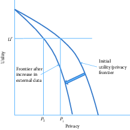

<!--
% - Rayid: "check Initially, assume the organization is on the outer frontier." ... what does this mean?
% - some references appear with n.d. in the compiled markdown
% - new references not defined in book.bib
% - Julia: on Research Data Centers, add a line how the new envisioned ADRF would allow more replicability/reproducibility and access toothers but researchers? (industry, non-profit, government) for whom current RDCs are too hard to jump through hoops?
--> 


Privacy and Confidentiality {#chap:privacy}
===========================

**Stefan Bender, Ron Jarmin, Frauke Kreuter, and Julia Lane**


This chapter addresses the issue that sits at the core of any study of
human beings---ensuring that the privacy and confidentiality of the people and organizations who are being studied is protected to the extent possible. 

The challenge that is faced for researchers is that the goal of their work, unlike the private sector, must be to create value the public good and not for private gain.  For that value to be realized, it is necessary that multiple researchers have access to the data so that results can be replicated, validated and extended. However, the more researchers access the data, the greater the risk that there is a breach of confidentiality. Social scientists have historically used two ways of minimizing that risk: anonymizing the data so that an individual's information can't be reidentified, and asking human subjects for the consent to the use their data [@NationalAcademies2014]. Those twin approaches have become obsolete, for reasons we will discuss in this chapter, and have not been replaced by an alternative framework. This concluding chapter identifies the issues that must be addressed for responsible research.

Introduction
------------

Much social science research uses data on individuals, households, different types of businesses, and organizations like educational, and government institutions. Indeed, the example running throughout this book involves data on individuals (such as faculty and students) and organizations (such as universities and firms). In circumstances such as these, researchers must ensure that such data are used responsibly---that there is a clear understanding and attempt to mitigate the possible harm from such use.  In practical terms, the study of human subjects requires that the interests of individual privacy and data confidentiality be balanced against the social benefits of research access and use.

We begin by defining terms.

**Utility** Data utility is the value resulting from data use. That utility has soared in the private sector - the biggest companies in the United States are data companies Amazon, Google, Microsoft, Facebook and Apple [@galloway2017four]. They make their money by producing utility to their customers. The goal of social science research, to hark back to the first chapter, to use new data and tools to answer questions like

 - ‘What are the earnings and employment outcomes of individuals graduating from two and four year colleges?’

- ‘How does placement in different types of firms change the likelihood of recidivism of formerly incarcerated workers?,’

and

- ‘How do regulatory agencies move from reactive, complaint-based, health and safety inspections for workplaces and housing to a more proactive approach that focuses on prevention?’ 

**Privacy** "encompasses not only the famous 'right to be left alone,' or keeping
one's personal matters and relationships secret, but also the ability to
share information selectively but not publicly" [@house2014big]. A useful way of thinking about privacy is the notion of preserving the appropriate flow of information [@nissenbaum2009]. There is no specific data type or piece of information that is too sensitive to be shared in all circumstances. In some context providing detailed information about one’s health is very appropriate, for example if it helps finding the right treatment for a disease. It is generally important to understand the context and the contextual integrity of the data flow when deciding which data to collect and how to analyze and share them. 

**Confidentiality** is
"preserving authorized restrictions on information access and
disclosure, including means for protecting personal privacy and
proprietary information" [@mccallister2010sp]. Doing so is not
easy---the challenge to the research community is how to balance the
*risk* of providing access with the associated utility
[@duncanstatistical]. To give a simple example, if means and percentages
are presented for a *large* number of people, it will be difficult to
infer an individual's value from such output, even if one knew that a
certain individual or unit contributed to the formation of that mean or
percentage. However, if those means and percentages are presented for
subgroups or in multivariate tables with small cell sizes, the risk for
disclosure increases [@doyle2001confidentiality]. 

```{r fig11-1, out.width = '70%', fig.align = 'center', echo = FALSE, fig.cap = 'The privacy--utility tradeoff'}

```

**Risk** is generally thought of as the risk of an intruder reidentifying an individual or a business in a research dataset [@duncan2004disclosure]. It is often argued that those risks increase every year as more and more data are available on individuals on the internet or in the databases of large corporations and as there are more and better tools available to make such linkages [@shlomo2014probabilistic, @herzog2007data]. However it could also be argued that the proliferation of data and tools reduces risk because it is so much easier for an intruder to find out information on an individual through a Google search [@Lane2020]. Regardless, it is generally accepted that greater research access to data and their original values increases the risk of reidentification for individual units.   

**Harm**  Although much of the discussion of privacy and confidentiality has been driven by the imperatives of the legislation governing statistical agencies, which imposes civil and criminal penalties for any reidentification, statistical agencies no longer have a monopoly on data access and use. As a result, there is more attention being paid to the potential for harm based on the type of information being shared, rather than the fact that a piece of information is shared [@nissenbaum2019contextual]. Intuitively, if an intruder finds out that an individual in a dataset is a woman, or is married, that may cause less harm than if information about income, sexual history, or criminal records are recovered.

There is an explicit tradeoff between data access and data utility. 
The greater the number of researchers and analysts that access the data, 
the greater the quality of the analysis and the greater the number of 
potential uses [@Lane2007a]. We depict this tradeoff graphically in
Figure \@ref(fig:fig11-1). The
concave curves in this hypothetical example depict the technological
relationship between data utility and privacy for an organization such
as a business firm or a statistical agency. At one extreme, all
information is available to anybody about all units, and therefore high
analytic utility is associated with the data that are not at all
protected. At the other extreme, nobody has access to any data and no
utility is achieved. Initially, assume the organization is on the outer
frontier. Increased external data resources (those not used by the
organization) increase the risk of reidentification. This is represented
by an inward shift of the utility/privacy frontier in
Figure \@ref(fig:fig11-1).
Before the increase in external data, the organization could achieve a
level of data utility $U^*$ and privacy $P_1$. The increase in
externally available data now means that in order to maintain utility at
$U^*$, privacy is reduced to $P_2$. This simple example represents the
challenge to all organizations that release statistical or analytical
products obtained from underlying identifiable data. As more data from 
external sources becomes available, it becomes more difficult
to maintain privacy.

Previously, national statistical agencies had the capacity
and the mandate to make dissemination decisions: they assessed the risk,
they understood the data user community and the associated utility from
data releases. And they had the wherewithal to address the legal,
technical, and statistical issues associated with protecting
confidentiality [@trewin2007managing].

But in a world of massive amounts of data, many once-settled issues have new
complications, and wholly new issues arise that need to be addressed,
albeit under the same rubrics. The new types of data have much greater
potential utility, often because it is possible to study small cells or
the tails of a distribution in ways not possible with small data. In
fact, in many social science applications, the tails of the distribution
are often the most interesting and hardest-to-reach parts of the
population being studied; consider health care costs for a small number
of ill people [@stanton2006high], or economic activity such as rapid
employment growth by a small number of firms [@decker2015has].

--- 

**BOX**

**Example: The importance of activity in the tails**

Spending on health care services in the United States is highly
concentrated among a small proportion of people with extremely high use.
For the overall civilian population living in the community, the latest
data indicate that more than 20% of all personal health care spending in
2009 (\$275 billion) was on behalf of just 1% of the population
[@healthcarespending].

**BOX**

---

It is important to understand the source of the risk of privacy breaches. 
Let us assume for a moment that we conducted a traditional
small-scale survey with 1,000 respondents. The survey contains
information on political attitudes, spending and saving in a given year,
and income, as well as background variables on income and education. If
name and address are saved together with this data, and someone gets
access to the data, obviously it is easy to identify individuals and
gain access to information that is otherwise not public. If the personal
identifiable information (name and address) are removed from this data
file, the risk is much reduced. If someone has access to the survey data
and sees all the individual values, it might be difficult to assess with
certainty which of the more than 330 million inhabitants in the USA is associated
with an individual data record. However, the risk is higher if one knows
some of this information (say, income) for a person, and knows that this
person is in the survey. With these two pieces of information, it is
likely possible to uniquely identify the person in the survey data.

Larger amounts of data increase the risk precisely for this reason. Much data is
available for reidentification purposes [@ohm2010broken]. Most
obviously, the risk of reidentification is much greater because the new
types of data have much richer detail and a much larger public community
has access to ways to reidentify individuals. There are many famous
examples of reidentification occurring even when obvious personal
information, such as name and social security number, has been removed
and the data provider thought that the data were consequently
deidentified. In the 1990s, Massachusetts Group Insurance released
"deidentified" data on the hospital visits of state employees;
researcher Latanya Sweeney quickly reidentified the hospital records of
the then Governor William Weld using nothing more than state voter
records about residence and date of birth [@sweeney2001computational].
In 2006, the release of supposedly de-identified web search data by AOL
resulted in two *New York Times* reports being able to reidentify a
customer simply from her browsing habits [@barbaro2006face]. And in
2012, statisticians at the department store, Target, used a young
teenager's shopping patterns to determine that she was pregnant before
her father did [@hill2012target].

But there are also less obvious problems. What is the legal framework
when the ownership of data is unclear? In the past, when data were more
likely to be collected and used within the same entity---for example,
within an agency that collects administrative data or within a
university that collects data for research purposes---organization-specific
procedures were (usually) in place and sufficient to regulate the usage of
these data. Today, legal ownership is less clear [@lane2014privacy].
There are many unresolved issues, such as Who has the legal authority to 
make decisions about permission, access, and dissemination and under what
circumstances?. The challenge today is that data sources are
often combined, collected for one purpose, and used for another. Data
providers often have a poor understanding of whether or how their data
will be used. Think, for example, about cell phone calls. The New York Times has produced a series of thought-provoking articles about the access to and use of cell-phone data, such as the one entitled *Your Apps Know Where You Were Last Night, and They’re Not Keeping It Secret* [@Valentino-DeVries]. Who owns your cell phone calls?  Should it be you, as the initiator of the call, your friend as the recipient, your cell phone company, your friend's cell phone company, the cloud server on which the data are stored for billing purposes, or the satellite company that connects the two of you?  And what laws should regulate access and use? The state (or country) that you're in when you make the call? Or your friend's state (or country)?  The state (or country) of your cell phone provider? And so on. The legal framework is, at best, murky.


---

**Example: Knowledge is power**

In a discussion of legal approaches to privacy in the context of big
data, Strandburg [@Strandburg2014] says: "'Big data' has great potential
to benefit society. At the same time, its availability creates
significant potential for mistaken, misguided or malevolent uses of
personal information. The conundrum for the law is to provide space for
big data to fulfill its potential for societal benefit, while protecting
citizens adequately from related individual and social harms. Current
privacy law evolved to address different concerns and must be adapted to
confront big data's challenges."

---


Why is access important?
------------------------

This chapters in this book have provided detailed examples of the 
potential of data to provide insights into a variety of social science
questions---particularly the relationship between investments in R&D and
innovation. But that potential is only realized if researchers have
access to the data [@Lane2007]: not only to perform primary analyses but
also to validate the data generation process (in particular, data
linkage), replicate analyses, and build a knowledge infrastructure
around complex data sets.

**Validating the data generating process**

Research designs requiring a combination of data sources and/or analysis
of the tails of populations challenge the traditional paradigm of
conducting statistical analysis on deidentified or aggregated data. In
order to combine data sets, someone in the chain that transforms raw
data into research outputs needs access to link keys contained in the
data sets to be combined. High-quality link keys uniquely identify the
subjects under study and typically are derived from items such as
individual names, birth dates, social security numbers, and business
names, addresses, and tax ID numbers. From a privacy and confidentiality
perspective, link keys are among the most sensitive information in many data
sets of interest to social scientists. This is why many organizations
replace link keys containing personal identifiable information (PII)^[PII 
is "any information about an individual maintained by an agency, including 
(1) any information that can be used to distinguish or trace an individual’s 
identity, such as name, social security number, date and place of birth, 
mother’s maiden name, or biometric records; and (2) any other information 
that is linked or linkable to an individual, such as medical, educational, 
financial, and employment information” [@mccallister2010sp].]
with privacy-protecting identifiers [@schnell2009privacy]. Regardless,
at some point in the process those must be generated out of the original
information, thus access to the latter is important.

**Replication**

John Ioannidis has claimed that most published research findings are
false [@Ioannidis2005]; for example, the unsuccessful replication of
genome-wide association studies, at less than 1%, is staggering
[@Bastian2013]. Inadequate understanding of coverage, incentive, and
quality issues, together with the lack of a comparison group, can result
in biased analysis---famously in the case of using administrative
records on crime to make inference about the role of death penalty
policy in crime reduction [@donohue2006uses; @levitt2006economic].
Similarly, overreliance on, say, Twitter data, in targeting resources
after hurricanes can lead to the misallocation of resources towards
young, Internet-savvy people with cell phones and away from elderly or
impoverished neighborhoods [@shelton2014mapping], just as bad survey
methodology led the *Literary Digest* to incorrectly call the 1936
election [@squire19881936]. The first step to replication is data
access; such access can enable other researchers to ascertain whether
the assumptions of a particular statistical model are met, what relevant
information is included or excluded, and whether valid inferences can be
drawn from the data [@kreuter201412].

**Building knowledge infrastructure**

Creating a community of practice around a data infrastructure can result
in tremendous new insights, as the Sloan Digital Sky Survey and the
Polymath project have shown [@nielsen2012reinventing]. In the social
science arena, the Census Bureau has developed a productive ecosystem
that is predicated on access to approved external experts to build,
conduct research using, and improve key data assets such as the
Longitudinal Business Database [@jarmin2002longitudinal] and
Longitudinal Employer Household Dynamics [@abowd2004integrated], which
have yielded a host of new data products and critical policy-relevant
insights on business dynamics [@haltiwanger2013creates] and labor market
volatility [@brown2008economic], respectively. Without providing robust,
but secure, access to confidential data, researchers at the Census
Bureau would have been unable to undertake the innovations that made
these new products and insights possible.

Providing access
----------------

The approaches to providing access have evolved over time. Statistical
agencies often employ a range of approaches depending on the needs of
heterogeneous data users
[@doyle2001confidentiality; @foster2009resolving]. Dissemination of data
to the public usually occurs in three steps: an evaluation of disclosure
risks, followed by the application of an anonymization technique, and
finally an evaluation of disclosure risks and analytical quality of the
candidate data release(s). The two main approaches have been
*statistical disclosure* control techniques to produce anonymized public
use data sets, and controlled access through a *research data center* 
[@shlomo2018].

**Statistical disclosure control techniques**

Statistical agencies have made data available in a number of ways:
through tabular data, public use files, licensing agreements and, more
recently, through synthetic data [@reiter2012statistical]. Hundepool et
al. [@hundepool2010handbook] define statistical disclosure control as
follows:

> concepts and methods that ensure the confidentiality of micro and
> aggregated data that are to be published. It is methodology used to
> design statistical outputs in a way that someone with access to that
> output cannot relate a known individual (or other responding unit) to
> an element in the output.

Traditionally, confidentiality protection was accomplished by
releasing only *aggregated tabular data*. This practice worked well in
settings where the primary purpose was enumeration, such as census
taking. However, tabular data are poorly suited to describing the
underlying distributions and covariance across variables that are often
the focus of applied social science research [@duncanstatistical].

To provide researchers access to data that permitted analysis of the
underlying variance--covariance structure of the data, some agencies
have constructed public use micro-data samples. To product
confidentiality in such *public use files*, a number of statistical
disclosure control procedures are typically applied. These include
stripping all identifying (e.g., PII) fields from the data, topcoding
highly skewed variables (e.g., income), and swapping records
[@doyle2001confidentiality; @zayatz2007disclosure]. However, the mosaic
effect---where disparate pieces of information can be combined to
reidentify individuals---dramatically increases the risk of releasing
public use files [@czajka2014minimizing]. In addition, there is more and
more evidence that the statistical disclosure procedure applied to
produce them decreases their utility across many applications
[@burkhauser2010improving].

Some agencies provide access to confidential micro-data through
*licensing* arrangements. A contract specifies the conditions of use and
what safeguards must be in place. In some cases, the agency has the
authority to conduct random inspections. However, this approach has led
to a number of operational challenges, including version control,
identifying and managing risky researcher behavior, and management costs
[@doyle2001confidentiality].

Another approach to providing access to confidential data that has been proposed by a group of theoretical computer scientists Cynthia Dwork, Frank McSherry, Kobbi Nissim, and Adam Smith [@Dworkroth2014]. Here statistics or other reported outputs are injected with noise, and are called “differentially private” if the inclusion or exclusion of the most at-risk person in the population does not change the probability of any output by more than a given factor. The parameter driving this factor (usually referred to as epsilon) quantifies how sensitive the aggregate output is to any one person’s data. If it is low, the output is highly “private” in the sense that it will be very difficult to reconstruct anything based on it. If it is high, reconstruction is easy. For a discussion of the applications to Census data see [@ruggles2019; @abowed2018].

Although the research agenda is an interesting and important one, there are a number of concerns about the practical implications.   The Census Bureau, for example, has spent many millions of dollars to implement differential privacy techniques for the 2020 Decennial Census, and researchers who have studied the potential impact on small towns worry that small towns will "disappear" from official statistics - a major issue when data are used for decision-making [@Wezerek].

Another approach that has had some resurgence is the use of *synthetic data* where certain properties of the original data are preserved but the original data are replaced by “synthetic data” so that no individual or  business entity can be found in the released data [@drechsler2011synthetic]. One of the earlier examples of such work was the IBM Quest system [@Agrawal1994] that generated synthetic transaction data. Two more recent examples of synthetic data sets are the SIPP Synthetic-Beta [@abowd2006final] of linked Survey of Income and Program Participation (SIPP) and Social Security Administration earnings data, and the Synthetic Longitudinal Business Database (SynLBD) [@kinney2011towards]. Jarmin et al. [-@jarmin2014expanding] discuss how synthetic data sets lack utility in many research settings but are useful for generating flexible data sets underlying data tools and apps such as the Census Bureau's OnTheMap. It is important to keep in mind that the utility of synthetic data sets as a general purpose “anonymization” tool is fairly limited. Synthetic data generation typically requires explicitly defining which properties of the original data need to be preserved (such as univariate or bivariate distributions of certain variables), and as such can be of limited use in most social science research.

**Research data centers**

The second approach is establishing research data centers (RDC). RDC present an established operational approach to facilitate access to confidential microdata for research and/or statistical purposes. This approach is based on the theoretical framework of the "Five Safes" which was initially developed by Felix Ritchie at the UK Office of National Statistics in 2003 [@desaietal2016]. The first dimension refers to safe projects. This dimension mainly refers to the whether the intended use of the data conforms with the use specified in legislations or regulations. For example, a legislation may specifically allow users to use the data only for independent scientific research. Safe people, the second dimension of the Five Saves framework, requires data users to be able to use the data in an appropriate way. A certain amount of technical skills or minimum educational levels may be required to access the data. In contrast, safe data refers to the potential to de-identifying individuals or entities in the data. Safe settings relate to the practical controls on how the data are accessed. Different channels may exist which in turn may depend on the de-identifcation risk. In practice, the lower the de-identifcation risk the more restrictive the setting will be. Lastly, safe output refers to the risk of de-identifcation in publications from confidential microdata. Strong input and output controls are in place to ensure that published findings comply with the privacy and confidentiality regulations
[@hayden2012broken]. 

**BOX**

It is not easy to use the FSRDCs. Every stage of the research process is significantly more time-consuming than using public use data, and only the most persistent researchers are successful. In addition, most of the branches charge high fees for anyone unaffiliated with an institution sponsoring an FSRDC. Projects are approved only if they benefit the Census Bureau, which by itself makes most research topics ineligible. Prospective users must prepare detailed proposals, including the precise models they intend to run and the research outputs they hope to remove from the center, which are generally restricted to model coefficients and supporting statistics. Most descriptive statistics are prohibited. Researchers are not allowed to “browse” the data or change the outputs based on their results. Under census law, researchers must become (unpaid) Census Bureau employees to gain access to non-public data. To meet this requirement, once a project is approved researchers must obtain Special Sworn Status, which involves a level 2 security clearance and fingerprint search. Applicants must be U.S. citizens or U.S. residents for three years, so most international scholars are excluded. Researchers then undergo data stewardship training. If researchers wish to modify their original model specifications or outputs, they must submit a written request and wait for approval. When the research is complete, theresults must be cleared before publication by the Center for Disclosure Avoidance Research at the Census Bureau. Any deviations from the original proposal must be documented, justified, and approved. The FSRDCs were never intended as a substitute for public use microdata, and they cannot fulfill that role. Even if the number of seats in the centers could be multiplied several hundred-fold to accommodate the current number of users of public use data, substantial hurdles remain. Applying for access and gaining approval to use the FSRDC takes at least six months and usually more. Eligibility for using FSRDCs is limited to investigators (a) affiliated with an FSRDC (or with significant financial resources), (b) with sufficient time to wait for review and approvals, and (c) doing work deemed valuable by the Bureau [@UnivTaskForceonDifferentialPrivacyforCensusData2019].

**Box**

There are other approaches that are becoming available.   The Commission on Evidencebased Policy identified new technologies, such as remote access, cloud-based, virtual data facilities, as a promising approach to provide scalable secure access to microdata without the disadvantages of the bricks and mortar approached used by the FSRDC system. One such approach, the Administrative Data Research Facility has incorporated the "five safes" principles - safe projects, safe people, safe settings, safe data, and safe outputs (https://en.wikipedia.org/wiki/Five_safes) - into its design. In addition to winning a Government Innovation Award [@GovernmentComputerNewsStaff2018], it has been used to provide secure access to confidential data to over 450 government analysts and researchers in the past 3 years [@Kreuter2019Change].

Non-Tabular data
-------------------

In addition to tabular data, many new sources of data consist of text, audio, image, and video content. The above approaches primarily deal with maintaining the privacy and confidentiality of entities in tabular data but it is equally important to do the same in non-tabular data. Medical records, sensitive crime records, notes and comments in administrative records, camera footage (from police body-cams or security cameras for example) are all examples of data that is being used for analysis and requires robust techniques to maintain the privacy and confidentiality of individuals. Although the techniques there are not as mature, there is some work in these areas:

Text Anonymization: Typical approaches here range from simply removing Personally identifiable information (PII) through regular expressions and dictionaries [@Neamatullah2008] to machine learning based approaches that balance the confidentiality of the entities in the data and the utility of the text [@Cumby2011].

Image and Video Anonymization: The most common use of anonymization techniques in image and video data is to redact, blur, or remove faces of individuals in order to protect their identity. This can be extended to other attributes of the person, such as clothing or the rest of the body but the primary focus so far has been on detecting, and then blurring or modifying the faces of individuals in the data. Sah et al. [-@Sah2017] provide a survey of video redaction methods. Hukkelas et al. [-@Hukkelas2019] recently presented a method to automatically anonymize faces in images while retaining the original data distribution.

The new challenges
------------------

While there are well-established policies and protocols surrounding
access to and use of survey and administrative data, a major new
challenge is the lack of clear guidelines governing the collection of
data about human activity in a world in which all public, and some
private, actions generate data that can be harvested
[@house2014big; @ohm2010broken; @Strandburg2014]. The twin pillars on
which so much of social science have rested---informed consent and
anonymization---are virtually useless in a big data setting where
multiple data sets can be and are linked together using individual
identifiers by a variety of players beyond social scientists with formal
training and whose work is overseen by institutional review boards. This
rapid expansion in data and their use is very much driven by the
increased utility of the linked information to businesses, policymakers,
and ultimately the taxpayer. In addition, there are no obvious data
stewards and custodians who can be entrusted with preserving the privacy
and confidentiality with regard to both the source data collected from
sensors, social media, and many other sources, and the related analyses
[@lane2013me].

It is clear that informed consent as historically construed is no longer
feasible. As Nissenbaum [@nissenbaum2011contextual] points out,
notification is either comprehensive or comprehensible, but not both.
While ideally human subjects are offered true freedom of choice based on
a sound and sufficient understanding of what the choice entails, in
reality the flow of data is so complex and the interest in the data
usage so diverse that simplicity and clarity in the consent statement
unavoidably result in losses of fidelity, as anyone who has accepted a
Google Maps agreement is likely to understand [@check2015researchers].
In addition, informed consent requires a greater understanding of the
breadth of type of privacy breaches, the nature of harm as diffused over
time, and an improved valuation of privacy in the big data context.
Consumers may value their own privacy in variously flawed ways. They
may, for example, have incomplete information, or an overabundance of
information rendering processing impossible, or use heuristics that
establish and routinize deviations from rational decision-making
[@Acquisti2014].

It is also nearly impossible to truly anonymize data. Big data are often
structured in such a way that essentially everyone in the file is
unique, either because so many variables exist or because they are so
frequent or geographically detailed, that they make it easy to
reidentify individual patterns [@narayanan2008robust]. It is also no
longer possible to rely on sampling or measurement error in external
files as a buffer for data protection, since most data are not in the
hands of statistical agencies.

There are no data stewards controlling access to individual data. Data
are often so interconnected (think social media network data) that one
person's action can disclose information about another person without
that person even knowing that their data are being accessed. The group
of students posting pictures about a beer party is an obvious example,
but, in a research context, if the principal investigator grants access
to the proposal, information could be divulged about colleagues and
students. In other words, volunteered information of a minority of
individuals can unlock the same information about many---a type of
"tyranny of the minority" [@barocas2014bigger].

There are particular issues raised by the new potential to link
information based on a variety of attributes that do not include PII.
Barocas and Nissenbaum write as follows [@barocas2014big]:

> Rather than attempt to deanonymize medical records, for instance, an
> attacker (or commercial actor) might instead infer a rule that relates
> a string of more easily observable or accessible indicators to a
> specific medical condition, rendering large populations vulnerable to
> such inferences even in the absence of PII. Ironically, this is often
> the very thing about big data that generate the most excitement: the
> capacity to detect subtle correlations and draw actionable inferences.
> But it is this same feature that renders the traditional protections
> afforded by anonymity (again, more accurately, pseudonymity) much less
> effective.

In light of these challenges, Barocas and Nissenbaum continue

> the value of anonymity inheres not in namelessness, and not even in
> the extension of the previous value of namelessness to all uniquely
> identifying information, but instead to something we called
> "reachability," the possibility of knocking on your door, hauling you
> out of bed, calling your phone number, threatening you with sanction,
> holding you accountable---with or without access to identifying
> information.

It is clear that the concepts used in the larger discussion of privacy
and big data require updating. How we understand and assess harms from
privacy violations needs updating. And we must rethink established
approaches to managing privacy in the big data context. The next section
discusses the framework for doing so.

Legal and ethical framework
---------------------------

The Fourth Amendment to the US Constitution, which constrains the
government's power to "search" the citizenry's "persons, houses, papers,
and effects" is usually cited as the legal framework for privacy and
confidentiality issues. In the US a "sectoral" approach to privacy
regulation, for example, the Family Education Rights and Privacy Act through
commercial transactions with a business, and hence is not covered by
these frameworks. There are major questions as to what is reasonably
private and what constitutes unwarranted intrusion [@Strandburg2014].
There is a lack of clarity on who owns the new types of data---whether
it is the person who is the subject of the information, the person or
organization who collects these data (the data custodian), the person
who compiles, analyzes, or otherwise adds value to the information, the
person who purchases an interest in the data, or society at large. The
lack of clarity is exacerbated because some laws treat data as property
and some treat it as information [@Cecil2003].

The ethics of the use of big data are also not clear, because analysis
may result in being discriminated against unfairly, being limited in
one's life choices, being trapped inside stereotypes, being unable to
delineate personal boundaries, or being wrongly judged, embarrassed, or
harassed. There is an entire research agenda to be pursued that examines
the ways that big data may threaten interests and values, distinguishes
the origins and nature of threats to individual and social integrity,
and identifies different solutions [@boyd2012critical]. The approach
should be to describe what norms and expectations are likely to be
violated if a person agrees to provide data, rather than to describe
what will be done during the research.

What is clear is that most data are housed no longer in statistical
agencies, with well-defined rules of conduct, but in businesses or
administrative agencies. In addition, since digital data can be alive
forever, ownership could be claimed by yet-to-be-born relatives whose
personal privacy could be threatened by release of information about
blood relations.

The new European Data Protection Regulation (GDPR), which is in effect since May, 2018, was designed to address some of the challenges.  In addition to ensuring lawful data collection practices, GDPR pushes for purpose limitation and data minimisation. This principle requires organisations to clearly state for what purpose personal data is collected, to collect the data only for the time needed to complete the purpose, and to collect only those personal data that is needed to achieve the specified processing purposes. In the U.S. the California Consumer Privacy Act (CCPA) is in effect since January 2020, and here too companies have now have time limits to process customer data. 

However, GDPR and other regulations of this type, still rely on traditional regulatory tools for managing privacy, which is notice, and consent. Both have failed to provide a viable market mechanism allowing a form of self-regulation governing industry data collection. Going forward, a more nuanced assessment of tradeoffs in the big data context, moving away from individualized assessments of the costs of privacy violations, is needed [@Strandburg2014]. 

Ohm advocates for a new conceptualization of legal policy regarding privacy 
in the big data context that uses five guiding principles for reform: 
first, that rules take into account the
varying levels of inherent risk to individuals across different data
sets; second, that traditional definitions of PII need to be rethought;
third, that regulation has a role in creating and policing walls between
data sets; fourth, that those analyzing big data must be reminded, with
a frequency in proportion to the sensitivity of the data, that they are
dealing with people; and finally, that the ethics of big data research
must be an open topic for continual reassessment [@Ohm2014].

Summary
-------

The excitement about how big data can change the social science research
paradigm should be tempered by a recognition that existing ways of
protecting privacy confidentiality are no longer viable [@karr2014analytical].
There is a great deal of research that can be used to inform the
development of such a structure, but it has been siloed into
disconnected research areas, such as statistics, cybersecurity, and
cryptography, as well as a variety of different practical applications,
including the successful development of remote access secure data
enclaves. We must piece together the knowledge from these various fields
to develop ways in which vast new sets of data on human beings can be
collected, integrated, and analyzed while protecting them [@lane2014].

It is possible that the confidentiality risks of disseminating data may
be so high that traditional access models will no longer hold; that the
data access model of the future will be to take the analysis to the data
rather than the data to the analyst or the analyst to the data. One
potential approach is to create an integrated system including (a)
unrestricted access to highly redacted data, most likely some version of
synthetic data, followed by (b) means for approved researchers to access
the confidential data via remote access solutions, combined with (c)
verification servers that allows users to assess the quality of their
inferences with the redacted data so as to be more efficient with their
use (if necessary) of the remote data access. Such verification servers
might be a web-accessible system based on a confidential database with
an associated public micro-data release, which helps to analyze the
confidential database [@karr2014analytical]. Such approaches are
starting to be developed, both in the USA and in Europe
[@Elias2014; @jones2006administrative].

There is also some evidence that people do not require complete
protection, and will gladly share even private information provided that
certain social norms are met [@Wilbanks2014; @Pentland2014]. There is a
research agenda around identifying those norms as well; characterizing
the interests and wishes of actors (the information senders and
recipients or providers and users); the nature of the attributes
(especially types of information about the providers, including how
these might be transformed or linked); and identifying transmission
principles (the constraints underlying the information flows).

However, it is likely that it is no longer possible for a lone social
scientist to address these challenges. One-off access agreements to
individuals are conducive to neither the production of high-quality
science nor the high-quality protection of data [@schermann2014big]. The
curation, protection, and dissemination of data on human subjects cannot
be an artisan activity but should be seen as a major research
infrastructure investment, like investments in the physical and life
sciences [@bird2011computing; @abazajian2009seventh; @human2010catalog].
In practice, this means that linkages become professionalized and
replicable, research is fostered within research data centers that
protect privacy in a systematic manner, knowledge is shared about the
process of privacy protections disseminated in a professional fashion,
and there is ongoing documentation about the value of evidence-based
research. It is thus that the risk--utility tradeoff depicted in
Figure \@ref(fig:fig11-1) can
be shifted in a manner that serves the public good.

Resources
---------

The American Statistical Association's Privacy and Confidentiality
website provides a useful source of information
[@AmericanStatisticalAssociation].

An overview of federal activities is provided by the Confidentiality and
Data Access Committee of the Federal Committee on Statistics and
Methodology [@ConfidentialityandDataAccessCommittee].

The World Bank and International Household Survey Network provide a good
overview of data dissemination "best practices"
[@InternationalHouseholdSurveyNetwork].

There is a *Journal of Privacy and Confidentiality* based at Carnegie
Mellon University [@JPC], and also a journal called *Transactions in
Data Privacy* [@TransactionsonDataPrivacy].

The United Nations Economic Commission on Europe hosts workshops and
conferences and produces occasional reports
[@UnitedNationsEconomicCommissionforEurope].

Collection of lectures from the semester on privacy at the Simons Institute for the Theory of Computing https://simons.berkeley.edu/programs/privacy2019 (available on youtube https://www.youtube.com/user/SimonsInstitute/).
