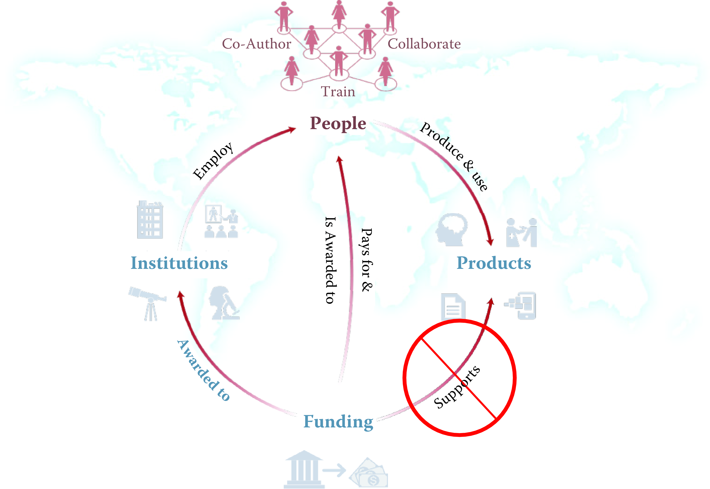
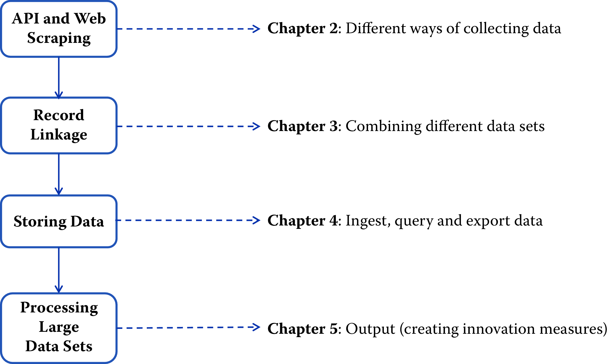
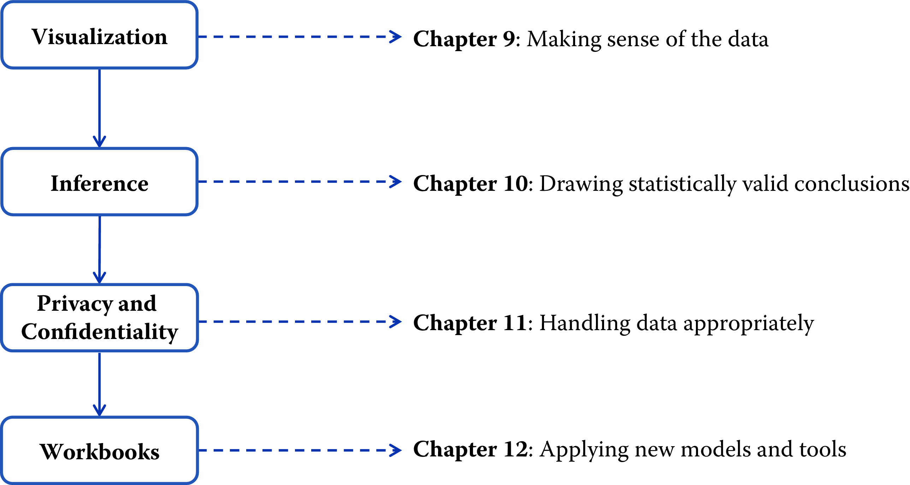

%ToDo: We need new flow chart graphs, they point to the wrong chapters right now.

Introduction {#chap:intro}
============

This section provides a brief overview of the goals and structure of the
book.

Why this book? {#sec:1-1}
--------------

The world has changed for empirical social scientists. The new types of
data, methods, and tools have generated an entire new research field---that of data
science. That world has traditionally been dominated by computer scientists who have
generated new ways of creating and collecting data, developed (or rebranded) new
analytical and statistical techniques, and provided new ways of
visualizing and presenting information. These new sources of data and
techniques have the potential to transform the way applied social
science is done.

Research has certainly changed. Researchers draw on data that are
"found" rather than "made" by federal agencies; those publishing in
leading academic journals are much less likely today to draw on
preprocessed survey data (Figure \@ref(fig:fig1)).

(\#fig:fig1)Use of pre-existing survey data in publications in leading journals, 1980--2010 (@Chetty2012)

The way in which data are used has also changed for both government
agencies and businesses. Chief data officers are becoming as common in
federal and state governments as chief economists were decades ago, and
in cities like New York and Chicago, mayoral offices of data analytics
have the ability to provide rapid answers to important policy questions
[@lee2012rise]. But since federal, state, and local agencies often lack the
capacity to do such analysis themselves [@alawadhi2012building], they
must make these data available either to consultants or to the research
community. Businesses are also learning that making effective use of
their data assets can have an impact on their bottom line
[@brynjolfsson2011strength].

And the jobs have changed. The new job title of "data scientist" is
highlighted in job advertisements on CareerBuilder.com and
Burning-glass.com---in the same category as statisticians, economists,
and other quantitative social scientists if starting salaries are useful
indicators.

The goal of this book is to provide social scientists with an
understanding of the key elements of this new science, its value, and
the opportunities for using it to improve their work. The goal is also to identify
the many ways in which the analytical toolkits possessed by social
scientists can inform data science research and result in new methods needed for social science research.

We take a pragmatic approach, drawing on our experience of working with
data in a variety of real-world contexts. Most social scientists set out to solve a real-world social or
economic problem: they frame the problem, identify the data, do the
analysis, and then draw inferences. At all points, of course, the social
scientist needs to consider the ethical ramifications of their work,
particularly respecting privacy and confidentiality. The book follows
the same structure. We chose a particular problem---the link between
research investments and innovation---because that is a major social
science policy issue, and one in which social scientists have been
addressing using big data techniques. While the example is specific and
intended to show how abstract concepts apply in practice, the approach
is completely generalizable to other important areas such as criminal justice, education, 
public health, sustainability, economic development, and workforce development. The web scraping, linkage, classification, and text analysis methods on display here are canonical in nature. The inference and privacy and confidentiality issues are no different than
in any other study involving human subjects, and the communication of
results through visualization is similarly generalizable.

Defining big data and its value {#sec:1-2}
-------------------------------

There are almost as many definitions of big data as there are new types
of data. One approach is to define big data as *anything too big to fit onto your computer*^[This topic is discussed in more detail in Chapter 5]. Another approach is to define it as data with high 
volume, high velocity, and great variety. Our aim is not to create yet another definition. Instead , we choose the pragmatic description adopted 
by the American Association of Public Opinion Research: "The term 'Big Data' 
is an imprecise description of a rich and complicated set of characteristics,
practices, techniques, ethical issues, and outcomes all associated with data"
[@japec2015big].

While the term "big data" may be a buzzword, what's real is the significant value of new types of data and new methods for social science. Personal data has been hailed as the "new oil" of the
twenty-first century, and the benefits to policy, society, and public
opinion research are undeniable [@greenwood2014]. Policymakers have
found that detailed data on human beings can be used to reduce crime,
improve health delivery, and manage cities better [@keller2012big]. The
scope is broad indeed: one of this book's editors has used such data to
not only help win political campaigns but also show its potential for
social good and public policy. For public opinion research, social scientists can  increase the scope of their data
collection efforts while at the same time reducing costs and respondent
burden, increasing timeliness, and increasing
precision[@murphy2014social]. Society can gain as well---recent work shows data-driven
businesses were 5% more productive and 6% more profitable than their
competitors[@brynjolfsson2011strength]. In short, the vision is that
social science researchers can potentially, by using new types of data and methods,increase the quality and impact of their work. 

---

**Example: New data enable new analyses**

Spotshotter data, which have fairly detailed information for each
gunfire incident, such as the precise timestamp and the nearest address,
as well as the type of shot, can be used to improve crime data
[@carr2015geography]; Twitter data can be used to improve understanding and predictions
around job loss, job gain, and job postings [@antenucci2014using]; and
eBay postings can be used to estimate demand elasticities
[@einav2013data]. Of course, these new sources come with their own caveats and biases that need to be considered when drawing inferences.  We will cover this later in the book in more detail.

---

But most interestingly, the new data can change the way we think about
measuring and making inferences about behavior. For example, it enables
the capture of information on the subject's entire environment---thus,
for example, the effect of fast food caloric labeling in health
interventions [@Elbel2011]; the productivity of a cashier if he is
within eyesight of a highly productive cashier but not otherwise
[@Mas2009]. So it offers the potential to understand the effects of
complex environmental inputs on human behavior. In addition, more data enables us to study the tails of a distribution in a
way that is not possible with small data. Much of interest in human
behavior is driven by the tails of the distribution---health care costs
by small numbers of ill people [@stanton2006high], economic activity and
employment by a small number of firms
[@evans1987tests; @decker2015has]---and is impossible to study with the
small sample sizes available to researchers.

At the same time, we still face the same challenges and responsibilities
as we did before in the survey and small data collection environment.
Indeed, social scientists have a great deal to offer to a (data) world
that is currently looking to computer scientists to provide answers. Two
major areas to which social scientists can contribute, based on decades
of experience and work with end users, are inference and attention to
data quality.

Social science, inference, and big data {#sec:1.3}
---------------------------------------

The goal of empirical social science is to make inferences about a
population from available data. That requirement exists regardless of
the data source---and is a guiding principle for this book. For
probability-based survey data, methodology has been developed to
overcome problems in the data generating process. A guiding principle
for survey methodologists is the total survey error framework, and
statistical methods for weighting, calibration, and other forms of
adjustments are commonly used to mitigate errors in the survey process.
Likewise for "broken" experimental data, techniques like propensity
score adjustment and principal stratification are widely used to fix
flaws in the data generating process [@imbens2015causal]. Two books provide frameworks for
*survey quality*^[This topic is discussed in more detail in Chapter 11.][@groves2004survey; @biemer2003].

Across the social sciences, including economics, public policy,
sociology, management, (parts of) psychology and the like, we can
identify three categories of analysis with three different inferential
goals: description, causation, and prediction.

**Description**

The job of many social scientists is to provide descriptive statements
about the population of interest. These could be univariate, bivariate,
or even multivariate statements. [Machine Learning](#chap:ml) on machine learning will cover methods that go beyond simple descriptive statistics, known as *unsupervised learning*
Methods that include cluster analysis.

Descriptive statistics are usually created based on census data or
sample surveys to generate some summary statistics like a mean, median,
or a graphical distribution to describe the population of interest. In
the case of a census, the work ends right there. With sample surveys the
point estimates come with measures of uncertainties (standard errors).
The estimation of standard errors has been worked out for most
descriptive statistics and most common survey designs, even complex ones
that include multiple layers of sampling and disproportional selection
probabilities [@hansen1993sample; @valliant2013practical].

---

**Example: Descriptive statistics**

The US Bureau of Labor Statistics surveys about 60,000 households a
month and from that survey is able to describe national employment and
unemployment levels. For example, in November 2015, total nonfarm
payroll employment increased by 211,000 in November, and the
unemployment rate was unchanged at 5.0%. Job gains occurred in
construction, professional and technical services, and health care.
Mining and information lost jobs [@BLS2015].

---

Proper inference, even for purely descriptive purposes, from a sample to
the population rests usually on knowing that everyone from the target
population had the chance to be included in the survey, and knowing the
selection probability for each element in the population. The latter
does not necessarily need to be known prior to sampling, but eventually
a probability is assigned for each case. Getting the selection
probabilities right is particularly important when reporting totals
[@lohr2009sampling]. Unfortunately in practice, samples that start out
as probability samples can suffer from a high rate of nonresponse.
Because the survey designer cannot completely control which units
respond, the set of units that ultimately respond cannot be considered
to be a probability sample [@Meyer2015]. Nevertheless, starting with a
probability sample provides some degree of comfort that a sample will
have limited coverage errors (nonzero probability of being in the
sample), and there are methods for dealing with a variety of missing
data problems [@little2014statistical].

 

**Causation**

In many cases, social scientists wish to test hypotheses, often
originating in theory, about relationships between phenomena of
interest. Ideally such tests stem from data that allow causal inference:
typically randomized experiments or strong nonexperimental study
designs. When examining the effect of $X$ on $Y$, knowing how cases were
selected into the sample or data set is much less important in the
estimation of causal effects than for descriptive studies, for example,
population means. What is important is that all elements of the
inferential population have a chance of being selected for the treatment
[@imbens2015causal]. In the debate about probability and nonprobability
surveys, this distinction is often overlooked. Medical researchers have
operated with unknown study selection mechanisms for years: for example,
randomized trials that enroll only selected samples.

---

**Example: New data and causal inference**

One of the major risks with using big data without thinking about the
data source is the misallocation of resources. Overreliance on, say,
Twitter data in targeting resources after hurricanes can lead to the
misallocation of resources towards young, Internet-savvy people with
cell phones, and away from elderly or impoverished neighborhoods
[@shelton2014mapping]. Of course, all data collection approaches have
had similar risks. Bad survey methodology led the *Literary Digest* to
incorrectly call the 1936 election [@squire19881936]. Inadequate
understanding of coverage, incentive and quality issues, together with
the lack of a comparison group, has hampered the use of administrative
records---famously in the case of using administrative records on crime
to make inference about the role of death penalty policy in crime
reduction [@donohue2006uses].

---

Of course, in practice it is difficult to ensure that results are
generalizable, and there is always a concern that the treatment effect
on the treated is different than the treatment effect in the full
population of interest [@stuart2010matching]. Having unknown study
selection probabilities makes it even more difficult to estimate
population causal effects, but substantial progress is being made
[@dugoff2014generalizing; @morgan2014counterfactuals]. As long as we are
able to model the selection process, there is no reason not to do causal
inference from so-called nonprobability data.

**Prediction**

Forecasting or prediction tasks are a little less common among applied
social science researchers as a whole, but are certainly an important
element for users of official statistics---in particular, in the context
of social and economic indicators---as generally for decision and policy makers in
government and business. Here, similar to the causal inference setting,
it is of utmost importance that we do know the process that generated
the data, and we can rule out any unknown or unobserved systematic
selection mechanism.

---

**Example: Learning from the flu**

"Five years ago in 2009, a team of researchers from Google announced
a remarkable achievement in one of the world's top scientific journals,
*Nature*. Without needing the results of a single medical check-up, they
were nevertheless able to track the spread of influenza across the US.
What's more, they could do it more quickly than the Centers for Disease
Control and Prevention (CDC). Google's tracking had only a day's delay,
compared with the week or more it took for the CDC to assemble a picture
based on reports from doctors' surgeries. Google was faster because it
was tracking the outbreak by finding a correlation between what people
searched for online and whether they had flu symptoms. ...

"Four years after the original *Nature* paper was published, *Nature
News* had sad tidings to convey: the latest flu outbreak had claimed an
unexpected victim: Google Flu Trends. After reliably providing a swift
and accurate account of flu outbreaks for several winters, the
theory-free, data-rich model had lost its nose for where flu was going.
Google's model pointed to a severe outbreak but when the slow-and-steady
data from the CDC arrived, they showed that Google's estimates of the
spread of flu-like illnesses were overstated by almost a factor of two.

"The problem was that Google did not know---could not begin to
know---what linked the search terms with the spread of flu. Google's
engineers weren't trying to figure out what caused what. They were
merely finding statistical patterns in the data. They cared about
correlation rather than causation" [@harford2014big].

---

Social science, data quality, and big data {#sec:1-5}
------------------------------------------

Most data in the real world are noisy, inconsistent, and suffers from
missing values, regardless of its source. Even if data collection is
cheap, the costs of creating high-quality data from the source -- *cleaning, curating, standardizing, and integrating*^[This topic is discussed in more detail in Chapter 3.] -- are substantial.

Data quality can be characterized in multiple ways [@christen2012data]:

- **Accuracy**: How accurate are the attribute values in the data?

- **Completeness**: Is the data complete?

- **Consistency**: How consistent are the values in and between the database(s)?

- **Timeliness**: How timely is the data?

- **Accessibility**: Are all variables available for analysis?

Social scientists have decades of experience in transforming messy,
noisy, and unstructured data into a well-defined, clearly structured,
and quality-tested data set. Preprocessing is a complex and
time-consuming process because it is "hands-on"---it requires judgment
and cannot be completely automated. It is difficult to overstate the value of preprocessing for any data
analysis, but this is particularly true in new types of data that are becoming available. Data need to be parsed, standardized, deduplicated, and normalized.

**Parsing** is a fundamental step taken regardless of the data source, and refers to
the decomposition of a complex variable into components. For example, a
freeform address field like "1234 E 56th St" might be broken down into a
street number "1234" and a street name "E 56th St." The street name
could be broken down further to extract the cardinal direction "E" and
the designation "St." Another example would be a combined full name
field that takes the form of a comma-separated last name, first name,
and middle initial as in "Miller, David A." Splitting these identifiers
into components permits the creation of more refined variables that can
be used in the matching step.

In the simplest case, the distinct parts of a character field are
delimited. In the name field example, it would be easy to create the
separate fields "Miller" and "David A" by splitting the original field
at the comma. In more complex cases, special code will have to be
written to parse the field. Typical steps in a parsing procedure
include:

1.  Splitting fields into tokens (words) on the basis of delimiters,

2.  Standardizing tokens by lookup tables and substitution by a standard
    form,

3.  Categorizing tokens,

4.  Identifying a pattern of anchors, tokens, and delimiters,

5.  Calling subroutines according to the identified pattern, therein
    mapping of tokens to the predefined components.

**Standardization** refers to the process of simplifying data by replacing variant
representations of the same underlying observation by a default value in
order to improve the accuracy of field comparisons. For example, "First
Street" and "1st St" are two ways of writing the same street name, but a
simple string comparison of these values will return a poor result. By
standardizing fields---and using the same standardization rules across
files!---the number of true matches that are wrongly classified as
nonmatches (i.e., the number of false nonmatches) can be reduced.

Some common examples of standardization are:

-   Standardization of different spellings of frequently occurring
    words: for example, replacing common abbreviations in street names
    (Ave, St, etc.) or titles (Ms, Dr, etc.) with a common form. These
    kinds of rules are highly country- and language-specific.

-   General standardization, including converting character fields to
    all uppercase and removing punctuation and digits.

**Deduplication** consists of removing redundant records from a single list, that is,
multiple records from the same list that refer to the same underlying
entity. After deduplication, each record in the first list will have at
most one true match in the second list and vice versa. This simplifies
the record linkage process and is necessary if the goal of record
linkage is to find the best set of one-to-one links (as opposed to a
list of all possible links). One can deduplicate a list by applying
record linkage techniques described in this chapter to link a file to
itself.

**Normalization** is the process of ensuring that the fields that are being compared
across files are as similar as possible in the sense that they could
have been generated by the same process. At minimum, the same
standardization rules should be applied to both files. For additional
examples, consider a salary field in a survey. There are number
different ways that salary could be recorded: it might be truncated as a
privacy-preserving measure or rounded to the nearest thousand, and
missing values could be imputed with the mean or with zero. During
normalization we take note of exactly how fields are recorded.

New tools for new data
----------------------

The new data sources that we have discussed frequently require working
at scales for which the social scientist's familiar tools are not
designed. Fortunately, the wider research and data analytics community
has developed a wide variety of often more scalable and flexible
tools---tools that we will introduce within this book.

Relational database management systems (DBMSs)^[This topic is discussed in more detail in Chapter 4.] are used throughout
business as well as the sciences to organize, process, and search large
collections of structured data. NoSQL DBMSs are used for data that is
extremely large and/or unstructured, such as collections of web pages,
social media data (e.g., Twitter messages), sensor data, and clinical notes.
Extensions to these systems and also specialized single-purpose DBMSs
provide support for data types that are not easily handled in
statistical packages such as geospatial data, networks, and graphs.

Open source programming languages such as Python (used extensively
throughout this book) and R provide high-quality implementations of
numerous data analysis and visualization methods, from regression to
statistics, text analysis, network analysis, and much more. Finally,
parallel computing platforms such as Hadoop and Spark can be used to
harness parallel computer clusters for extremely large data sets and
computationally intensive analyses.

These various components may not always work together as smoothly as do
integrated packages such as SAS, SPSS, and Stata, but they allow
researchers to take on problems of greater scale and complexity.
Furthermore, they are developing at a tremendous rate as the result of
work by thousands of people worldwide. For these reasons, the modern
social scientist needs to be familiar with their capabilities.

The book's "use case" {#sec:1-6}
---------------------

This book is about the uses of big data in social science. Our focus is
on working through the use of data as a social scientist normally
approaches research. That involves thinking through how to use such data
to address a question from beginning to end, and thereby learning about
the associated tools---rather than simply engaging in coding exercises
and then thinking about how to apply them to a potpourri of social
science examples.

There are many examples of the use of big data in social science
Research. The chapters in the book draw
heavily on a use case based on one of the first large-scale big data
social science data infrastructures. This infrastructure, based on
UMETRICS^[UMETRICS: Universities Measuring the Impact of Research on Innovation and Science [@lane2015new]] data housed at the University of Michigan's Institute for
Research on Innovation and Science (IRIS)^[iris.isr.umich.edu] and enhanced with data from
the US Census Bureau, provides a new quantitative analysis and
understanding of science policy based on large-scale computational
analysis of new types of data.

The infrastructure was developed in response to a call from the
President's Science Advisor (Jack Marburger) for a *science of science
policy* [@marburger2005wanted]. He wanted a scientific response to the
questions that he was asked about the impact of investments in science.

---

**Example: The Science of Science Policy**

Marburger wrote [@marburger2005wanted]: "How much should a nation spend
on science? What kind of science? How much from private versus public
sectors? Does demand for funding by potential science performers imply a
shortage of funding or a surfeit of performers? These and related
science policy questions tend to be asked and answered today in a highly
visible advocacy context that makes assumptions that are deserving of
closer scrutiny. A new 'science of science policy' is emerging, and it
may offer more compelling guidance for policy decisions and for more
credible advocacy. ...

"Relating R&D to innovation in any but a general way is a tall order,
but not a hopeless one. We need econometric models that encompass enough
variables in a sufficient number of countries to produce reasonable
simulations of the effect of specific policy choices. This need won't be
satisfied by a few grants or workshops, but demands the attention of a
specialist scholarly community. As more economists and social scientists
turn to these issues, the effectiveness of science policy will grow, and
of science advocacy too."

---

Responding to this policy imperative is a tall order, because it
involves using all the social science and computer science tools
available to researchers. The new digital technologies can be used to
capture the links between the inputs into research, the way in which
those inputs are organized, and the subsequent outputs
[@weinberg2014science; @zolas2015wrapping]. The social science questions
that are addressable with this data infrastructure include the effect of
research training on the placement and earnings of doctoral recipients,
how university trained scientists and engineers affect the productivity
of the firms they work for, and the return on investments in research. Figure \@ref(fig:fig2) provides an abstract representation of the empirical approach that is needed: data about grants, the people who are funded on grants, and the subsequent scientific and economic activities.

First, data must be captured on what is funded, and since the data are
in text format, computational linguistics tools must be applied
([Text Analysis](#chap:text)). Second, data must be captured on who is funded,
and how they interact in teams, so network tools and analysis must be
used ([Networks: The Basics]). Third, information about the type of
results must be gleaned from the web and other sources ([Working with Web Data and APIs]).

Finally, the disparate
complex data sets need to be stored in databases ([Databases]), integrated ([Record Linkage]), analyzed ([Machine Learning](#chap:ml)), and used to make inferences ([Errors and Inference]).

(\#fig:fig2)A visualization of the complex links between what and who is funded, and the results; tracing the direct link between funding and results is misleading and wrong

The use case serves as the thread that ties many of the ideas together.
Rather than asking the reader to learn how to code "hello world," we
build on data that have been put together to answer a real-world
question, and provide explicit examples based on that data. We then
provide examples that show how the approach generalizes.

For example, the text analysis chapter
([Text Analysis](#chap:text)) shows how to use natural language processing to
describe *what* research is being done, using proposal and award text to
identify the research topics in a portfolio
[@talley2011database; @Evans2011]. But then it also shows how the
approach can be used to address a problem that is not just limited to
science policy---the conversion of massive amounts of knowledge that is
stored in text to usable information.

Similarly, the network analysis chapter
([Networks: The Basics]) gives specific examples using the UMETRICS
data and shows how such data can be used to create new units of
analysis---the networks of researchers who do science, and the networks
of vendors who supply research inputs. It also shows how networks can be
used to study a wide variety of other social science questions.

In another example, we use APIs^[Application Programming Interfaces] provided by publishers to describe the
results generated by research funding in terms of publications and other
measures of scientific impact, but also provide code that can be
repurposed for many similar APIs.

And, of course, since all these new types of data are provided in a
variety of different formats, some of which are quite large (or
voluminous), and with a variety of different timestamps (or velocity),
we discuss how to store the data in different types of data formats.

**BOX**
** Additional Examples**

The methods covered in this book are broadly applicable across a variety of policy areas including health, education, criminal justice, sustainability, workforce development, social services, public safety, and urban infrastructure. These methods have been used to build systems to improve the understanding  of critical questions such as: 
 - ‘Which individuals graduating from four year colleges are at risk of being long-term unemployed and which education and training programs improve their earnings and employment outcomes?,’
 
 -  ‘Which ex-offenders are likely to go back to prison and can proactive outreach to connect them with health and social services reduce their risk of recidivism and improve their outcomes?,’ and
 
  - ‘How do regulatory agencies move from reactive, complaint-based, health and safety inspections for workplaces and housing to a more proactive approach that focuses on prevention?’
  
**BOX**

The structure of the book
-------------------------

We organize the book in three parts, based around the way social
scientists approach doing research. The first set of chapters addresses
the new ways to capture, curate, and store data. The second set of
chapters describes what tools are available to process and analyze
data. The last set deals with the appropriate handling of
data on individuals and organizations as well as what inferences can be drawn from the data and the analysis that was done. Of course, we assume that before starting with the data and analysis, we have spent time on formulating the problem or question that is being addressed. We don't cover that in this book but refer readers to resources such as "Data Science Project Scoping" (cite:) for more information.

(\#fig:projectfig)The data science project workflow. Blue represents each step in the project, orange represents the tools used in that step, and green represents the methods for analysis.

### Part I: Capture and curation

The four chapters in Part I (see Figure \@ref(fig:fig3)) tell you how to collect, store, link, and manage data.

[Working with Web Data and APIs] describes how to extract information from data sources on the Web, including social media. The particular application
will be to develop links to authors' articles on Twitter using PLOS
articles and to pull information about authors and articles from web
sources by using an API. You will learn how to retrieve link data from
bookmarking services, citations from Crossref, links from Facebook, and
information from news coverage. In keeping with the social science
grounding that is a core feature of the book, the chapter discusses what
data can be captured from online sources, what is potentially reliable,
and how to manage data quality issues.

This data differs from survey data in that we must typically combine data
from multiple sources to get a complete picture of the activities of
interest. Although computer scientists may sometimes simply "mash" data
sets together, social scientists are rightfully concerned about issues
of missing links, duplicative links, and erroneous links.
[Record Linkage] provides an overview of traditional rule-based
and probabilistic approaches to data linkage, as well as machine learning approaches that are more adaptive and tunable. 

Once data have been collected and linked, it is
necessary to store and organize it. Social scientists are used to
working with one analytical file, often in statistical software tools
such as SAS or Stata. [Databases] describes different approaches to storing data in ways that facilitate rapid, scalable, and reliable exploration and analysis.

Big data is sometimes defined as data that are too big to fit onto the
analyst's computer. [Programming with Big Data](#chap:parallel) provides an overview of programming techniques that facilitate the scalable use of data (often using parallel
computing). While the focus is on one of the most widely used big data
programming paradigms and its most popular implementation, Apache
Hadoop, the goal of the chapter is to provide a conceptual framework to
the key challenges that the approach is designed to address.

(\#fig:fig3)The four chapters of Part I focus on *data capture* and *curation*

### Part II: Modeling and analysis

The four chapters in Part II (see Figure \@ref(fig:fig4)) introduce four of the most important tools that can be used by social scientists to do new and exciting research: information visualization, machine learning, text analysis, and social network analysis.

[Information Visualization](#chap:viz) introduces information visualization methods and
describes how you can use those methods to explore data and communicate
results so that data can be turned into interpretable, actionable
information. There are many ways of presenting statistical information
that convey content in a rigorous manner. The goal of this chapter is to
explore different approaches and examine the information content and
analytical validity of the different approaches. It provides an overview
of effective visualizations. Using visualization already in early analysis stages is key to a good understanding of data quality and potential pitfalls. 

[Machine Learning](#chap:ml) introduces machine learning methods. It shows the
power of machine learning in a variety of different contexts,
particularly focusing on clustering, classification, and prediction. You will get an
overview of basic approaches and how those approaches are applied. The
chapter builds from a conceptual framework on how to formulate social science problems as machine learning problems, how to perform machine learning analysis, and how to evaluate the analysis. These concepts are then translated into code to ensure that the analysis can be put into practical use by social science researchers and practitioners.

[Text Analysis](#chap:text) describes how social scientists can make use of
text data through text analysis and natural language processing methods. Dealing with text and analysing text is not new to social scientists. What is different these days is that the vast
amounts of data that are stored in documents can now be analyzed
and searched and analyzed at scale, so that different types of information can be retrieved. Documents (and the underlying activities of the entities that generated
the documents) can be categorized into topics or fields as well as
summarized. In addition, machine translation can be used to compare
documents in different languages.

Social scientists are typically interested in describing the activities
of individuals and organizations (such as households and firms) in a
variety of economic and social contexts. The frames within which data
are collected have typically been generated from tax or other
programmatic sources. The new types of data permit new units of
analysis---particularly network analysis---largely enabled by advances
in mathematical graph theory. Thus, [Networks: The Basics](#chap:networks) describes how social scientists can use network theory to generate measurable representations of patterns of
relationships connecting entities. As the author points out, the value
of the new framework is not only in constructing different
right-hand-side variables but also in studying an entirely new unit of
analysis that lies somewhere between the largely atomistic actors that
occupy the markets of neo-classical theory and the tightly managed
hierarchies that are the traditional object of inquiry of sociologists
and organizational theorists.

(\#fig:fig4)The four chapters in Part II focus on data *modeling* and *analysis*

### Part III: Inference and ethics

The three chapters in Part III (see Figure \@ref(fig:fig5)) cover three advanced topics relating to data inference and ethics---errors and inference, bias, and privacy and confidentiality---and introduce the workbooks that provide access to the practical exercises associated with the text.

[Errors and Inference] deals with inference and the errors associated
with big data. Social scientists know only too well the cost associated
with bad data---we highlighted the classic *Literary Digest* example in
the introduction to this chapter, as well as the more recent Google Flu
Trends. Although the consequences are well understood, the new types of
data are so large and complex that their properties often cannot be
studied in traditional ways. In addition, the data generating function
is such that the data are often selective, incomplete, and erroneous.
Without proper data hygiene, errors can quickly compound. This chapter
provides a systematic way to think about the error framework in a big
data setting.

[Bias and Fairness] Interest in algorithmic fairness and bias has been growing recently, but it’s easy to get lost in the large number of definitions and metrics. There are many different, often competing, ways to measure whether a given model and the resulting system is "fair". In this chapter, we provide an overview of these metrics along with some concrete examples to help navigate these concepts and understand the trade-offs involved in choosing to optimize one metric over others.

[Privacy and Confidentiality] addresses the issue that sits at the core of
any study of human beings---privacy and confidentiality. In a new field,
like the one covered in this book, it is critical that many researchers
have access to the data so that work can be replicated and built
on---that there be a scientific basis to data science. Yet the rules
that social scientists have traditionally used for survey data, namely
anonymity and informed consent, no longer apply when the data are
collected in the wild. This concluding chapter identifies the issues
that must be addressed for responsible and ethical research to take
place.

Finally, [Workbooks] provides an overview of the practical work
that accompanies each chapter---the workbooks that are designed, using *Jupyter notebooks*^[See jupyter.org.], to enable students and interested practitioners to apply the new
techniques and approaches in selected chapters. This last chapter gives a broad overview of the tools needed to work with these workbooks and some instructions on how to use the workbooks if you decide to teach a class using this content. The chapter also informs broadly about the data and problems these workbooks tackle, and about the general structure of the workbooks. We are constantly expanding and updating the set of available workbooks, so check GitHub regularly if you want to see the latest version. We hope you have a lot of fun with them. 

(\#fig:fig5)The four chapters in Part III focus on *inference* and *ethics*

Resources {#sec:intro:resources}
---------

For more information on the **science of science policy**, see Husbands et al.'s book for a full discussion of many issues [@husband2011science] and the online resources
at the eponymous website [@SOSP].

This book is above all a *practical* introduction to the methods and
tools that the social scientist can use to make sense of big data, and
thus **programming** resources are also important. We make extensive use of the Python
programming language and databases in both
the book and its supporting workbooks. We recommend that any social
scientist who aspires to work with large data sets become proficient in
the use of these two systems and GitHub. All three,
fortunately, are quite accessible and are supported by excellent online
resources. Time spent mastering them will be repaid many times over in
more productive research.

For **Python**^[Read this! http://alexbell.net/pyseminar/pyseminar.html], Alex Bell's *Python for Economists* (available online [@BellPython]) provides a wonderful 30-page introduction to the use of Python in the social sciences,
complete with XKCD cartoons. Economists Tom Sargent and John Stachurski
provide a very useful set of lectures and examples at
<http://quant-econ.net/>. For more detail, we recommend Charles
Severance's *Python for Informatics: Exploring Information*
[@SeverancePython], which not only covers basic Python but also provides
material relevant to web data (the subject of
[Working with Web Data and APIs]) and MySQL (the subject of
[Databases]). This book is also freely available online and is
supported by excellent online lectures and exercises.

For **SQL**, Chapter [Databases] provides introductory material and pointers to
additional resources, so we will not say more here.

We also recommend that you master **GitHub**. A version control system is a tool
for keeping track of changes that have been made to a document over
time. GitHub is a hosting service for projects that use the Git version
control system. As Strasser explains [@GitResearch], Git/GitHub makes it
straightforward for researchers to create digital lab notebooks that
record the data files, programs, papers, and other resources associated
with a project, with automatic tracking of the changes that are made to
those resources over time. GitHub also makes it easy for collaborators
to work together on a project, whether a program or a paper: changes
made by each contributor are recorded and can easily be reconciled. For
example, we used GitHub to create this book, with authors and editors
checking in changes and comments at different times and from many time
zones. We also use GitHub to provide access to the supporting workbooks.
Ram [@ram2013git] provides a nice description of how Git/GitHub can be
used to promote reproducibility and transparency in research.

One more resource that is outside the scope of this book but that you
may well want to master is the **cloud** [@armbrust2010view; @Lifka]. It used to
be that when your data and computations became too large to analyze on
your laptop, you were out of luck unless your employer (or a friend) had
a larger computer. With the emergence of cloud storage and computing
services from the likes of Amazon Web Services, Google, and Microsoft,
powerful computers are available to anyone with a credit card. We and
many others have had positive experiences using such systems for the
analysis of urban [@plenario], environmental [@elliott2014parallel], and
genomic [@bhuvaneshwar2015case] data analysis and modeling, for example.
