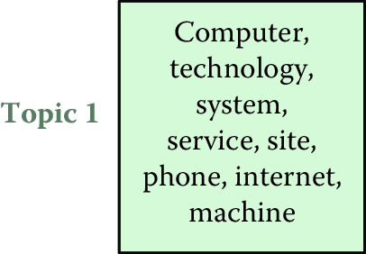

% TODO
% get paragraph from Jordan
% fold TOC into text
% finish intro abstract
% keyword definitions
% create table where is says: Type of Analysis Description Examples Search

Text Analysis {#chap:text}
=============

**Evgeny Klochikhin and Jordan Boyd-Graber**


This chapter provides an overview of how social scientists can make use
of text data using computational data analysis methods. We cover the types of analysis that can be done with text data (search, topic detection, classification, etc.) and give an overview of how to do these analysis, social science tasks that they’re useful for, and how to evaluate the results. We provide a set of tools that are commonly used for doing text analysis and provide ….

Understanding human generated text
-------------------------------

You wake up and read the newspaper, a Facebook post, or an academic article a colleague sent you. You, like other humans, can digest and understand rich information, but an increasingly central challenge for humans is to cope with the deluge of information we are supposed to read
and understand. As social scientists, we often deal with text data that comes from a variety of sources – open ended survey responses, phone call transcriptions, social media data, notes from electronic health records, and news. A challenge we face when dealing with these types of data is how to efficiently analyze it just like we do structured (tabular) data. For example, when analyzing survey responses or electronic health records data, both of which contain narrative text (from the respondents and medical practitioners respectively), the text data often gets ignored or read by the analysts (manually) and used anecdotally. Text analysis techniques described in this chapter allow you to use all of the data available (structured and unstructured), and efficiently incorporate large amounts of text data in your analysis. 

**Structure of the chapter [REMOVE WHEN DONE WITH EDITING]:**

-   How is text data different than “structured” data?
-   What types of analysis can be done with text data?
-   Use it by itself
-   Combine it with structured data
-   List the types of analysis and examples
-   How do we do the analysis
-   Processing Pipeline
-   Tokenization
-   Stemming
-   Stopwords
-   Linguistic analysis
-   Turning text into a matrix
-   Term weights
-   TFIDF
-   Analysis (what it is, how to do it, how to evaluate it, and applications/examples in social science)
-   Finding similar documents
-   Finding themes and topics (describe the methods, examples, and evaluation process)
-   Clustering
-   Topic models
-   Classification (describe the methods, examples, and evaluation process)
-   Deep Learning and Word Embeddings
-   Tools
-   Summary


---

**Text analysis vocabulary**

* Corpus
* Token
* Term
* Frequency
* TFIDF
* Part of speech tags
* Parsing

---


## How is text data different than “structured” data?

We’re comfortable analyzing structured data that is structured into rows and columns. Text data, often also known as unstructured data(footnote: this is often the term used but is a fallacy. There is a lot of structure in text - that is makes you, the reader, understand what we’re writing here. Unstructured often refers to not having defined rows and columns in our data), is harder to analyze using traditional data analysis tools because it doesn’t come with rows and columns, but instead consists of characters, words, sentences, and paragraphs. In traditional, “structured”, data, a human has already decided what constitutes a row (a person for example), what constitutes a column (their age, gender, address, for example), and the relationship between them. We covered that in the Database chapter where we created a data model for a given domain. When dealing with text data, we have to create that structure ourselves, often using methods that are designed specifically for different types of problems. 

While creating that structure, we have to deal with human language being complex and nuanced, which makes analyzing it difficult. We often make simplifying assumptions: we assume our input is perfect text; we ignore humor [@halevy-09] and deception [@niculae-15; @ott-11]; and we assume "standard" English [@kong-14]^[See Chapter 6 for a discussion of speech recognition, which can turn spoken language into text]. Text data also often reflects human observations that are exceptions to regular processes - the ubiquitous “other” or “Anything else you want to tell us” field in questionnaires. Recognizing this complexity, the goal of text analysis is to efficiently extract important information from large amounts of text in a comprehensible and meaningful way, and use it in our analysis just like we use structured data.

## What can we do with text data?
We are often faced with two scenarios when we encounter text data:
We have some text “corpus”, for example open-ended survey responses, and our goal is to understand the content - patterns, themes, trends - of that data.
We have some data that consists of both structured and text data. Examples include electronic health records containing both patient medical records (structured data) and text notes from clinicians and lab results or survey responses consisting of both closed ended (multiple choice for example) and open ended responses. The goal here is not to analyze the text data in isolation but to incorporate the text data with the structured data in to our analysis. This happens regularly when we incorporate text from social media posts to data we already have about a particular person, organization, or location.

In both cases, there are a set of analyses that can be done with text data. We describe these analyses in the Table below:

Type of Analysis
Description
Examples
Search


For example, we used these techniques in systematic
    literature reviews to facilitate the discovery and retrieval of
    relevant publications related to early grade reading in Latin
    America and the Caribbean.


Topic Detection / Clustering
provide a big picture of the contents
    of thousands of documents in a comprehensible format by discovering
    only the most important words and phrases in those documents.


Classification


Sentiment analysis 
Examples using machine learning to
analyze the flow and topic segmentation of political debates and
behaviors [@nguyen-12; @Nguyen:Boyd-Graber:Resnik:Miler-2015] and to
assign automated tags to documents [@tuarob-13].
Word Clustering/Synonyms


Named Entity Extraction


General Extraction


Summarization


For example, Wang et
    al. [@wang-09] use topic modeling to produce category-sensitive text
    summaries and annotations on large-scale document collections.
Translation
Automatic translation of text from one language to another
Look at reaction to a political event in newspapers of different countries in different languages
Visualization
Visualization of text data and / or visual mashups combining text with other forms of data (maps, networks, etc.)


How to analyze text
-------------------

Text analysis requires us to go through a series of steps:

-   **Processing Text Data**: We take raw text data (word documents, html content scraped from webpages, etc.) and run it through some processing where the goal is to clean the text (dealing with content that is redundant or dirty, such as cleaning up html if processing data from web pages), turning sentences or documents into words or phrases, or removing words that we don’t consider useful for a specific analysis. 

-   **Adding Linguistic Features**: This is not a critical step and is only needed when the problem requires deeper linguistic analysis. For example, when trying to understand the structure of a sentence, we can use a part of speech tagger to tag words with their corresponding part of speech (noun phrase for example) and use a statistical parser to generate what’s called a parse tree that shows relationships between different components of a sentence. 

-   **Converting the text to a matrix**: Once we’ve cleaned up the text and split them into sentences, phrases, words, and their corresponding linguistic attributes, the goal of this step is to make decisions that turn our “document” into a matrix. The key decisions we have to make are 1) what a row is, 2) what a column is, and 3) what do we put as the value for that row and column.

-   **Analysis**: once we have a matrix, then we can apply the methods we covered in the Machine Learning chapter (such as clustering and classification) as well as any other data analysis methods available to us. Later in this chapter, we’ll do deeper into applying these methods to text data as well as describe new methods that are specifically designed for text analysis.


### Processing text data


The first important step in working with text data is cleaning and processing^[Cleaning and processing are discussed extensively in Chapter 3.]. Textual data are often messy and unstructured, which makes many researchers and practitioners overlook their value. Depending on the source, cleaning and processing these data can require varying amounts of effort but typically involve a set of established techniques.

**Tokenization**

The first step in processing text is deciding what terms and phrases are
meaningful. Tokenization separates sentences and terms from each other.
The Natural Language Toolkit (NLTK) [@bird-09] provides simple reference
implementations of standard natural language processing algorithms such
as tokenization---for example, sentences are separated from each other
using punctuation such as period, question mark, or exclamation mark.
However, this does not cover all cases such as quotes, abbreviations, or
informal communication on social media. While separating sentences in a
single language is hard enough, some documents "code-switch," combining
multiple languages in a single document. These complexities are best
addressed through data-driven machine learning frameworks [@kiss-06].

**Stop words**

Once the tokens are clearly separated, it is possible to perform further
text processing at a more granular, token level. Stop words are a
category of words that have limited semantic meaning regardless of the
document contents. Such words can be prepositions, articles, common
nouns, etc. For example, the word "the" accounts for about 7% of all
words in the Brown Corpus, and "to" and "of" are more than 3% each
[@malmkjar-02].

*Hapax legomena* are rarely occurring words that might have only one
instance in the entire corpus. These words---names, misspellings, or
rare technical terms---are also unlikely to bear significant contextual
meaning. Similar to stop words, these tokens are often disregarded in
further modeling either by the design of the method or by manual removal
from the corpus before the actual analysis.

**$N$-grams**

However, individual words are sometimes not the correct unit of
analysis. For example, blindly removing stop words can obscure important
phrases such as "systems of innovation," "cease and desist," or
"commander in chief." Identifying these $N$-grams requires looking for
statistical patterns to discover phrases that often appear together in
fixed patterns [@Dunning-93]. These combinations of phrases are often
called *collocations*, as their overall meaning is more than the sum of
their parts.

**Stemming and lemmatization**

Text normalization is another important aspect of preprocessing textual
data. Given the complexity of natural language, words can take multiple
forms dependent on the syntactic structure with limited change of their
original meaning. For example, the word "system" morphologically has a
plural "systems" or an adjective "systematic." All these words are
semantically similar and---for many tasks---should be treated the same.
For example, if a document has the word "system" occurring three times,
"systems" once, and "systematic" twice, one can assume that the word
"system" with similar meaning and morphological structure can cover all
instances and that variance should be reduced to "system" with six
instances.

The process for text normalization is often implemented using
established lemmatization and stemming algorithms. A *lemma* is the
original dictionary form of a word. For example, "go," "went," and
"goes" will all have the lemma "go." The stem is a central part of a
given word bearing its primary semantic meaning and uniting a group of
similar lexical units. For example, the words "order" and "ordering"
will have the same stem "ord." Morphy (a lemmatizer provided by the
electronic dictionary WordNet), Lancaster Stemmer, and Snowball Stemmer
are common tools used to derive lemmas and stems for tokens, and all
have implementations in the NLTK [@bird-09].

Linguistic Analysis
 So far , we’ve treated words as tokens without regard to the meaning of the word or the way it is used, or even what language the word comes from. There are several techniques in text analysis that are language specific that go deeper into the syntax of the document, paragraph, and sentence structure to extract linguistic characteristics of the document. 


\vspace*{-2pt}
**Part-of-speech tagging**

When the examples $x$ are individual words and the labels $y$ represent
the grammatical function of a word (e.g., whether a word is a noun,
verb, or adjective), the task is called part-of-speech tagging. This
level of analysis can be useful for discovering simple patterns in text:
distinguishing between when "hit" is used as a noun (a Hollywood hit)
and when "hit" is used as a verb (the car hit the guard rail).

Unlike document classification, the examples $x$ are not independent:
knowing whether the previous word was an adjective makes it far more
likely that the next word will be a noun than a verb. Thus, the
classification algorithms need to incorporate structure into the
decisions. Two common algorithms for this problem are hidden Markov
models [@rabiner-89] and conditional random fields [@lafferty-01].

\vspace*{-2pt}
**Parsing**


All text-processing steps are critical to successful analysis. Some of
them bear more importance than others, depending on the specific
application, research questions, and properties of the corpus. Having
all these tools ready is imperative to producing a clean input for
subsequent modeling and analysis. Some simple rules should be followed
to prevent typical errors. For example, stop words should not be removed
before performing $n$-gram indexing, and a stemmer should not be used
where data are complex and require accounting for all possible forms and
meanings of words. Reviewing interim results at every stage of the
process can be helpful.


### Turning text into a matrix: How much is a word worth?

The processing stages described above provide us with the columns in our matrix. Now we have to decide what value we assign that word/phrase/column. In text analysis, we typically refer to them as tokens (where a token can be a word or a phrase). One simple approach would be to give each column a binary 0 or 1 value - if this token occurs in a document, we assign that cell a value of 1 and 0 otherwise. Another approach would be to assign it the value of how many times this token occurs in that document (often known as frequency of that term or token). This is essentially a way to define the importance or value of this token in this document. Not all words are worth the same; in an article about economics, "free market" is more important than "social good." Appropriately weighting^[Term weighting is an example of feature engineering discussed in Chapter 6.] and calibrating words is important for both human and machine consumers of text data: humans do not want to see "the" as the most frequent word of
every document in summaries, and classification algorithms benefit from knowing which features are actually important to making a decision.

Weighting words requires balancing how often a word appears in a local context (such as a document) with how much it appears overall in the document collection. Term frequency--inverse document frequency (TFIDF) [@salton-68] is a weighting scheme to explicitly balance these factors and prioritize the most meaningful words. The TFIDF model takes into account both the term frequency of a given token and its document
frequency (Box 7.1) so that if a highly frequent word also appears
in almost all documents, its meaning for the specific context of the
corpus is negligible. Stop words are a good example when highly frequent
words also bear limited meaning since they appear in virtually all
documents of a given corpus.

<div class="F00">
<p><strong>Box 7.1: TFIDF</strong></p>
<p>For every token <span class="math inline">\(t\)</span> and every document <span class="math inline">\(d\)</span> in the corpus <span class="math inline">\(D\)</span>, TFIDF is calculated as <span class="math display">\[tfidf(t,d,D) = tf(t,d) \times
idf(t,D),\]</span> where term frequency is either a simple count, <span class="math display">\[tf(t,d)=f(t,d),\]</span> or a more balanced quantity, <span class="math display">\[tf(t,d) = 0.5+\frac{0.5 \times
  f(t,d)}{\max\{f(t,d):t\in d\}},\]</span> and inverse document frequency is <span class="math display">\[\
idf(t,D) = \log\frac{N}{|\{d\in D:t\in d\}|}.\]</span></p>
</div>

\enlargethispage{24pt}
\vspace*{-36pt}


**Analysis**

Now that we have a matrix with documents as rows, words/phrases as columns and the TFIDF score as the value of that word in that document, we are now ready to run different machine learning methods on this data. We will not recap all of the methods and evaluation methodologies already covered in Chapter 6 here but they can all be used with text data.


We’ll focus on three types of analysis: finding similar documents,  clustering, and classification. For each type of analysis, we ‘ll focus on what it allows us to do, what types of tasks social scientists will find it useful for, and how to evaluate the results of the analysis.


Some evaluation text

**Finding Similar Documents**

One task social scientists may be interested in is finding similar documents to a document they’re analyzing. This is a routine task for lawyers where they are looking at a case file and want to find all prior cases similar to this case or during literature review where we may have a paper and we’re interested in finding similar papers. The key challenge here it to define what makes two documents similar and what similarity metrics we can use. Typical metrics involved in this process include cosine similarity and Kullback--Leibler divergence [@kullback1951information].

Cosine similarity is a popular measure in text analysis. Given two documents $d_a$ and $d_b$ presented as term vectors
$\overrightarrow{t_a}$ and $\overrightarrow{t_b}$, the cosine similarity
is

$$SIM_C(\overrightarrow{t_a},\overrightarrow{t_b}) = \frac{\overrightarrow{t_a} \cdot
     \overrightarrow{t_b}}{|\overrightarrow{t_a}|*|\overrightarrow{t_b}|}.$$
     
---

**Example: Measuring cosine similarity between documents**

NSF awards are not labeled by scientific field---they are labeled by
program. This administrative classification is not always useful to
assess the effects of certain funding mechanisms on disciplines and
scientific communities. One approach is to understand how awards are similar
to each other even if they were funded by different programs. Cosine
similarity allows us to do just that.

**Example code**

The Python `numpy` module is a powerful library of tools for efficient linear
algebra computation. Among other things, it can be used to compute the
cosine similarity of two documents represented by numeric vectors, as
described above. The `gensim` module that is often used as a Python-based topic
modeling implementation can be used to produce vector space
representations of textual data.
Notebook XXX provides an example of measuring cosine similarity
using these modules.

Kullback--Leibler (KL) divergence is a measure that allows us to compare probability distributions in general and is often used to compare two documents represented as vectors.
Given two term vectors $\overrightarrow{t_a}$ and
$\overrightarrow{t_b}$, the KL divergence from vector
$\overrightarrow{t_a}$ to $\overrightarrow{t_b}$ is
$$D_{KL}(\overrightarrow{t_a}||\overrightarrow{t_b}) = \sum\limits_{t=1}^m w_{t,a}\times \log\left(\frac{w_{t,a}}{w_{t,b}}\right),$$
where $w_{t,a}$ and $w_{t,b}$ are term weights in two vectors,
respectively.

An averaged KL divergence metric is then defined as
$$D_{AvgKL}(\overrightarrow{t_a}||\overrightarrow{t_b}) = \sum\limits_{t=1}^m (\pi_1\times D(w_{t,a}||w_t)+\pi_2\times D(w_{t,b}||w_t)),$$
where
$\pi_1 = \frac{w_{t,a}}{w_{t,a}+w_{t,b}}, \pi_2 = \frac{w_{t,b}}{w_{t,a}+w_{t,b}}$,
and $w_t = \pi_1\times w_{t,a} + \pi_2\times w_{t,b}$ [@huang-08].

A Python-based `scikit-learn` library provides an implementation of these measures as
well as other machine learning models and approaches.

**Augmenting Similarity Calculations with External Knowledge repositories**

Similarity calculations can be significantly enriched by the use of
external resources that provide relationships between words, documents, or concepts present in specific domains. Established corpora, such as the Brown Corpus and
Lancaster--Oslo--Bergen Corpus, are one type of such preprocessed
repositories.

Wikipedia and WordNet are examples of another type of lexical and
semantic resources that are dynamic in nature and that can provide a
valuable basis for consistent and salient information retrieval and
clustering. These repositories have the innate hierarchy, or ontology,
of words (and concepts) that are explicitly linked to each other either
by inter-document links (Wikipedia) or by the inherent structure of the
repository (WordNet). In Wikipedia, concepts thus can be considered as
titles of individual Wikipedia pages and the contents of these pages can
be considered as their extended semantic representation.

Information retrieval techniques build on these advantages of WordNet
and Wikipedia. For example, Meij et al. [@meij-09] mapped search queries
to the DBpedia ontology (derived from Wikipedia topics and their
relationships), and found that this mapping enriches the search queries
with additional context and concept relationships. One way of using
these ontologies is to retrieve a predefined list of Wikipedia pages
that would match a specific taxonomy. For example, scientific
disciplines are an established way of tagging documents--- some are in
physics, others in chemistry, engineering, or computer science. If a
user retrieves four Wikipedia pages on "Physics," "Chemistry,"
"Engineering," and "Computer Science," they can be further mapped to a
given set of scientific documents to label and classify them, such as a
corpus of award abstracts from the US National Science Foundation.

*Personalized PageRank* is a similarity system that can help with the
task. This system uses WordNet to assess semantic relationships and
relevance between a search query (document $d$) and possible results
(the most similar Wikipedia article or articles). This system has been
applied to text categorization [@navigli-11] by comparing documents to
*semantic model vectors* of Wikipedia pages constructed using WordNet.
These vectors account for the term frequency and their relative
importance given their place in the WordNet hierarchy, so that the
overall $wiki$ vector is defined as:

$$SMV_{wiki}(s) = \sum\nolimits_{w\in Synonyms(s)} \frac{tf_{wiki}(w)}{|Synsets(w)|}$$,

where $w$ is a token within $wiki$, $s$ is a WordNet synset that is
associated with every token $w$ in WordNet hierarchy, $Synonyms(s)$ is
the set of words (i.e., synonyms) in the synset $s$, $tf_{wiki}(w)$ is
the term frequency of the word $w$ in the Wikipedia article $wiki$, and
$Synsets(w)$ is the set of synsets for the word $w$.

The overall probability of a candidate document $d$ (e.g., an NSF award
abstract or a PhD dissertation abstract) matching the target query, or
in our case a Wikipedia article $wiki$, is
$$wiki_{BEST}=\sum\nolimits_{w_t\in doc} \max_{s\in Synsets(w_t)} SMV_{wiki}(s),$$
where $Synsets(w_t)$ is the set of synsets for the word $w_t$ in the
target document document (e.g., NSF award abstract) and $SMV_{wiki}(s)$
is the semantic model vector of a Wikipedia page, as defined above.

Evaluating “Find Similar” Methods:
When developing methods to find similar documents, we want to make sure that we find all relevant documents that are similar to the document under consideration, and we want to make sure we don’t find any non-relevant documents.  Chapter [Machine Learning](#chap:ml) already touched on the importance of precision and
recall for evaluating the results of machine
learning models (Box 7.3 provides a reminder of the formulae). The same metrics can be used to evaluate the two goals we have in finding relevant and simialr documents. 

<div class="F00">
<p><strong>Box 7.3: Precision and recall</strong> Precision computes the type I errors—<em>false positives</em>—and is formally defined as <span class="math display">\[\mathrm{Precision} = \frac{|\{\mathrm{relevant\ documents}\}\cap \{\mathrm{retrieved\ documents}\}|}{|\{\mathrm{retrieved\ documents}\}|}.\]</span> Recall accounts for type II errors—<em>false negatives</em>—and is defined as <span class="math display">\[\mathrm{Recall}=\frac{|\{\mathrm{relevant\ documents}\}\cap \{\mathrm{retrieved\ documents}\}|}{|\{\mathrm{relevant\ documents}\}|}.\]</span></p>
</div>

We assume that a user has three sets of documents $D_a =\{d_{a1},d_{a2},\ldots, d_n\}$, $D_b=\{d_{b1}, d_{b2}, \ldots, d_k\}$, and $D_c =\{d_{c1},d_{c2},\ldots,d_i\}$. All three sets are clearly tagged with a
disciplinary label: $D_a$ are computer science documents, $D_b$ are
physics, and $D_c$ are chemistry.

The user also has a different set of documents---Wikipedia pages on
"Computer Science," "Chemistry," and "Physics." Knowing that all
documents in $D_a$, $D_b$, and $D_c$ have clear disciplinary
assignments, let us map the given Wikipedia pages to all documents
within those three sets. For example, the Wikipedia-based query on
"Computer Science" should return all computer science documents and none
in physics or chemistry. So, if the query based on the "Computer
Science" Wikipedia page returns only 50% of all computer science
documents, then 50% of the relevant documents are lost: the recall is
0.5.

On the other hand, if the same "Computer Science" query returns 50% of
all computer science documents but also 20% of the physics documents and
50% of the chemistry documents, then all of the physics and chemistry
documents returned are false positives. Assuming that all document sets
are of equal size, so that $|D_a| = 10$, $|D_b|=10$ and $|D_c| = 10$,
then the precision is $\frac{5}{12} = 0.42$.

***F* score**

The *F score* combines precision and recall. In formal terms, the $F$
score is a weighted average of the precision and recall:
$$\label{eq:text:F1}
F_1 = 2\cdot \frac{\mathrm{Precision}\cdot \mathrm{Recall}}{\mathrm{Precision}+\mathrm{Recall}}.$$
In terms of type I and type II errors:
$$F_\beta = \frac{(1+\beta^2)\cdot \mathrm{true\ positive}}{(1+\beta^2)\cdot \mathrm{true\ positive} + \beta^2\cdot \mathrm{false\ negative} + \mathrm{false\ positive}},$$
where $\beta$ is the balance between precision and recall. Thus, $F_2$
puts more emphasis on the recall measure and $F_{0.5}$ puts more
emphasis on precision.

**Examples**

Some examples from our recent work can demonstrate how Wikipedia-based
labeling and labeled LDA
[@ramage-09; @Nguyen:Boyd-Graber:Resnik:Chang-2014] cope with the task
of document classification and labeling in the scientific domain. See
Table \@ref(tab:table7-1).

Table: (\#tab:table7-1) Wikipedia articles as potential labels generated by $n$-gram indexing of NSF awards

| **Abstract excerpt**                                                                                                                                                                                                                                                                                                                                                | **ProQuest subject category**                                      | **Labeled LDA**      | **Wikipedia-based labeling**                          |
|-----------------------------------------------------------------------------------------------------------------------------------------------------------------------------------------------------------------------------------------------------------------------------------------------------------------------------------------------------------------|----------------------------------------------------------------|------------------|---------------------------------------------------|
| **Reconfigurable computing platform for smallscale resource-constrained robot.**  Specific applications often require robots of small size for reasons such as costs, access, and stealth. Smallscale robots impose constraints on resources such as power or space for modules...                                                                                  | Engineering, Electronics and Electrical; Engineering, Robotics | Motor controller | Robotics, Robot, Fieldprogrammable gate array     |
|  **Genetic mechanisms of thalamic nuclei specification and the influence of thalamocortical axons in regulating neocortical area formation.** Sensory information from the periphery is essential for all animal species to learn, adapt, and survive in their environment. The thalamus, a critical structure in the diencephalon, receives sensory information... | Biology, Neurobiology                                          | HSD2 neurons     | Sonic hedgehog, Induced stem cell, Nervous system |
| **Poetry ’n acts: The cultural politics of twentieth century American poets’ theater.**  This study focuses on the disciplinary blind spot that obscures the productive overlap between poetry and dramatic theater and prevents us from seeing the cultural work that this combination can perform...                                                               | Literature, American; Theater                                  | Audience         | Counterculture of the 1960s, Novel, Modernism     |


**Clustering**

Another task social scientists often perform is finding themes, topics, and patterns in a text data set, such as open-ended survey responses, news articles, or publications. Given open ended responses from a survey on how people feel about a certain issue, we may be interested in finding out the common themes that occur in these responses. Clustering methods are designed to do exactly that. With text data, clustering is often used to explore what topics and concepts are present in a new corpus (collection of documents). It is important to note that if we already have a pre-specified set of categories and documents that are tagged with those categories, and the goal is to tag new documents, then we would use classification methods instead of clustering methods. As we covered in the previous chapter, clustering a is a form of unsupervised learning where the goal is exploration and understanding of the data.

As we covered earlier, unsupervised analysis of large text corpora without extensive investment of time provides additional opportunities for social scientists and policymakers to gain insights into policy and research questions through text analysis. The clustering methods described in the Machine Learning chapter, such as k-means clustering, can be used for text data as well once the text has been converted to a matrix as described earlier. We will describe Topic Modeling, that provides us with another clustering approach specifically designed for text data. 

### Topic modeling {#sec:lda}

Topic modeling is an approach that describes *topics* that constitute the high-level themes of a text corpus. Topic modeling is often described as an *information discovery* process: describing what “concepts” are present in a corpus. We refer to them as “concepts” or “topics” (in quotes) because they typically will be represented as a probability distribution over the words (that the topic modeling method groups together) which may or may not be semantically coherent as a “topic” to social scientists. 

As topic modeling is a broad subfield of natural language processing and machine learning, we will restrict our focus to a single methods called Latent Dirichlet Allocation (LDA) [@blei-03]. LDA is a fully Bayesian extension of probabilistic latent semantic indexing [@hofmann-99], itself a probabilistic extension of latent semantic analysis [@landauer-97]. Blei and Lafferty [@blei-09] provide a more detailed discussion of the history of topic models.

LDA, like all topic models, assumes that there are topics that form the
building blocks of a corpus. Topics are distributions over words and are
often shown as a ranked list of words, with the highest probability
words at the top of the list
(Figure \@ref(fig:nyt-topics-3)). However, we do not know what the topics are
[a priori]{.roman}; the goal is to discover what they are (more on
this shortly).



<div class="figure" style="text-align: center">

<p class="caption">(\#fig:nyt-topics-3)Topics are distributions over words. Here are three example topics learned by latent Dirichlet allocation from a model with 50 topics discovered from the *New York Times* [@sandhaus-08]. Topic 1 seems to be about technology, Topic 2 about business, and Topic 3 about the arts</p>
</div>

In addition to assuming that there exist some number of topics that
explain a corpus, LDA also assumes that each document in a corpus can be
explained by a small number of topics. For example, taking the example
topics from Figure \@ref(fig:nyt-topics-3), a document titled "Red Light, Green Light: A
Two-Tone LED to Simplify Screens" would be about Topic 1, which appears
to be about technology. However, a document like "Forget the Bootleg,
Just Download the Movie Legally" would require all three of the topics.
The set of topics that are used by a document is called the document's
*allocation* (Figure \@ref(fig:nyt-documents)). This terminology explains the name
*latent Dirichlet allocation*: each document has an allocation over
latent topics governed by a Dirichlet distribution.

<div class="figure" style="text-align: center">

<p class="caption">(\#fig:nyt-documents)Allocations of documents to topics</p>
</div>

\vspace*{-12pt}

#### Inferring “topics” from raw text

Algorithmically, the problem can be viewed as a black box. Given a
corpus and an integer $K$ as input, provide the topics that best
describe the document collection: a process called *posterior
inference*. The most common algorithm for solving this problem is a
technique called *Gibbs sampling* [@geman-90].

Gibbs sampling works at the word level to discover the topics that best
describe a document collection. Each word is associated with a single
topic, explaining why that word appeared in a document. For example,
consider the sentence "Hollywood studios are preparing to let people
download and buy electronic copies of movies over the Internet." Each
word in this sentence is associated with a topic: "Hollywood" might be
associated with an arts topic; "buy" with a business topic; and
"Internet" with a technology topic
(Figure \@ref(fig:inference-1)).

\enlargethispage{18pt}
<div class="figure" style="text-align: center">

<p class="caption">(\#fig:inference-1)Each word is associated with a topic. Gibbs sampling inference iteratively resamples the topic assignments for each word to discover the most likely topic assignments that explain the document collection</p>
</div>

This is where we should eventually get. However, we do not know this to
start. So we can initially assign words to topics randomly. This will
result in poor topics, but we can make those topics better. We improve
these topics by taking each word, pretending that we do not know the
topic, and selecting a new topic for the word.

A topic model wants to do two things: it does not want to use many
topics in a document, and it does not want to use many words in a topic.
So the algorithm will keep track of how many times a document $d$ has
used a topic $k$, $N_{d,k}$, and how many times a topic $k$ has used a
word $w$, $V_{k,w}$. For notational convenience, it will also be useful
to keep track of marginal counts of how many words are in a document,
$$N_{d, \cdot} \equiv \sum_k N_{d,k},$$ and how many words are
associated with a topic, $$V_{k, \cdot} \equiv \sum_w V_{k, w}.$$ The
algorithm removes the counts for a word from $N_{d,k}$ and $V_{k,w}$ and
then changes the topic of a word (hopefully to a better topic than the
one it had before). Through many thousands of iterations of this
process, the algorithm can find topics that are coherent, useful, and
characterize the data well.

The two goals of topic modeling---balancing document allocations to
topics and topics' distribution over words---come together in an
equation that multiplies them together. A good topic will be both common
in a document and explain a word's appearance well.

---

**Example: Gibbs sampling for topic models**

The topic assignment $z_{d,n}$ of word $n$ in document $d$ is
proportional to
$$p(z_{d,n}=k) \propto \left( \underset{how much doc likes the topic}{\frac{N_{d,k} + \alpha}{N_{d, \cdot} + K \alpha}} \right) \left(\underset{how much topic likes the word}{\frac{V_{k,w_{d,n}} + \beta}{V_{k, \cdot} + V \beta}} \right),$$
where $\alpha$ and $\beta$ are smoothing factors that prevent a topic
from having zero probability if a topic does not use a word or a
document does not use a topic [@wallach-09b]. Recall that we do not
include the token that we are sampling in the counts for $N$ or $V$.

For the sake of concreteness, assume that we have three documents with
the following topic assignments:

-   Document 1: $^A$dog$_3$ $^B$cat$_2$ $^C$cat$_3$ $^D$pig$_1$

-   Document 2: $^E$hamburger$_2$ $^F$dog$_3$ $^G$hamburger$_1$

-   Document 3: $^H$iron$_1$ $^I$iron$_3$ $^J$pig$_2$ $^K$iron$_2$

If we want to sample token B (the first instance of of "cat" in
document 1), we compute the conditional probability for each of the
three topics ($z=1,2,3$): $$\begin{aligned}
p(z_B = 1) = & \frac{1 + 1.000}{3 + 3.000} \times \frac{0
    + 1.000}{3 + 5.000} = 0.333 \times 0.125 = 0.042, \\[4pt]
p(z_B = 2) = & \frac{0 + 1.000}{3 + 3.000} \times \frac{0
    + 1.000}{3 + 5.000} = 0.167 \times 0.125 = 0.021\mbox{, and} \\[4pt]
p(z_B = 3) = & \frac{2 + 1.000}{3 + 3.000} \times \frac{1 + 1.000}{4 + 5.000} = 0.500 \times 0.222 = 0.111.\end{aligned}$$
To reiterate, we do not include token B in these counts: in computing
these conditional probabilities, we consider topic 2 as never appearing
in the document and "cat" as never appearing in topic 2. However, "cat"
does appear in topic 3 (token C), so it has a higher probability than
the other topics. After renormalizing, our conditional probabilities are
$(0.24, 0.12, 0.64)$. We then sample the new assignment of token B to be
topic 3 two times out of three. Griffiths and Steyvers [@griffiths-04]
provide more details on the derivation of this equation.

**Example code**

#### Applications of topic models

Topic modeling is most often used for topic exploration, allowing users
to understand the contents of large text corpora. Thus, topic models
have been used, for example, to understand what the National Institutes
of Health funds [@talley2011database]; to compare and contrast what was
discussed in the North and South in the Civil War [@nelson-10]; and to
understand how individuals code in large programming projects
[@maskeri-08].

Topic models can also be used as features to more elaborate algorithms
such as machine translation [@Hu:Zhai:Eidelman:Boyd-Graber-2014],
detecting objects in images [@wang-09b], or identifying political
polarization [@paul-10]. Find a good example of topic models used in social sciences (maybe political science)

Evaluating clustering methods for text analysis

Objective evaluation
Task specific evaluation

**Document classification**

The section above focused on the task of finding topics and themes in a new text data set. In many cases, we already know a set of topics  - this could be the set of topics or research fields as described by the Social Science Research Network or the set of sections (local news, international, sports, finance, etc.) in a news publication. The task we often face is to automatically categorize new documents into an existing set of categories. In text analysis, this is called text classification or categorization and uses supervised learning techniques from machine learning described in the earlier chapter.

Text classification typically requires two things:
A set of categories we want documents to be categorized into (each document can belong to one or more categories)
Set of documents annotated/tagged with one or more categories from step 1.

For example, if we want to classify twitter or facebook posts as being about health or finance,  a classification method would take a small number of posts, manually tagged as belonging to either health or finance, and train a classification model. This model can then be used to automatically classify new posts as belonging to either health or finance

**Diagram of Text Classification Pipeline**

Processing -> linguistic - > matrix -> classification method

All of the classification (supervised learning) methods we covered in the Machine Learning chapter can be used here once the text data has been processed and converted to a matrix. Neural Networks [reference],. Random Forests [ref], and Support Vector Machines [ref] are some of the commonly used methods applied to text data.

---

**Example: Using text to categorize scientific fields**

The National Center for Science and Engineering Statistics, the US
statistical agency charged with collecting statistics on science and
engineering, uses a rule-based system to manually create categories of
science; these are then used to categorize research as "physics" or
"economics" [@oecd2005measurement; @manual2004summary]. In a rule-based
system there is no ready response to the question "how much do we spend
on climate change, food safety, or biofuels?" because existing rules
have not created such categories. Text analysis techniques can be used
to provide such detail without manual collation. For example, data about
research awards from public sources and about people funded on research
grants from UMETRICS can be linked with data about their subsequent
publications and related student dissertations from ProQuest. Both award
and dissertation data are text documents that can be used to
characterize what research has been done, provide information about
which projects are similar within or across institutions, and
potentially identify new fields of study [@talley2011database].

**Evaluating Text Classification Methods**

The metrics used to evaluate text classification methods are the same as  those used in supervised learning, as described in the Machine Learning chapter. The most commonly used metrics include accuracy, precision, recall, AUC, and F1 score. [include example in notebook]


**Applications**
\vspace*{-2pt}

**Spam Detection**

One simple but ubiquitous example of document classification is spam
detection: an email is either an unwanted advertisement (spam) or it is
not. Document classification techniques such as naïve Bayes [@lewis-05]
touch essentially every email sent worldwide, making email usable even
though most emails are spam.

**Sentiment analysis**

Instead of being what a document is about, a label $y$ could also reveal
the speaker. A recent subfield of natural language processing is to use
machine learning to reveal the internal state of speakers based on what
they say about a subject [@pang-08]. For example, given an example of
sentence $x$, can we determine whether the speaker is a Liberal or a
Conservative? Is the speaker happy or sad?

Simple approaches use dictionaries and word counting methods
[@pennebaker-99], but more nuanced approaches make use of
*domain*-specific information to make better predictions. One uses
different approaches to praise a toaster than to praise an air
conditioner [@blitzer-07]; liberals and conservatives each frame health
care differently from how they frame energy policy [@nguyen-13:shlda].


Word Embeddings and Deep Learning
-----------


Text analysis tools
-------------------

We are fortunate to have access to a set of powerful open source text
analysis tools. We describe three here.

**The Natural Language Toolkit**

The NLTK is a commonly used natural language toolkit that provides a
large number of relevant solutions for text analysis. It is Python-based
and can be easily integrated into data processing and analytical scripts
by a simple `import nltk` (or similar for any one of its submodules).

The NLTK includes a set of tokenizers, stemmers, lemmatizers and other
natural language processing tools typically applied in text analysis and
machine learning. For example, a user can extract tokens from a document
*doc* by running the command `tokens = nltk.word_tokenize(doc)`.

Useful text corpora are also present in the NLTK distribution. For
example, the stop words list can be retrieved by running the command `stops=nltk.corpus.stopwords.words(language)`. These stop words are available for several languages within NTLK, including English, French, and Spanish.

Similarly, the Brown Corpus or WordNet can be called by running `from nltk.corpus import wordnet/brown`. After the corpora are loaded, their various properties can be explored and used in text analysis; for example, `dogsyn = wordnet.synsets('dog')` will return a list of WordNet synsets related to the word "dog."

Term frequency distribution and $n$-gram indexing are other techniques
implemented in NLTK. For example, a user can compute frequency
distribution of individual terms within a document *doc* by running a
command in Python: `fdist=nltk.FreqDist(text)`. This command returns a dictionary of all tokens with associated frequency within *doc*.

$N$-gram indexing is implemented as a chain-linked collocations
algorithm that takes into account the probability of any given two,
three, or more words appearing together in the entire corpus. In
general, $n$-grams can be discovered as easily as running `bigrams = nltk.bigrams(text)`. However, a more sophisticated approach is needed to discover statistically significant word collocations, as we show in Listing 7.4.

Bird et al. [@bird-09] provide a detailed description of NLTK tools and
techniques. See also the official NLTK website [@NLTKweb].


```r
def bigram_finder(texts):
  # NLTK bigrams from a corpus of documents separated by new line
  tokens_list = nltk.word_tokenize(re.sub("\n"," ",texts))
  bgm    = nltk.collocations.BigramAssocMeasures()
  finder = nltk.collocations.BigramCollocationFinder.from_words(tokens_list)
  scored = finder.score_ngrams( bgm.likelihood_ratio  )

  # Group bigrams by first word in bigram.
  prefix_keys = collections.defaultdict(list)
  for key, scores in scored:
      prefix_keys[key[0]].append((key[1], scores))

  # Sort keyed bigrams by strongest association.
  for key in prefix_keys:
      prefix_keys[key].sort(key = lambda x: -x[1])
```
<div style="text-align: center">Listing 7.4. Python code to find bigrams using NLTK</div>

**Stanford CoreNLP**

While NLTK's emphasis is on simple reference implementations, Stanford's
CoreNLP [@corenlp; @manning2014stanford] is focused on fast
implementations of cutting-edge algorithms, particularly for syntactic
analysis (e.g., determining the subject of a sentence).

**MALLET**

For probabilistic models of text, MALLET, the MAchine Learning for
LanguagE Toolkit [@mallet], often strikes the right balance between
usefulness and usability. It is written to be fast and efficient but
with enough documentation and easy enough interfaces to be used by
novices. It offers fast, popular implementations of conditional random
fields (for part-of- speech tagging), text classification, and topic
modeling.

Summary
-------

Many of the new sources of data that are of interest to social scientists is text: tweets,
Facebook posts, corporate emails, and the news of the day. However, the
meaning of these documents is buried beneath the ambiguities and
noisiness of the informal, inconsistent ways by which humans communicate
with each other and traditional data analysis methods do not work with text data directly. Despite attempts to formalize the meaning of text data
through asking users to tag people, apply metadata, or to create
structured representations, these attempts to manually curate meaning
are often incomplete, inconsistent, or both.

These aspects make text data difficult to work with, but also a
rewarding object of study. Unlocking the meaning of a piece of text
helps bring machines closer to human-level intelligence---as language is
one of the most quintessentially human activities---and helps overloaded
information professionals do their jobs more effectively: understand
large corpora, find the right documents, or automate repetitive tasks.
And as an added bonus, the better computers become at understanding
natural language, the easier it is for information professionals to
communicate their needs: one day using computers to grapple with big
data may be as natural as sitting down for a conversation over coffee
with a knowledgeable, trusted friend.

Resources
---------

**Text corpora**

A set of multiple similar documents is called a *corpus*. For example,
the Brown University Standard Corpus of Present-Day American English, or
just the Brown Corpus [@browncorpus], is a collection of processed
documents from works published in the United States in 1961. The Brown
Corpus was a historical milestone: it was a machine-readable collection
of a million words across 15 balanced genres with each word tagged with
its part of speech (e.g., noun, verb, preposition). The British National
Corpus [@bnc] repeated the same process for British English at a larger
scale. The Penn Treebank [@marcus-93] provides additional information:
in addition to part-of-speech annotation, it provides *syntactic*
annotation. For example, what is the object of the sentence "The man
bought the hat"? These standard corpora serve as training data to train
the classifiers and machine learning techniques to automatically analyze
text [@halevy-09].


Text analysis is one of the more complex tasks in big data analysis.
Because it is unstructured, text (and natural language overall) requires
significant processing and cleaning before we can engage in interesting
analysis and learning. In this chapter we have referenced several
resources that can be helpful in mastering text mining techniques:

-   The Natural Language Toolkit is one of the most popular Python-based
    tools for natural language processing. It has a variety of methods
    and examples that are easily accessible online [@NLTKweb]. The book
    by Bird et al. [@bird-09], available online, contains multiple
    examples and tips on how to use NLTK.

-   The book *Pattern Recognition and Machine Learning* by Christopher
    Bishop [@bishop-06] is a useful introduction to computational
    techniques, including probabilistic methods, text analysis, and
    machine learning. It has a number of tips and examples that are
    helpful to both learning and experienced researchers.

-   A paper by Anna Huang [@huang-08] provides a brief overview of the
    key similarity measures for text document clustering discussed in
    this chapter, including their strengths and weaknesses in different
    contexts.

-   Materials at the MALLET website [@mallet] can be specialized for the
    unprepared reader but are helpful when looking for specific
    solutions with topic modeling and machine classification using this
    toolkit.

-   David Blei, one of the authors of the latent Dirichlet allocation
    algorithm (topic modeling), maintains a helpful web page with
    introductory resources for those interested in topic modeling
    [@BleiTM].

-   We provide an example of how to run topic modeling using MALLET on
    textual data from the National Science Foundation and Norwegian
    Research Council award abstracts [@NSFsearch].

