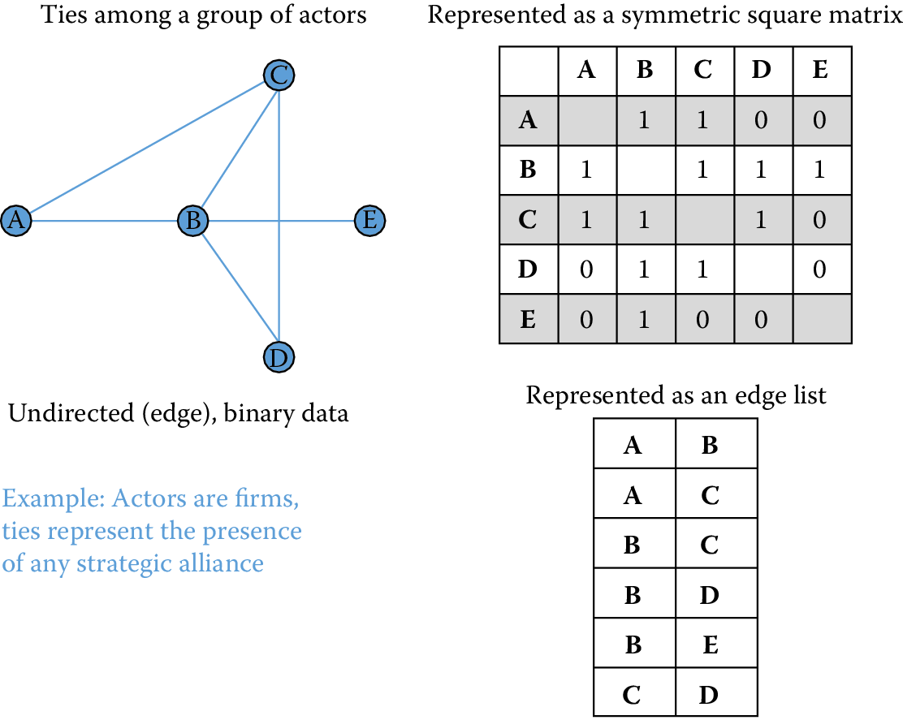
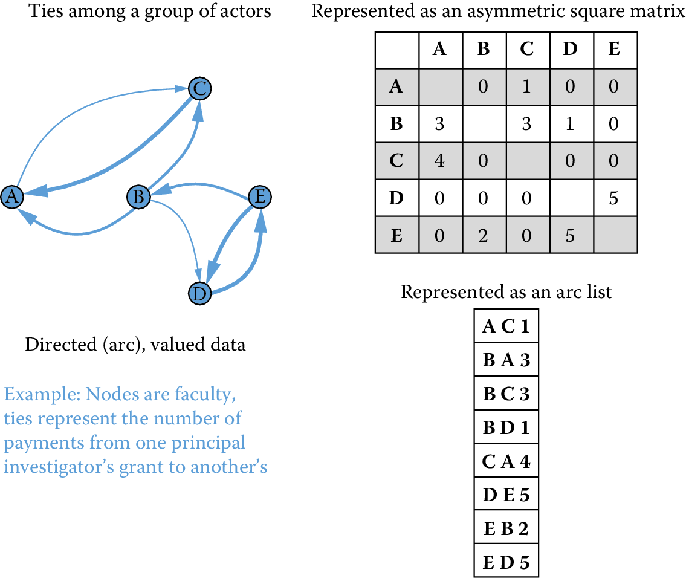
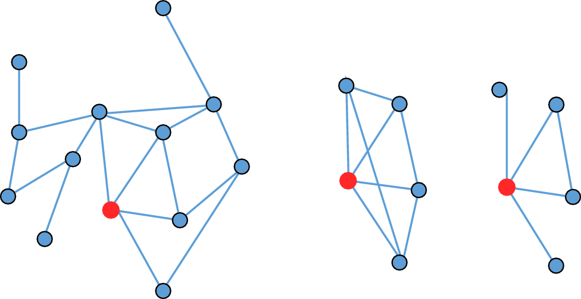
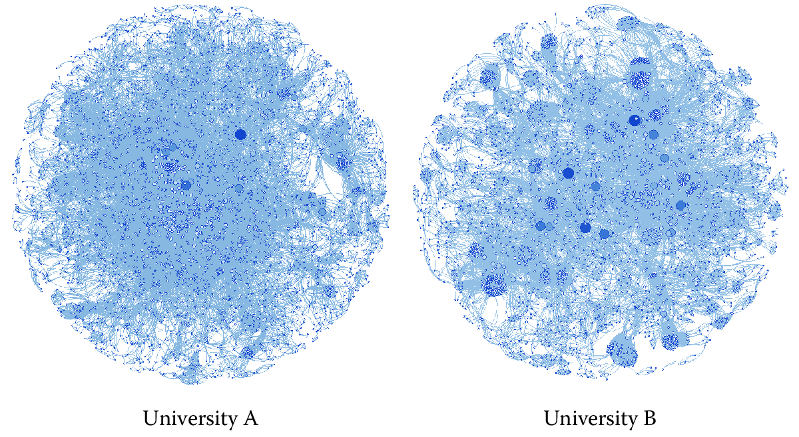
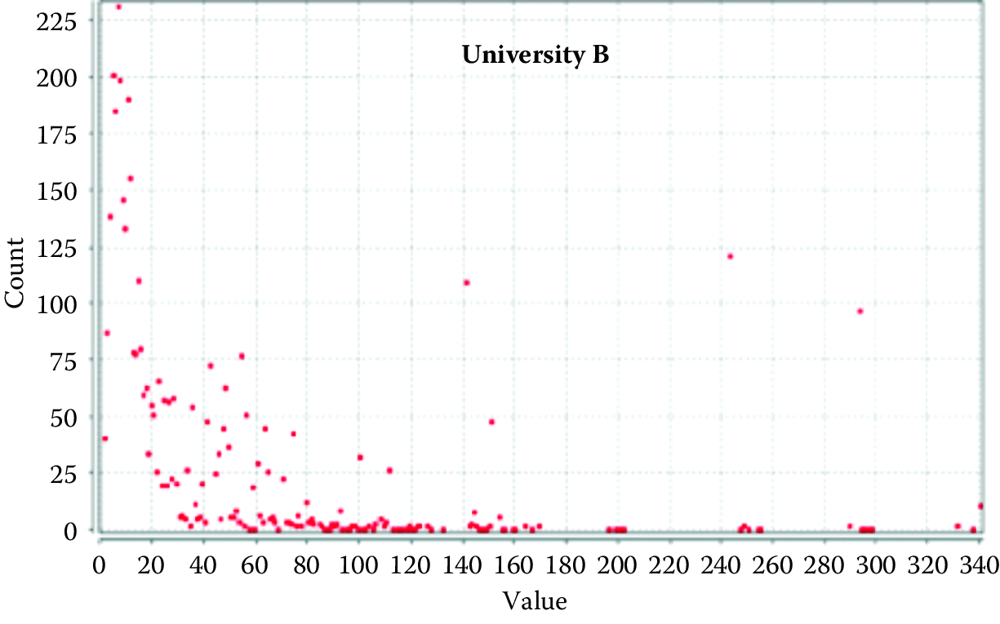
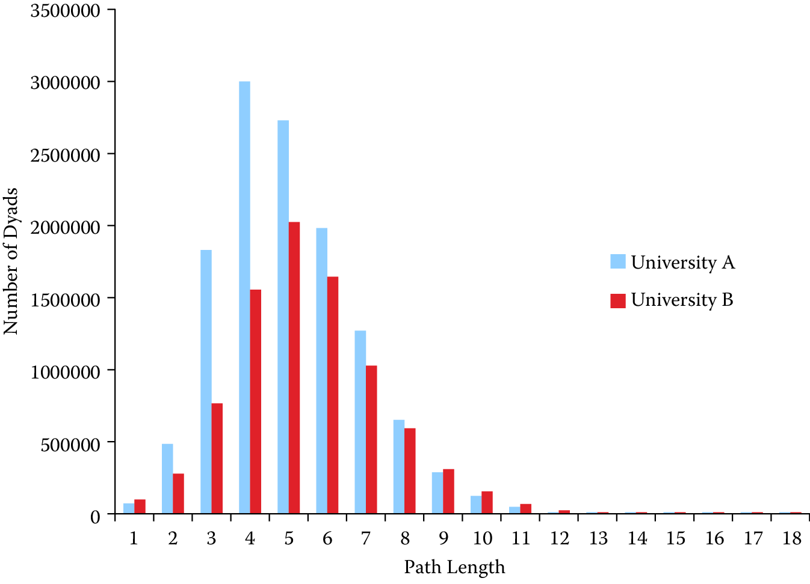

<!--done --> 

Networks: The Basics {#chap:networks}
====================

**Jason Owen-Smith**

Social scientists are typically interested in describing the activities
of individuals and organizations (such as households and firms) in a
variety of economic and social contexts. The frame within which data has
been collected will typically have been generated from tax or other
programmatic sources. The new types of data permit new units of
analysis---particularly network analysis---largely enabled by advances
in mathematical graph theory. This chapter provides an overview of how
social scientists can use network theory to generate measurable
representations of patterns of relationships connecting entities. The value of the new framework is not only in
constructing different right-hand-side variables but also in studying an
entirely new unit of analysis that lies somewhere between the largely
atomistic actors that occupy the markets of neo-classical theory and the
tightly managed hierarchies that are the traditional object of inquiry
of sociologists and organizational theorists.


Introduction
------------

Social Scientists have studied networks for a long time. A lot of the theory behind network analysis in fact comes from the social sciences where we studied relationships between people, groups, and organizations [@moreno1934]. What’s different today is the scale of the data available to us to perform this analysis. Instead of studying a group of 25 participants in a karate club [@zachary1977], we now have data about hundreds of millions of people communicating with each other through social media channels, or hundreds of thousands of employees in a large multinational organizations collaborating on projects. This increased scale requires us to explore new methods of answering the same questions that we used to be interested in, as well as opens up avenues to answer new questions that could not be answered before.^[If you have examples from your own research using the methods we describe in this chapter, please submit a link to the paper (and/or code) here: https://textbook.coleridgeinitiative.org/submitexamples]

---

<!-- - Survey paper: http://keg.cs.tsinghua.edu.cn/jietang/publications/WWW17-Tang-Comp-Social-Science-Survey.pdf -->

**Box: Network Analysis Examples** <a id="box:net1"></a>

- **Example 1: Cascading Information**^[https://cs.stanford.edu/people/jure/pubs/recurrence-www16.pdf] [@ugander2011]. By using network analysis, researchers were able to characterize how information travels and recurs in patterns, exhibiting multiple bursts of popularity.

- **Example 2: Large-Scale Social Networks**^[https://www.ncbi.nlm.nih.gov/pmc/articles/PMC4000208] [@stopczynski2014]. Using data from a variety of sources to determine how people are connected, Stopczynski et al. are able to observe how communities form and social interactions change over time.

- **Example 3: Facebook Social Graph**^[http://snap.stanford.edu/class/cs224w-readings/backstrom12fb.pdf] [@cheng2016]. A study of the Facebook friendship network was able to characterize how connected people were on the social networking site. By studying clustering and friendship preferences, the researchers were able to see how communities form and explore the "six degrees of separation" phenomenon on Facebook.

---

This chapter provides a basic introduction to the analysis of large networks for social science research and practice. We describe how to use data from existing social networks as well as how to turn “non-network” data into a network to perform further analysis. We then describe different measures that can be calculated to understand the properties of the network being analyzed, show different network visualization techniques, and discuss social science questions that these network measures and visualizations can help us answer.

We use the comparison of the collaboration networks of two research-intensive universities to show how to perform network analysis but the same approach generalizes to other types of problems. The collaboration networks and a grant co-employment network for a large public university examined in this chapter are derived from data produced by the multi-university
Committee on Institutional Cooperation (CIC)'s UMETRICS project [@lane2015new]. The snippets of code that are provided are from the `igraph` package for network analysis as implemented in Python.

What are networks?
------------------

Networks are measurable representations of relationships connecting entities. What this means is that there are two fundamental questions to ask of any network representation: First, what are the nodes, or entities that are connected? Second, what are the relationships (ties or edges) connecting the nodes? Once we have the representation, we can then analyze the underlying data and relationships through the measures and methods described in this chapter. This is of great interest because a great deal of research in social sciences demonstrates that networks are essential to understanding behaviors and outcomes at both the individual and the organizational level.

Networks offer not just another convenient set of right-hand-side variables, but an entirely new unit of analysis that lies somewhere between the largely atomistic actors that occupy the
markets of neo-classical theory and the tightly managed hierarchies that are the traditional object of inquiry of sociologists and organizational theorists. As Walter W. Powell [-@powell2003neither] puts it in a description of buyer supplier networks of small Italian firms: "when the entangling of obligation and reputation reaches a point where the
actions of the parties are interdependent, but there is no common
ownership or legal framework ... such a transaction is neither a market
exchange nor a hierarchical governance structure, but a separate,
different mode of exchange."

Existing as they do between the uncoordinated actions of independent
individuals and coordinated work of organizations, networks offer a
unique level of analysis for the study of scientific and creative teams
[@wuchty2007increasing], collaborations [@kabo2015shared], and clusters
of entrepreneurial firms [@owen2004knowledge]. 


The following sections will introduce you to this approach to studying innovation and discovery,
focusing on examples drawn from high-technology industries and
particularly from the scientific collaborations among grant-employed
researchers at UMETRICS universities. We make particular use of a network
that connects individual researchers to grants that paid their salaries
in 2012 for a large public university. The grants network for university
A includes information on 9,206 individuals who were employed on 3,389
research grants from federal science agencies in a single year. The web of partnerships that emerges from university scientists' decentralized efforts to build effective collaborations and
teams generates a distinctive social infrastructure for cutting-edge science.

While this chapter focuses on social networks, the techniques described here have been used to examine the structure of networks such as the World Wide Web, the national
railway route map of the USA, the food web of an ecosystem, or the neuronal network of a particular species of animal. 

Structure for this chapter
--------------------------

The chapter first introduces the most common structures for large network data,
briefly introduce three key social "mechanisms of action" by which
social networks are thought to have their effects, and then present a
series of basic measures that can be used to quantify characteristics of
entire networks and the relative position individual people or
organizations hold in the differentiated social structure created by
networks.

Taken together, these measures offer an excellent starting point for
examining how global network structures create opportunities and
challenges for the people in them, for comparing and explaining the
productivity of collaborations and teams, and for making sense of the
differences between organizations, industries, and markets that hinge on
the pattern of relationships connecting their participants.

Understanding the productivity and effects of university research thus
requires an effort to measure and characterize the networks on which it
depends. As suggested, those networks influence outcomes in three ways:
first, they distinguish among individuals; second, they differentiate
among teams; and third, they help to distinguish among
research-performing universities. Most research-intensive institutions
have departments and programs that cover similar arrays of topics and
areas of study. What distinguishes them from one another is not the
topics they cover but the ways in which their distinctive collaboration
networks lead them to have quite different scientific capabilities.

Turning Data into a Network
------------

Networks are comprised of *nodes*, which represent entities that can be
connected to one another, and of ties that represent the relationships
connecting nodes. When ties are undirected (representing a relationshop between the nodes that is not directional) they are called *edges*. When
they are directed (as when I lend money to you and you do or do not
reciprocate) they are called *arcs*. Nodes, edges and arcs can, in
principle, be anything: patents and citations, web pages and hypertext
links, scientists and collaborations, teenagers and intimate
relationships, nations and international trade agreements. The very
flexibility of network approaches means that the first step toward doing
a network analysis is to first turn our data into a graph by clearly defining what counts as a node and what counts as a tie.
In traditional social network analysis studies, there is a natural representation of the data as a network. People are often nodes, and some type of communication between them form the “ties”.  While this seems like an easy move, it often requires deep thought. For
instance, an interest in innovation and discovery could take several forms. We could be interested in how universities differ in their capacity to respond to new requests for proposals (a macro question that would require the comparison of full networks across campuses). We could
wonder what sorts of training arrangements lead to the best outcomes for
graduate students (a more micro-level question that requires us to
identify individual positions in larger networks). Or we could ask what
team structure is likely to lead to more or less radical discoveries (a
decidedly meso-level question that requires we identify substructures
and measure their features).

Each of these is a network question that relies on the ways in which
people are connected to one another. The first challenge of measurement
is to identify the nodes (what is being connected) and the ties (the
relationships that matter) in order to construct the relevant networks.
The next is to collect and structure the data in a fashion that is
sufficient for analysis. Finally, measurement and visualization
decisions must be made.

### Types of Networks

Network ties can be directed (flowing from one node to another) or
undirected. In either case they can be binary (indicating the presence
or absence of a tie) or valued (allowing for relationships of different
types or strengths). Network data can be represented in matrices or as
lists of edges and arcs. All these types of relationships can connect
one type of node (what is commonly called *one-mode* network data) or
multiple types of nodes (what is called *two-mode* or affiliation data).
Varied data structures correspond to different classes of network data.
The simplest form of network data represents instances where the same
kinds of nodes are connected by undirected ties (edges) that are binary.
An example of this type of data is a network where nodes are firms and
ties indicate the presence of a strategic alliance connecting them
[@powell2005network]. This network would be represented as a square
symmetric matrix or a list of edges connecting nodes. Figure
\@ref(fig:fig8-1) summarizes
this simple data structure, highlighting the idea that network data of
this form can be represented either as a matrix or as an edge list. If this data was representing acquisitions, we could turn it into a directed graph where the edge would be directed from the acquiring firm to the acquired firm.

<div class="figure" style="text-align: center">

<p class="caption">(\#fig:fig8-1)Undirected, binary, one-mode network data</p>
</div>

A much more complicated network would be one that is both directed and
valued. One example might be a network of nations connected by flows of
international trade. Goods and services flow from one nation to another
and the value of those goods and services (or their volume) represents
ties of different strengths. When networks connecting one class of nodes
(in this case nations) are directed and valued, they can be represented
as asymmetric valued matrices or lists of arcs with associated values.
(See Figure \@ref(fig:fig8-1).)

<div class="figure" style="text-align: center">

<p class="caption">(\#fig:fig8-2)Directed, valued, one-mode network data</p>
</div>

Many studies of small- to medium-sized social networks rely on
one-mode data. Large-scale social network data of this type are
relatively rare, but one-mode data of this sort are fairly common in
relationships among other types of nodes such as web pages or citations
connecting patents or publications. Nevertheless, much "big" social
network analysis is conducted using two-mode data. The UMETRICS employee
data set is a two-mode network that connects people (research employees)
to the grants that pay their wages. These two types of nodes can be
represented as a rectangular matrix that is either valued or binary. It
is relatively rare to analyze untransformed two-mode network data.
Instead, most analyses take advantage of the fact that such networks are
*dual* [@white1976social]. In other words, a two-mode network connecting
grants and people can be conceptualized (and analyzed) as two one-mode
networks, or *projections*^[Key insight: A two-mode network can be conceptualized and analyzed as two one-mode networks, or projections.].

### Inducing one-mode networks from two-mode data

The most important trick in large-scale social network analysis is that
of inducing one-mode, or unipartite, networks (e.g., employee $\times$
employee relationships) from two-mode, or bipartite, data. But the
ubiquity and potential value of two-mode data can come at a cost. Not
all affiliations are equally likely to represent real, meaningful
relationships. While it seems plausible to assume that two individuals
paid by the same grant have interactions that reasonably pertain to the
work funded by the grant, this need not be the case.

For example, consider the two-mode grant $\times$ person network for
university A. I used SQL to create a representation of this network that
is readable by a freeware network visualization program called Pajek
[@batagelj1998pajek]. In this format, a network is represented as two
lists: a *vertex list* that lists the nodes in the graph and an *edge
list* that lists the connections between those nodes. In our grant
$\times$ person network, we have two types of nodes, people and grants,
and one kind of edge, used to represent wage payments from grants to
individuals.

I present a brief snippet of the resulting network file in what follows,
showing first the initial 10 elements of the vertex list and then the
initial 10 elements of the edge list, presented in two columns for
compactness. (The complete file comprises information on 9,206 employees
and 3,389 grants, for a total of 12,595 vertices and 15,255 edges. The
employees come first in the vertex list, and so the 10 rows shown below
all represent employees.) Each vertex is represented by a vertex
number--label pair and each edge by a pair of vertices plus an optional
value. Thus, the first entry in the edge list (1 10419) specifies that
the vertex with identifier 1 (which happens to be the first element of
the vertex list, which has value "00100679") is connected to the vertex
with identifier 10419 by an edge with value 1, indicating that employee
"00100679" is paid by the grant described by vertex 10419.

<div style="text-align: center"> *Grant-Person-Network </div>

|\*Vertices 12595  9206 | | \*Edges| |
|---------------------------|-|-|-|
1 |"00100679"| 1| 10419|
2 |"00107462"| 2 |10422|
3 |"00109569" |3 |9855|
4 |"00145355" |3 |9873|
5 |"00153190" |4 |9891|
6 |"00163131" |7 |10432|
7 |"00170348" |7 |12226|
8 |"00172339" |8 |10419|
9 |"00176582" |9 |11574|
10 |"00203529"| 10 |11196|

The network excerpted above is two-mode because it represents
relationships between two different classes of nodes, grants, and
people. In order to use data of this form to address questions about
patterns of collaboration on UMETRICS campuses, we must first transform
it to represent collaborative relationships.

A person-by-person projection of the original two-mode network assumes
that ties exist between people when they are paid by the same grant. By
the same token, a grant-by-grant projection of the original two-mode
network assumes that ties exist between grants when they pay the same
people. Transforming two-mode data into one-mode projections is a fairly
simple matter. If $\mathbf{X}$ is a rectangular matrix, $p \times g$,
then a one-mode projection, $p \times p$, can be obtained by multiplying
$\mathbf{X}$ by its transpose $\mathbf{X}'$.
Figure \@ref(fig:fig8-3) summarizes this transformation.

<div class="figure" style="text-align: center">

<p class="caption">(\#fig:fig8-3)Two-mode affiliation data</p>
</div>

In the following snippet of code, I use the `igraph` package in Python to read in
a Pajek file and then transform the original two-mode network into two
separate projections. Because my focus in this discussion is on
relationships among people, I then move on to work exclusively with the
employee-by-employee projection. However, every technique that I
describe below can also be used with the grant-by-grant projection,
which provides a different view of how federally funded research is put
together by collaborative relationships on campus.


```python
from igraph import *

# Read the graph
g = Graph.Read_Pajek("public_a_2m.net")

# Look at result
summary(g)


# IGRAPH U-WT 12595 15252 --
# + attr: color (v), id (v), shape (v), type (v), x (v), y (v), z (v), weight (e)
# ...
# ...

# Transform to get 1M projection
pr_g_proj1, pr_g_proj2= g.bipartite_projection()

# Look at results
summary(pr_g_proj1)

# IGRAPH U-WT 9206 65040 --
# + attr: color (v), id (v), shape (v), type (v), x (v), y (v), z (v), weight (e)

summary(pr_g_proj2)
# IGRAPH U-WT 3389 12510 --
# + attr: color (v), id (v), shape (v), type (v), x (v), y (v), z (v), weight (e)

# pr_g_proj1 is the employeeXemployee projection, n=9,206 nodes
# Rename to emp for use in future calculations

emp=pr_g_proj1
```

We now can work with the graph `emp`, which represents the collaborative
network of federally funded research on this campus. Care must be taken
when inducing one-mode network projections from two-mode network data
because not all affiliations provide equally compelling evidence of
actual social relationships. While assuming that people who are paid by
the same research grants are collaborating on the same project seems
plausible, it might be less realistic to assume that all students who
take the same university classes have meaningful relationships. For the
remainder of this chapter, the examples I discuss are based on UMETRICS
employee data rendered as a one-mode person-by-person projection of the
original two-mode person-by-grants data. In constructing these networks
I assume that a tie exists between two university research employees
when they are paid any wages from the same grant during the same year.
Other time frames or thresholds might be used to define ties if
appropriate for particular analyses^[Key insight: Care must
be taken when inducing one-mode network projections from two-mode 
network data because not all affiliations provide equally
compelling evidence of actual social relationships.].

Network measures
----------------

The power of networks lies in their unique flexibility and ability to
address many phenomena at multiple levels of analysis. But harnessing
that power requires calculating measures that take into account
the overall structure of relationships represented in a given network.
The key insight of structural analysis is that outcomes for any
individual or group are a function of the complete pattern of
connections among them. In other words, the explanatory power of
networks is driven as much by the pathways that *indirectly* connect
nodes as by the particular relationships that *directly* link members of
a given dyad. Indirect ties create reachability in a network^[Key insight:
Structural analysis of outcomes for any individual or group are
a function of the complete pattern of connections among them.].

### Reachability

Two nodes are said to be reachable when they are connected by an
unbroken chain of relationships through other nodes. For instance, two
people who have never met may nonetheless be able to reach each other
through a common acquaintance who is positioned to broker an
introduction [@obstfeld2005social] or the transfer of information and
resources [@burt2004structural]. It is the reachability that networks
create that makes them so important for understanding the work of
science and innovation.

Consider Figure \@ref(fig:fig8-4), which presents three schematic networks. In each,
one focal node, ego, is colored orange. Each ego has four alters, but
the fact that each has connections to four other nodes masks important
differences in their structural positions. Those differences have to do
with the number of other nodes they can reach through the network and
the extent to which the other nodes in the network are connected to each
other. The orange node (ego) in each network has four partners, but
their positions are far from equivalent. Centrality measures on full
network data can tease out the differences. The networks also vary in
their gross characteristics. Those differences, too, are measurable^[Key 
insight: Much of the power of networks (and their systemic features) is
due to indirect ties that create reachability. Two nodes can reach each 
other if they are connected by an unbroken chain of relationships.
These are often called indirect ties.].

<div class="figure" style="text-align: center">

<p class="caption">(\#fig:fig8-4)Reachability and indirect ties</p>
</div>

Networks in which more of the possible connections among nodes are
realized are denser and more cohesive than networks in which fewer
potential connections are realized. Consider the two smaller networks in
Figure \@ref(fig:fig8-4), each
of which is comprised of five nodes. Just five ties connect those nodes
in the network on the far right of the figure. One smaller subset of
that network, the triangle connecting ego and two alters at the center
of the image, represents a more cohesively connected subset of the
networks. In contrast, eight of the nine ties that are possible connect
the five nodes in the middle figure; no subset of those nodes is clearly
more interconnected than any other. While these kinds of differences may
seem trivial, they have implications for the orange nodes, and for the
functioning of the networks as a whole. Structural differences between
the positions of nodes, the presence and characteristics of cohesive
"communities" within larger networks [@girvan2002community], and many
important properties of entire structures can be quantified using
different classes of network measures. Newman [-@newman2010networks]
provides the most recent and most comprehensive look at measures and
algorithms for network research.

The most essential thing to be able to understand about larger scale
networks is the pattern of indirect connections among nodes. What is
most important about the structure of networks is not necessarily the
ties that link particular pairs of nodes to one another. Instead, it is
the chains of indirect connections that make networks function as a
system and thus make them worthwhile as new levels of analysis for
understanding social and other dynamics.

### Whole-network measures

The basic terms needed to characterize whole networks are fairly simple.
It is useful to know the size (in terms of nodes and ties) of each
network you study. This is true both for the purposes of being able to
generally gauge the size and connectivity of an entire network and
because many of the measures that one might calculate using such
networks should be standardized for analytic use. While the list of
possible network measures is long, a few commonly used indices offer
useful insights into the structure and implications of entire network
structures.

**Components and reachability**

As we have seen, a key feature of networks is reachability. The
reachability of participants in a network is determined by their
membership in what network theorists call *components*, subsets of
larger networks where every member of a group is indirectly connected to
every other. If you imagine a standard node and line drawing of a
network, a component is a portion of the network where you can trace
paths between every pair of nodes without ever having to lift your pen.

Most large networks have a single dominant component that typically
includes anywhere from 50% to 90% of its participants as well as many
smaller components and isolated nodes that are disconnected from the
larger portion of the network. Because the path length centrality
measures described below can only be computed on connected subsets of
networks, it is typical to analyze the largest component of any given
network. Thus any description of a network or any effort to compare
networks should report the number of components and the percentage of
nodes reachable through the largest component. In the code snippet
below, I identify the weakly connected components of the employee
network, `emp`.


```python
# Add component membership
emp.vs["membership"] = emp.clusters(mode="weak").membership

# Add component size
emp.vs["csize"] = [emp.clusters(mode="weak").sizes()[i] for i in emp.clusters(mode="weak").membership]

# Identify the main component
# Get indices of max clusters
maxSize = max(emp.clusters(mode="weak").sizes())
emp.vs["largestcomp"] = [1 if maxSize == x else 0 for x in emp.vs["csize"]]

# Add component membership

emp.vs["membership"] = emp.clusters(mode="weak").membership
```

The main component of a network is commonly analyzed and visualized
because the graph-theoretic distance among unconnected nodes is
infinite, which renders calculation of many common network measures
impossible without strong assumptions about just how far apart
unconnected nodes actually are. While some researchers replace infinite
path lengths with a value that is one plus the longest path, called the
network's diameter, observed in a given structure, it is also common to
simply analyze the largest connected component of the network.

**Path length**

One of the most robust and reliable descriptive statistics about an
entire network is the average path length, $l_{G}$, among nodes.
Networks with shorter average path lengths have structures that may make
it easier for information or resources to flow among members in the
network. Longer path lengths, by comparison, are associated with greater
difficulty in the diffusion and transmission of information or
resources. Let $g$ be the number of nodes or vertices in a network. Then
$$l_G=\frac{1}{g(g-1)}\sum_{i\neq j}d(n_i,n_j),$$ where $d(n_i,n_j)$ is the path length between $n_i$ and $n_j$. Typically, the path length is defined as the length of the shortest path^[A *shortest path* is a path that requires the fewest steps, taking into account values of ties if applicable. In networks with unvalued ties, most pairs have several of those. In networks with valued ties, the shortest path may not be the one with the fewest vertices.] between two nodes.

As with other measures
based on reachability, it is most common to report the average path
length for the largest connected component of the network because the
graph-theoretic distance between two unconnected nodes is infinite. In
an electronic network such as the World Wide Web, a shorter path length
means that any two pages can be reached through fewer hyperlink clicks.

The snippet of code below identifies the distribution of shortest path
lengths among all pairs of nodes in a network and the average path
length. I also include a line of code that calculates the network
distance among all nodes and returns a matrix of those distances. That
matrix (saved as `empdist`) can be used to calculate additional measures or to
visualize the graph-theoretic proximities among nodes.


```python
# Calculate distances and construct distance table

dfreq=emp.path_length_hist(directed=False)
print(dfreq)

# N = 12506433, mean +- sd: 5.0302 +- 1.7830
# Each * represents 51657 items
# [ 1,  2): * (65040)
# [ 2,  3): ********* (487402)
# [ 3,  4): *********************************** (1831349)
# [ 4,  5): ********************************************************** (2996157)
# [ 5,  6): **************************************************** (2733204)
# [ 6,  7): ************************************** (1984295)
# [ 7,  8): ************************ (1267465)
# [ 8,  9): ************ (649638)
# [ 9, 10): ***** (286475)
# [10, 11): ** (125695)
# [11, 12): * (52702)
# [12, 13):  (18821)
# [13, 14):  (5944)
# [14, 15):  (1682)
# [15, 16):  (403)
# [16, 17):  (128)
# [17, 18):  (28)
# [18, 19):  (5)
print(dfreq.unconnected)
# 29864182

print(emp.average_path_length(directed=False))
#[1] 5.030207

empdist= emp.shortest_paths()
```

These measures provide a few key insights into the employee network we
have been considering. First, the average pair of nodes that are
connected by indirect paths are slightly more than five steps from one
another. Second, however, many node pairs in this network (`$unconnected` =
29,864,182) are unconnected and thus unreachable to each other. Figure
\@ref(fig:fig8-5) presents a
histogram of the distribution of path lengths in the network. It
represents the numeric values returned by the `distance.table` command in the code
snippet above. In this case the diameter of the network is 18 and five
pairs of nodes are reachable at this distance, but the largest group of
dyads is reachable ($N=2{,}996{,}157$ dyads) at distance 4. In short,
nearly 3 million pairs of nodes are collaborators of collaborators of
collaborators of collaborators.

<div class="figure" style="text-align: center">

<p class="caption">(\#fig:fig8-5)Histogram of path lengths for university A employee network</p>
</div>

**Degree distribution**

Another powerful way to describe and compare networks is to look at the
distribution of centralities across nodes. While any of the centrality
measures described above could be summarized in terms of their
distribution, it is most common to plot the degree distribution of large
networks. Degree distributions commonly have extremely long tails. The
implication of this pattern is that most nodes have a small number of
ties (typically one or two) and that a small percentage of nodes account
for the lion's share of a network's connectivity and reachability.
Degree distributions are typically so skewed that it is common practice
to plot degree against the percentage of nodes with that degree score on
a log--log scale.

High-degree nodes are often particularly important actors. In the
UMETRICS networks that are employee $\times$ employee projections of
employee $\times$ grant networks, for instance, the nodes with the
highest degree seem likely to include high-profile faculty---the
investigators on larger institutional grants such as National Institutes
of Health-funded Clinical and Translational Science Awards and National
Science Foundation-funded Science and Technology Centers, and perhaps
staff whose particular skills are in demand (and paid for) by multiple
research teams. For instance, the head technician in a core microscopy
facility or a laboratory manager who serves multiple groups might appear
highly central in the degree distribution of a UMETRICS network.

Most importantly, the degree distribution is commonly taken to provide
insight into the dynamics by which a network was created. Highly skewed
degree distributions often represent scale-free networks
[@powell2005network; @barabasi1999emergence; @newman2005measure], which
grow in part through a process called *preferential attachment*, where
new nodes entering the network are more likely to attach to already
prominent participants. In the kinds of scientific collaboration
networks that UMETRICS represents, a scale-free degree distribution
might come about as faculty new to an institution attempt to enroll more
established colleagues on grants as coinvestigators. In the comparison
exercise outlined below, I plot degree distributions for the main
components of two different university networks.

**Clustering coefficient**

The third commonly used whole-network measure captures the extent to
which a network is cohesive, with many nodes interconnected. In networks
that are more cohesively clustered, there are fewer opportunities for
individuals to play the kinds of brokering roles that we will discuss
below in the context of betweenness centrality. Less cohesive networks,
with lower levels of clustering, are potentially more conducive to
brokerage and the kinds of innovation that accompany it.

However, the challenge of innovation and discovery is both the moment of
invention, the "aha!" of a good new idea, and the often complicated,
uncertain, and collaborative work that is required to turn an initial
insight into a scientific finding. While less clustered, open networks
are more likely to create opportunities for brokers to develop fresh
ideas, more cohesive and clustered networks support the kinds of
repeated interactions, trust, and integration that are necessary to do
uncertain and difficult collaborative work.

While it is possible to generate a global measure of cohesiveness in
networks, which is generically the number of closed triangles (groups of
three nodes all connected to one another) as a proportion of the number
of possible triads, it is more common to take a local measure of
connectivity and average it across all nodes in a network. This local
connectivity measure more closely approximates the notion of cohesion
around nodes that is at the heart of studies of networks as means to
coordinate difficult, risky work. The code snippet below calculates both
the global clustering coefficient and a vector of node-specific
clustering coefficients whose average represents the local measure for
the employee $\times$ employee network projection of the university A
UMETRICS data.


```python
# Calculate clustering coefficients
emp.transitivity_undirected()
# 0.7241

local_clust=emp.transitivity_local_undirected(mode="zero")
# (isolates="zero" sets clustering to zero rather than undefined)

import pandas as pd
print(pd.Series(local_clust).describe())
# count    9206.000000
# mean        0.625161
# std         0.429687
# min         0.000000
# 25%         0.000000
# 50%         0.857143
# 75%         1.000000
# max         1.000000
#--------------------------------------------------#
```

Together, these summary statistics---number of nodes, average path
length, distribution of path lengths, degree distribution, and the
clustering coefficient---offer a robust set of measures to examine and
compare whole networks. It is also possible to distinguish among the
positions nodes hold in a particular network. Some of the most powerful
centrality measures also rely on the idea of indirect ties^[Key insight: Some of
the most powerful centrality
measures also rely on the
idea of indirect ties.].

**Centrality measures**

This class of measures is the most common way to distinguish between the
positions individual nodes hold in networks. There are many different
measures of centrality that capture different aspects of network
positions, but they fall into three general types. The most basic and
intuitive measure of centrality, *degree centrality,* simply counts the
number of ties that a node has. In a binary undirected network, this
measure resolves into the number of unique alters each node is connected
to. In mathematical terms it is the row or column sum of the adjacency
matrix that characterizes a network. Degree centrality, $C_{D}(n_{i})$,
represents a clear measure of the prominence or visibility of a node.
Let $$C_D(n_i)=\sum_jx_{ij}.$$ The degree of a node is limited by the
size of the network in which it is embedded. In a network of $g$ nodes
the maximum degree of any node is $g-1$. The two orange nodes in the
small networks presented in Figure \@ref(fig:fig8-4) have the maximum degree possible (4). In contrast,
the orange node in the larger, 13-node network in that figure has the
same number of alters but the possible number of partners is three times
as large (12). For this reason it is problematic to compare raw degree
centrality measures across networks of different sizes. Thus, it is
common to normalize degree by the maximum value defined by $g-1$:
$$C_D^{\prime}(n_i)=\frac{\sum_j x_{ij}}{g-1}.$$

While the normalized degree centrality of the two orange nodes of the
smaller networks in Figure \@ref(fig:fig8-4) is 1.0, the normalized value for the node in the
large network of 13 nodes is 0.33. Despite the fact that the highlighted
nodes in the two smaller networks have the same degree centrality, the
pattern of indirect ties connecting their alters means they occupy
meaningfully different positions. There are a number of degree-based
centrality measures that take more of the structural information from a
complete network into account by using a variety of methods to account
not just for the number of partners a particular ego might have but also
for the prominence of those partners. Two well-known examples are
eigenvector centrality and page rank (see @newman2010networks Ch. 7.2
and 8.4).

Consider two additional measures that capture aspects of centrality that
have more to do with the indirect ties that increase reachability. Both
make explicit use of the idea that reachability is the source of many of
the important social and economic benefits of salutary network
positions, but they do so with different substantive emphases. Both of
these approaches rely on the idea of a network geodesic, the
shortest path connecting any pair of actors. Because these measures rely
on reachability, they are only useful when applied to components. When
nodes have no ties (degree 0) they are called *isolates*. The geodesic
distances are infinite and thus path-based centrality measures cannot be
calculated. This is a shortcoming of these measures, which can only be
used on connected subsets of graphs where each node has at least one tie
to another and all are indirectly connected.

Closeness centrality, $C_{C,}$ is based on the idea that networks
position some individuals closer to or farther away from other
participants. The primary idea is that shorter network paths between
actors increase the likelihood of communication and with it the ability
to coordinate complicated activities. Let $d(n_{i}, n_{j})$ represent
the number of network steps in the geodesic path connecting two nodes
$i$ and $j$. As $d$ increases, the network distance between a pair of
nodes grows. Thus a standard measure of closeness is the inverse of the
sum of distances between any given node and all the others that are
reachable in a network: $$C_C(n_i) = \frac{1}{\sum_{j=1}^gd(n_i,n_j)}.$$
The maximum of closeness centrality occurs when a node is directly
connected to every possible partner in the network. As with degree
centrality, closeness depends on the number of nodes in a network. Thus,
it is necessary to standardize the measure to allow comparisons across
multiple networks:
$$C_C^{\prime}(n_i)=\frac{g-1}{\sum_{j=1}^gd(n_i,n_j)}.$$

Like closeness centrality, betweenness centrality, $C_{B}$, relies on
the concept of geodesic paths to capture nuanced differences the
positions of nodes in a connected network. Where closeness assumes that
communication and the flow of information increase with proximity,
betweenness captures the idea of brokerage that was made famous by Burt
[-@burt1993social]. Here too the idea is that flows of information and
resources pass between nodes that are not directly connected through
indirect paths. The key to the idea of brokerage is that such paths pass
through nodes that can interdict, or otherwise profit from their
position "in between" unconnected alters. This idea has been
particularly important in network studies of innovation
[@owen2003expanding; @burt2004structural], where flows of information
through strategic alliances among firms or social networks connecting
individuals loom large in explanations of why some organizations or
individuals are better able to develop creative ideas than others.

To calculate betweenness as originally specified, two strong assumptions
are required [@freeman1979centrality]. First, one must assume that when
people (or organizations) search for new information through their
networks, they are capable of identifying the shortest path to what they
seek. When multiple paths of equal length exist, we assume that each
path is equally likely to be used. Newman [-@newman2005measure] describes
an alternative betweenness measure based on random paths through a
network, rather than shortest paths, that relaxes these assumptions. For
now, let $g_{jk}$ equal the number of geodesic paths linking any two
actors. Then $1/g_{jk}$ is the probability that any given path will be
followed on a particular node's search for information or resources in a
network. In order to calculate the betweenness score of a particular
actor, $i$, it is then necessary to determine how many of the geodesic
paths connecting $j$ to $k$ include $i$. That quantity is
$g_{jk}(n_{i})$. With these (unrealistic) assumptions in place, we
calculate $C_{B}(n_{i})$ as
$$C_B(n_i)=\sum_{j<k} g_{jk}^{(n_i)}/g_{jk}.$$ Here, too, the maximum
value depends on the size of the network. $C_{B}(n_{i}) = 1$ if $i$ sits
on every geodesic path in the network. While this is only likely to
occur in small, star-shaped networks, it is still common to standardize
the measure. Instead of conceptualizing network size in terms of the
number of nodes, however, this measure requires that we consider the
number of possible pairs of actors (excluding ego) in a structure. When
there are $g$ nodes, that quantity is $(g-1)(g-2)/2$ and the
standardized betweenness measure is
$$C_B^{\prime}(n_i)=\frac{C_B(n_i)}{(g-1)(g-2)/2}.$$

Centrality measures of various sorts are the most commonly used means to
examine network effects at the level of individual participants in a
network. In the context of UMETRICS, such indices might be applied to
examine the differential scientific or career success of graduate
students as a function of their positions in the larger networks of
their universities. In such an analysis, care must be taken to use the
standardized measures as university collaboration networks can vary
dramatically in size and structure. Describing and accounting for such
variations and the possibility of analyses conducted at the level of
entire networks or subsets of networks, such as teams and labs, requires
a different set of measures. The code snippet presented below calculates
each of these measures for the university A employee network we have
been examining.


```python
# Calculate centrality measures
emp.vs["degree"]=emp.degree()
emp.vs["close"]=emp.closeness(vertices=emp.vs)
emp.vs["btc"]=emp.betweenness(vertices=emp.vs, directed=False)
```

Case Study: Comparing collaboration networks
--------------------------------

Consider Figure \@ref(fig:fig8-6), which presents visualizations of the main
component of two university networks. Both of these representations are
drawn from a single year (2012) of UMETRICS data. Nodes represent
people, and ties reflect the fact that those individuals were paid with
the same federal grant in the same year. The images are scaled so that
the physical location of any node is a function of its position in the
overall pattern of relationships in the network. The size and color of
nodes represent their betweenness centrality. Larger, darker nodes are
better positioned to play the role of brokers in the network. A complete
review of the many approaches to network visualization and their dangers
in the absence of descriptive statistics such as those presented above
is beyond the scope of this chapter, but consider the guidelines
presented in Chapter [Information Visualization](#chap:viz) on 
information visualization as well as useful
discussions by Powell et al. [-@powell2005network] and Healy and Moody
[-@healy2014data].

Consider the two images. University A is a major public institution with
a significant medical school. University B, likewise, is a public
institution but lacks a medical school. It is primarily known for strong
engineering. The two networks manifest some interesting and suggestive
differences. Note first that the network on the left (university A)
appears much more tightly connected. There is a dense center and there
are fewer very large nodes whose positions bridge less well-connected
clusters. Likewise, the network on the right (university B) seems at a
glance to be characterized by a number of densely interconnected groups
that are pulled together by ties through high-degree brokers. One part
of this may have to do with the size and structure of university A's
medical school, whose significant NIH funding dominates the network. In
contrast, university B's engineering-dominated research portfolio seems
to be arranged around clusters of researchers working on similar topic
areas and lacks the dominant central core apparent in university B's
image.

The implications of these kinds of university-level differences are just
starting to be realized, and the UMETRICS data offer great possibilities
for exactly this kind of study. These networks, in essence, represent
the local social capacity to respond to new problems and to develop
scientific findings. Two otherwise similar institutions might have quite
different capabilities based on the structure and composition of their
collaboration networks.

<div class="figure" style="text-align: center">

<p class="caption">(\#fig:fig8-6)The main component of two university networks</p>
</div>

The intuitions suggested by Figure \@ref(fig:fig8-6) can also be checked against some of the measures we
have described. Figure \@ref(fig:fig8-7a), for instance, presents degree distributions for
each of the two networks. Figure \@ref(fig:fig8-8) presents the histogram of path lengths for each network.


<div class="figure" style="text-align: center">

<p class="caption">(\#fig:fig8-7a)Degree distribution for two universities</p>
</div>

It is evident from Figure \@ref(fig:fig8-7a) that they are quite different in character.
University A's network follows a more classic skewed distribution of the
sort that is often associated with the kinds of power-law degree
distributions common to scale-free networks. In contrast, university
B's distribution has some interesting features. First, the left-hand
side of the distribution is more dispersed than it is for university A,
suggesting that there are many nodes with moderate degree. These nodes
may also have high betweenness centrality if their ties allow them to
span different subgroups within the networks. Of course this might also
reflect the fact that each cluster also has members that are more
locally prominent. Finally, consider the few instances on the right-hand
end of the distribution where there are relatively large numbers of
people with surprisingly high degree. I suspect these are the result of
large training grants or center grants that employ many people. A quirk
of relying on one-mode projections of two-mode data is that every person
associated with a particular grant is connected to every other. More
work needs to be done to bear out these hypotheses, but for now it
suffices to say that the degree distribution of the networks bears out
the intuition we drew from the images that they are significantly
different.

<div class="figure" style="text-align: center">

<p class="caption">(\#fig:fig8-8)Distribution of path lengths for universities A and B</p>
</div>

The path length histogram presented in Figure
\@ref(fig:fig8-8) suggests a
similar pattern. While the average distance among any pair of connected
nodes in both networks is fairly similar (see
Table \@ref(tab:table8-1), university B has a larger number of unconnected
nodes and university A has a greater concentration of more closely
connected dyads. The preponderance of shorter paths in this network
could also be a result of a few larger grants that connect many pairs of
nodes at unit distance and thus shorten overall path lengths.

Table: (\#tab:table8-1) Descriptive statistics for the main components of two university networks

|                             |  **University A**|   **University B**|
|----------------------------|:------------------:|:------------------:|
|Nodes                       |       4,999      |        4,144|
|Edges (total)               |       57,756     |        91,970|
|\% nodes in main component   |      68.67%     |        67.34%|
|Diameter                     |        18       |          18|
|Average degree              |       11.554     |        44.387|
|Clustering coefficient      |       0.855      |        0.913|
|Density                     |       0.005      |        0.011|
|Average path length         |       5.034      |        5.463|
<br>

But how do the descriptive statistics shake out?
Table \@ref(tab:table8-1) presents the basic descriptive statistics we have
discussed for each network. University A's network includes 855 more
nodes than university B's, a difference of about 20%. In contrast, there
are far fewer edges connecting university A's research employees than
connecting university B's, a difference that appears particularly
starkly in the much higher density of university B's network. Part of
the story can be found in the average degree of nodes in each network.
As the degree distributions presented in Figure
\@ref(fig:fig8-6) suggested, the
average researcher at university B is much more highly connected to
others than is the case at university A. The difference is stark and
quite likely has to do with the presence of larger grants that employ
many individuals.

Both schools have a low average path length (around 5), suggesting that
no member of the network is more than five acquaintances away from any
other. Likewise, the diameter of both networks is 18, which means that
on each campus the most distant pair of nodes is separated by just 18
steps. University A's slightly lower path length may be accounted for by
the centralizing effect of its large medical school grant
infrastructure. Finally, consider the clustering coefficient. This
measure approaches 1 as it becomes more likely that two partners to a
third node will themselves be connected. The likelihood that
collaborators of collaborators will collaborate is high on both
campuses, but substantially higher at university B.

Summary
-------

This chapter has provided a brief overview of the basics of networks and how to do large-scale network analysis. While network measures can produce new and exciting ways to characterize social dynamics, they are also important levels of analysis in their own right. Concepts such as reachability, cohesion, brokerage, and reciprocity are important, for a
variety of reasons---they can be used to describe networks in terms of
their composition and community structure. This chapter provides a
classic example of how well social science meets data science. Social
science is needed to identify the nodes (what is being connected) and
the ties (the relationships that matter) in order to construct the
relevant networks. Computer science is necessary to collect and
structure the data in a fashion that is sufficient for analysis. The
combination of data science and social science is key to making the
right measurement and visualization decisions.

Resources
---------

For more information about network analysis *in general*, the
International Network for Social Network Analysis
(<http://www.insna.org/>) is a large, interdisciplinary association
dedicated to network analysis. It publishes a traditional academic
journal, *Social Networks*, an online journal, *Journal of Social Structure*, and a short-format journal, *Connections*, all dedicated to
social network analysis. Its several listservs offer vibrant
international forums for discussion of network issues and questions.
Finally, its annual meetings include numerous opportunities for
intensive workshops and training for both beginning and advanced
analysts.

A new journal, *Network Science*
(<http://journals.cambridge.org/action/displayJournal?jid=NWS>),
published by Cambridge University Press and edited by a team of
interdisciplinary network scholars, is a good venue to follow for
cutting-edge articles on computational network methods and for
substantive findings from a wide range of social, natural, and
information science applications.

There are some good software packages available. *Pajek*
(<http://mrvar.fdv.uni-lj.si/pajek/>) is a freeware package for network
analysis and visualization. It is routinely updated and has a vibrant
user group. Pajek is exceptionally flexible for large networks and has a
number of utilities that allow import of its relatively simple file
types into other programs and packages for network analysis. *Gephi*
(<https://gephi.org/>) is another freeware package that supports
large-scale network visualization. Though I find it less flexible than
Pajek, it offers strong support for compelling visualizations.

*Stanford Network Analysis Platform (SNAP)* (<snap.stanford.edu>) is a general purpose library for network analysis and graph mining. Is scales to very large networks, efficiently manipulates large graphs, calculates structural properties, generates regular and random graphs. 

*Network Workbench* (<http://nwb.cns.iu.edu/>) is a freeware package
that supports extensive analysis and visualization of networks. This
package also includes numerous shared data sets from many different
fields that can used to test and hone your network analytic skills.

*iGraph* (<http://igraph.org/redirect.html>) is my preferred package for
network analysis. Implementations are available in R, in Python, and in
C libraries. The examples in this chapter were coded in iGraph for
Python.

*Nexus*
(<http://nexus.igraph.org/api/dataset_info?format=html&limit=10&offset=20&operator=or&order=date>)
is a growing repository for network data sets that includes some classic
data dating back to the origins of social science network research as
well as more recent data from some of the best-known publications and
authors in network science.

The *Networks* workbook of Chapter [Workbooks](#chap:workbooks) provides an introduction to network analysis and visualizations.^[See <https://workbooks.coleridgeinitiative.org>.]
